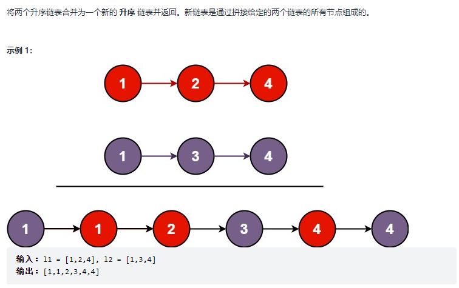

# 一些炫酷好用的小技巧

## 指针篇

### 来自 [21. 合并两个有序链表](https://leetcode-cn.com/problems/merge-two-sorted-lists/)

#### 题目描述：



`在这个题目中，如果采用迭代法解题，势必会需要用到去判断当前迭代的指针是指向的l1链表还是l2链表，这样才可以在当前节点被选取后做p = p->next`

如果不采取`指向指针的指针`，就需要判断语句，如下所示：

```C++
class Solution {
public:
    ListNode* mergeTwoLists(ListNode* l1, ListNode* l2) {
        ListNode* dummy = new ListNode(0);
        ListNode* cur = dummy;
        while(l1 && l2){
           ListNode* p = (l1->val < l2->val) ? l1 : l2;
           cur->next = p;
           cur = cur->next;
           if(p == l1) l1 = l1->next;
           else l2 = l2->next;
        }

        cur->next = (l1 == NULL) ? l2 : l1;

        ListNode* ans = dummy->next;
        delete dummy;

        return ans;
    }
};
```

但是，如果采取了指向指针的指针，就可以省去判断

```C++
class Solution {
public:
    ListNode* mergeTwoLists(ListNode* l1, ListNode* l2) {
        ListNode* dummy = new ListNode(0);
        ListNode* cur = dummy;
        while(l1 && l2){
           ListNode** pp = (l1->val < l2->val) ? &l1 : &l2;
           cur->next = *pp;
           cur = cur->next;
           *pp = (*pp)->next;
        }

        cur->next = (l1 == NULL) ? l2 : l1;

        ListNode* ans = dummy->next;
        delete dummy;

        return ans;
    }
};
```

示意图如下所示：


