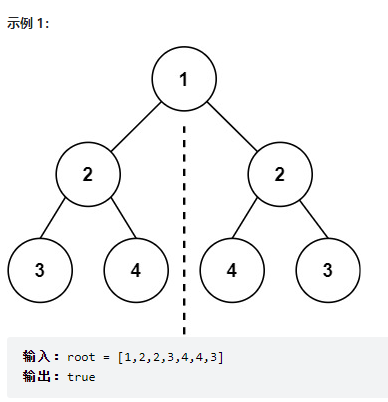
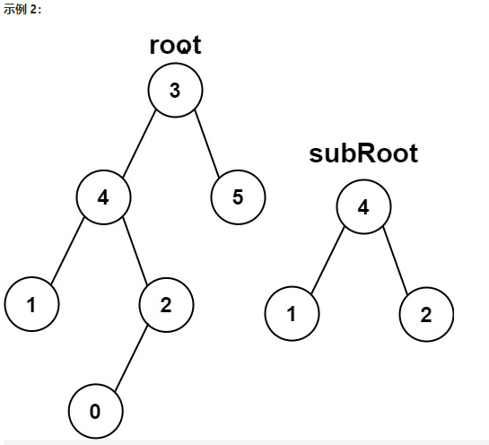

# 二叉树的处理

## 目录

[TOC]

## 题目类型

- 二叉搜索树的最大、最小深度及其延申问题
- 重建二叉树问题
- 子树、子结构问题
- 层序遍历二叉树问题
- 二叉树的序列化及其反序列化问题

## 二叉树的定义

```C++
struct TreeNode {
    int val;
    TreeNode *left;
    TreeNode *right;
    TreeNode(int x) : val(x), left(NULL), right(NULL) {}
};
```

在刷leetcode的时候，节点的定义默认都定义好了，真到面试的时候，需要自己写节点定义的时候，有时候会一脸懵逼

## 二叉树分类

- 满二叉树：除了叶结点外每一个结点都有左右子叶且叶结点都处在最底层的二叉树

  

- 完全二叉树：只有最下面的两层结点度小于2，并且最下面一层的结点都集中在该层最左边的若干位置的二叉树。也就是说，在满叉树的基础上，我在最底层从右往左删去若干节点，得到的都是完全二叉树。所以说，满二叉树一定是完全二叉树，但是完全二叉树不一定是满二叉树

  > **度：指的是一个节点拥有子节点的个数。如二叉树的节点的最大度为2。**

  

  `注意：优先级队列其实是一个堆，堆就是一棵完全二叉树，同时保证父子节点的顺序关系。`

- 二叉搜索树（Binary Search Tree，BST）

  - 若左子树不空，则左子树上所有节点的值均小于它的根节点的值；
  - 若右子树不空，则右子树上所有节点的值均大于它的根节点的值；
  - 左、右子树也分别为二叉搜索树；
  - **二叉搜索树的中序遍历的结果是一个有序数组**

- 平衡二叉树：又称AVL树。它或者是一棵空树，或者是具有下列性质的二叉树：它的左子树和右子树都是平衡二叉树，且左子树和右子树的高度之差之差的绝对值不超过1

  - **方便搜索，是二叉搜索树核心的设计初衷。不让查找算法时间复杂度退化到线性是平衡二叉树的初衷**。
  - 
  - `C++中map、set、multimap，multiset的底层实现都是平衡二叉搜索树，所以map、set的增删操作时间时间复杂度是logn，注意我这里没有说unordered_map、unordered_set，unordered_map、unordered_map底层实现是哈希表。`

- 红黑树

  - 红黑树就是一种二叉平衡搜索树
  - C++中map、multimap、set、multiset的底层实现机制是二叉平衡搜索树，再具体一点是红黑树。


### 二叉树分类小结

1. 平衡二叉搜索数是不是二叉搜索树和平衡二叉树的结合？

是的，是二叉搜索树和平衡二叉树的结合。

2. 平衡二叉树与完全二叉树的区别在于底层节点的位置？

是的，完全二叉树底层必须是从左到右连续的，且次底层是满的。

3. 堆是完全二叉树和排序的结合，而不是平衡二叉搜索树？

堆是一棵完全二叉树，同时保证父子节点的顺序关系（有序）。 **但完全二叉树一定是平衡二叉树，堆的排序是父节点大于子节点，而搜索树是父节点大于左孩子，小于右孩子，所以堆不是平衡二叉搜索树**。


## 树的一个中心和两个基本点

一个中心指的就是：**树的遍历**

两个基本点就是：**深度优先遍历（以下简称 DFS）和广度优先遍历（以下简称 BFS）**，其中， **DFS 细分为前中后序遍历， BFS 细分为带层的和不带层的**

`注`：

> **BFS 的核心在于求最短问题时候可以提前终止，这才是它的核心价值，层次遍历是一种不需要提前终止的 BFS 的副产物**。
>
> 这个提前终止不同于 DFS 的剪枝的提前终止，而是找到最近目标的提前终止。比如我要找距离最近的目标节点，BFS 找到目标节点就可以直接返回。而 DFS 要穷举所有可能才能找到最近的，这才是 BFS 的核心价值。

> **深度优先搜索算法（英语：Depth-First-Search，DFS）是一种用于遍历树或图的算法。**沿着树的深度遍历树的节点，尽可能深的搜索树的分支。当节点 v 的所在边都己被探寻过，搜索将回溯到发现节点 v 的那条边的起始节点。这一过程一直进行到已发现从源节点可达的所有节点为止。如果还存在未被发现的节点，则选择其中一个作为源节点并重复以上过程，整个进程反复进行直到所有节点都被访问为止，属于**盲目搜索**。


## 树的三种题型

> 树的题目就三种类型，分别是：**搜索类，构建类和修改类，而这三类题型的比例也是逐渐降低的**，即搜索类的题目最多，其次是构建类，最后是修改类。这一点和链表有很大的不同，链表更多的是修改类。

### 搜索类

搜索类的题目是树的题目的绝对大头。而搜索类只有两种解法，那就是 DFS 和 BFS

### 构建类

除了搜索类，另外一个大头是构建类。构建类又分为两种：`普通二叉树的构建`和`二叉搜索树的构建`。

### 修改类

>  当然修改类的题目也是要基于搜索算法的，不找到目标怎么删呢？

1. 题目要求的修改：一种是题目让你增加，删除节点，或者是修改节点的值或者指向。

2. 算法需要，自己修改：另外一种是为了方便计算，自己加了一个指针。


## 在Leetcode调试一颗二叉树的代码框架

```C++
#include <iostream>
#include<string>
#include <sstream>
#include<vector>
#include<queue>
using namespace std;

struct TreeNode {
	int val;
	TreeNode* left;
	TreeNode* right;
	TreeNode() : val(0), left(nullptr), right(nullptr) {}
	TreeNode(int x) : val(x), left(nullptr), right(nullptr) {}
	TreeNode(int x, TreeNode* left, TreeNode* right) : val(x), left(left), right(right) {}
};


//  ************* 横向输出图形二叉树 *************
void output_impl(TreeNode* n, bool left, string const& indent)
{
	if (n->right)
	{
		output_impl(n->right, false, indent + (left ? "|     " : "      "));
	}
	cout << indent;
	cout << (left ? '\\' : '/');
	cout << "-----";
	cout << n->val << endl;
	if (n->left)
	{
		output_impl(n->left, true, indent + (left ? "      " : "|     "));
	}
}
void output(TreeNode* root)
{
	if (root->right)
	{
		output_impl(root->right, false, "");
	}
	cout << root->val << endl;
	if (root->left)
	{
		output_impl(root->left, true, "");
	}
}
//  ***************************************


TreeNode* initTree(vector<string>& vec)
{
	queue<TreeNode*> qu;
	TreeNode* root = new TreeNode(atoi(vec[0].c_str()));
	int i = 1;
	qu.push(root);
	while (!qu.empty())
	{
		int len = qu.size();
		while (len--)
		{
			TreeNode* node = qu.front();
			qu.pop();
			if (vec[i] != "null")
			{
				node->left = new TreeNode(atoi(vec[i].c_str()));
				qu.push(node->left);
			}
			i++;
			if (i == vec.size())
				return root;
			if (vec[i] != "null")
			{
				node->right = new TreeNode(atoi(vec[i].c_str()));
				qu.push(node->right);
			}
			i++;
			if (i == vec.size())
				return root;
		}
	}
	return root;
}

// 步骤1：在这里拷贝Solution类
// 添加类功能说明： 输出节点数值总和等于某个给定值的所有路径
class Solution {
public:
    vector<vector<int>> res;
    void pathSum(TreeNode* root, int sum) {
    	if(!root) return;
    	
        vector<int> track;
        dfs(root, track, sum);
        
        pathSum(root->left, sum);
        pathSum(root->right, sum);

    }

    void dfs(TreeNode* root, vector<int>& track, int target){
        if(!root) return;

        track.push_back(root->val);

        target -= root->val;
        if(target == 0) res.push_back(track);

        dfs(root->left, track, target);
        dfs(root->right, track, target);

        track.pop_back();  
    }
};

int main()
{
	vector<string> v;
	string str = "5,4,8,11,null,13,4,7,2,null,null,5,1";   //步骤2：示例，leetcode上测试用例粘贴此处，删去[]
	stringstream sstr(str);
	string buf;
	while (getline(sstr, buf, ','))
	{
		cout << buf << endl;
		v.push_back(buf);
	}

	TreeNode* root = initTree(v);
	output(root);
    
	//步骤3：下面创建solution对象调试代码
	Solution s;
	s.pathSum(root, 22);
	cout << s.res.size() << endl;
	for(int i = 0; i < s.res.size(); ++i){
		for(int j = 0; j < s.res[i].size(); ++j){
			cout << s.res[i][j] << " ";
		}
		cout << endl;
	}
	
	return 0;
}
```


## 二叉树的迭代写法

### 前序遍历

```C++
class Solution {
public:
    vector<int> preorderTraversal(TreeNode* root) {
        stack<TreeNode*> st;
        vector<int> result;
        if (root == NULL) return result;
        st.push(root);
        
        while (!st.empty()) {
            TreeNode* node = st.top();                       // 中
            st.pop();
            
            result.push_back(node->val);
            
            if (node->right) st.push(node->right);           // 右（空节点不入栈）
            if (node->left) st.push(node->left);             // 左（空节点不入栈）
        }
        return result;
    }
};
```

`示例题目`

#### [226. 翻转二叉树](https://leetcode-cn.com/problems/invert-binary-tree/)

题目描述：给你一棵二叉树的根节点 `root` ，翻转这棵二叉树，并返回其根节点。

```C++
 // 采用迭代的方法模拟先序遍历的递归 
class Solution {
public:
    TreeNode* invertTree(TreeNode* root) {
        if(root == NULL) return NULL;

        stack<TreeNode*> stk;
        stk.push(root);

        while(!stk.empty()){
            TreeNode* node = stk.top();
            stk.pop();

            // 先序动作
            swap(node->left, node->right);
            
            if(node->right) stk.push(node->right);
            if(node->left) stk.push(node->left);
        }

        return root;
    }
};
```

### 中序遍历

待补充

### 后序遍历

待补充


## 相关题目

### 搜索类题目（注意与回溯算法的联系）- DFS搜索

> 其实后序也可以理解为是一种回溯，当然这是题外话，讲回溯的时候会重点讲的。？

#### [112. 路径总和](https://leetcode-cn.com/problems/path-sum/)

题目描述：给你二叉树的根节点 root 和一个表示目标和的整数 targetSum 。判断该树中是否存在 根节点到叶子节点 的路径，这条路径上所有节点值相加等于目标和 targetSum 。如果存在，返回 true ；否则，返回 false 。

```C++
class Solution {
public:
    bool hasPathSum(TreeNode* root, int targetSum) {
        if(root == NULL) return false;

        targetSum -= root->val;
        if(root->left == NULL && root->right == NULL && targetSum == 0) return true;

        return hasPathSum(root->left, targetSum) || hasPathSum(root->right, targetSum);
    }
};
```


#### [剑指 Offer 34. 二叉树中和为某一值的路径](https://leetcode-cn.com/problems/er-cha-shu-zhong-he-wei-mou-yi-zhi-de-lu-jing-lcof/)

#### [113. 路径总和 II](https://leetcode-cn.com/problems/path-sum-ii/)

题目描述：输入一棵二叉树和一个整数，打印出二叉树中节点值的和为输入整数的所有路径。`从树的根节点开始往下一直到叶节点所经过的节点形成一条路径`

```C++
class Solution {
public:
    vector<vector<int>> res; // 记录结果

    vector<vector<int>> pathSum(TreeNode* root, int target) {
        vector<int> track;

        backtrack(track, target, root);
        return res;
    }

private:
    void backtrack(vector<int>& track, int target, TreeNode* node){
        if(!node) return;

        // 做选择
        track.push_back(node->val);
        target -= node->val;

        if(target == 0 && node->left == NULL && node->right == NULL) res.push_back(track);

        // 递归
        backtrack(track, target, node->left);
        backtrack(track, target, node->right);

        // 撤销选择
        track.pop_back();
        target += node->val;
    }
};
```

`注`

1. 对于入口固定的题目，使用单递归就可以

#### [437. 路径总和 III](https://leetcode-cn.com/problems/path-sum-iii/)

题目描述：给定一个二叉树的根节点 root ，和一个整数 targetSum ，求该二叉树里节点值之和等于 targetSum 的 路径 的数目。

路径 不需要从根节点开始，也不需要在叶子节点结束，但是路径方向必须是向下的（只能从父节点到子节点）。


```C++
/**
 * Definition for a binary tree node.
 * struct TreeNode {
 *     int val;
 *     TreeNode *left;
 *     TreeNode *right;
 *     TreeNode(int x) : val(x), left(NULL), right(NULL) {}
 * };
 */
class Solution {
public:
    int cnt;
    int pathSum(TreeNode* root, int sum) {
        pathAll(root, sum);
        return cnt;
    }
    // 外层递归
    void pathAll(TreeNode* root, int sum) {
        if(!root) return;

        dfs(root, sum);
        
        pathAll(root->left, sum);
        pathAll(root->right, sum);

    }
    // 内层递归
    void dfs(TreeNode* root, int target){
        if(!root) return;

        target -= root->val;
        if(target == 0) cnt++;

        dfs(root->left, target);
        dfs(root->right, target);

        //target += root->val; 
    }
};
```

`注`

1. 对于入口不固定的题目，可以使用双递归


#### [257. 二叉树的所有路径](https://leetcode-cn.com/problems/binary-tree-paths/)


```C++
class Solution {
public:
    vector<string> res;
    vector<string> binaryTreePaths(TreeNode* root) {
        if(root == NULL) return res;
        string track = "";
        dfs(root, track);

        return res;
    }
    // string参数不带&，自动暗含了回溯，不需要再显式回溯
    void dfs(TreeNode* root, string track){
        if(root == NULL) return;

        if(track.size() == 0) track += to_string(root->val); // 第一个数前面不需要 ->
        else{
            track += "->"; // 第二个数开始需要 -> + 节点值
            track += to_string(root->val);
        }

        if(root->left == NULL && root->right == NULL) res.push_back(track);

        dfs(root->left, track);
        dfs(root->right, track);
    }
};
```


#### [563. 二叉树的坡度](https://leetcode-cn.com/problems/binary-tree-tilt/)

题目描述：给你一个二叉树的根节点 root ，计算并返回 整个树 的坡度 。

一个树的 节点的坡度 定义即为，该节点左子树的节点之和和右子树节点之和的 差的绝对值 。如果没有左子树的话，左子树的节点之和为 0 ；没有右子树的话也是一样。空结点的坡度是 0 。

整个树 的坡度就是其所有节点的坡度之和。

##### 解法1：双递归

```C++
class Solution {
public:
    int sum;

    int findTilt(TreeNode* root) {
        dfs2(root);

        return sum;
    }

    // 外层递归，遍历每一个节点
    void dfs2(TreeNode* root){
        if(!root) return;
          
        dfs2(root->left);
        dfs2(root->right);
        
        sum += abs(dfs1(root->left) - dfs1(root->right));
    }

    // 内层递归，求当前节点为根节点的子树的val值的和
    int dfs1(TreeNode* root){
        if(root == NULL) return 0;

        return root->val + dfs1(root->left) + dfs1(root->right);
    }
};
```

##### 解法2：单递归

> 上述解法之所以为$ O(n^2)$的时间复杂度，是因为我们将「计算子树坡度」和「计算子树权值和」两个操作分开进行。
>
> 事实上，我们可以在计算子树权值和的时候将坡度进行累加，从而将复杂度降为 O(n)。
>

```C++
class Solution {
public:
    int sum;

    int findTilt(TreeNode* root) {
        if(!root) return 0;
          
        dfs1(root);

        return sum;
    }

    // 递归，求当前节点为根节点的子树的val值的和
    int dfs1(TreeNode* root){
        if(root == NULL) return 0;

        int leftSum = dfs1(root->left);
        int rightSum = dfs1(root->right);

        sum += abs(leftSum - rightSum);

        return root->val + leftSum + rightSum;
    }
};
```


#### [129. 求根节点到叶节点数字之和](https://leetcode-cn.com/problems/sum-root-to-leaf-numbers/)

题目描述：


```C++
class Solution {
public:
    vector<int> nums;
    int sumNumbers(TreeNode* root) {
        if(root == NULL) return 0;
        int track = 0;
        int sum = 0;
        dfs(root, track);

        for(auto it : nums){
            cout << it << endl;
            sum += it;
            
        } 

        return sum;
    }

    // 先序遍历二叉树
    void dfs(TreeNode* root, int track){
        if(root == NULL){
            return;
        }

        track = track * 10 + root->val;
        // 重要，不然左右叶子节点会被处理两遍
        if(root->left == NULL && root->right == NULL){
            nums.push_back(track);
            return;
        } 

        dfs(root->left, track);
        dfs(root->right, track);

        //track /= 10;
    }
};
```


#### [124. 二叉树中的最大路径和](https://leetcode-cn.com/problems/binary-tree-maximum-path-sum/)  **困难**

题目描述：

路径 被定义为一条从树中任意节点出发，沿父节点-子节点连接，达到任意节点的序列。同一个节点在一条路径序列中 至多出现一次 。该路径 至少包含一个 节点，且不一定经过根节点。

路径和 是路径中各节点值的总和。

给你一个二叉树的根节点 root ，返回其 最大路径和 。

`一个优秀的对于理解递归也有很大帮助的题解思路`


- 为啥，第四种情况不能作为递归得返回值？

  > 我理解的是：第四种情况是属于最终确定的结果的，没办法再变长了，从形状上看是"n"型的；而其他三种情况是可延长的，可以作为递归返回值成为其他结果的组成部分，从形状上看是“I”型的

```C++
class Solution {
public:
    // 全局记录最大路径和
    int pathSum = INT_MIN;
    
    int maxPathSum(TreeNode* root) {
        dfs(root);
        return pathSum;
    }

    int dfs(TreeNode* node){
        if(!node) return 0;
        int left = dfs(node->left);
        int right = dfs(node->right);

        // 当前节点有四个选项
        // 1）独立成线，直接返回自己的值
        // 2) 跟左子节点合成一条路线
        // 3) 跟右子节点合成一条路线
        int ret = node->val + max(0, max(left, right));
        // 4) 以自己为桥梁，跟左、右子节点合成一条路线
        pathSum = max(pathSum, max(ret, node->val + left + right));

        return ret;
    }
};
```


#### [1372. 二叉树中的最长交错路径](https://leetcode-cn.com/problems/longest-zigzag-path-in-a-binary-tree/)

题目描述：

```swift
给你一棵以 root 为根的二叉树，二叉树中的交错路径定义如下：

选择二叉树中 任意 节点和一个方向（左或者右）。
如果前进方向为右，那么移动到当前节点的的右子节点，否则移动到它的左子节点。
改变前进方向：左变右或者右变左。
重复第二步和第三步，直到你在树中无法继续移动。
交错路径的长度定义为：访问过的节点数目 - 1（单个节点的路径长度为 0 ）。

请你返回给定树中最长 交错路径 的长度。

```

```C++
class Solution {
public:
    int ans = 0;
    int longestZigZag(TreeNode* root) {
        dfs(root->left, false, 0);
        dfs(root->right, true, 0);

        return ans;
    }

private:
    void dfs(TreeNode* root, bool rightside, int curr){
        if(!root) return;
        curr++;
        // 每到一个节点就记录当前交错路径的最大值
        ans = max(ans, curr);
        // 左右子树区分对待
        if(rightside){ // 上一次走的是右子树
            dfs(root->left, !rightside, curr); // 交错
            dfs(root->right, rightside, 0); // 未交错
        }
        else{
            dfs(root->left, rightside, 0); // 交错
            dfs(root->right, !rightside, curr); // 未交错
        }
    }
};
```

`注`

1. 这里遗留一个问题是，如何采用可视化的调试来验证代码的执行逻辑，等待先学习完下面的二叉树构建类的方法后再进行补充 （已闭环）


#### [101. 对称二叉树](https://leetcode-cn.com/problems/symmetric-tree/)

题目描述：给你一个二叉树的根节点 `root` ， 检查它是否轴对称。



```C++
class Solution {
public:
    bool isSymmetric(TreeNode* root) {
        if(!root) return true;

        return compare(root->left, root->right);
    }

    bool compare(TreeNode* left, TreeNode* right){
        if(left == NULL && right == NULL) return true;
        else if(left != NULL && right == NULL) return false;
        else if(left == NULL && right != NULL) return false;
        else if(left->val != right->val) return false;

        // 剩下就是，左右节点都不为空，且数值相等的情况
        bool outside = compare(left->left, right->right);
        bool inside = compare(left->right, right->left);

        return outside && inside;
    }
};
```

一个很基础的题

`注`

1. 重要精彩的是检查前面的一串条件，然后进行判断

下面这题，同理：

#### [100. 相同的树](https://leetcode-cn.com/problems/same-tree/)

题目描述：给你两棵二叉树的根节点 `p` 和 `q` ，编写一个函数来检验这两棵树是否相同。如果两个树在结构上相同，并且节点具有相同的值，则认为它们是相同的。

```C++
class Solution {
public:
    bool isSameTree(TreeNode* p, TreeNode* q) {
        if(p != NULL && q == NULL) return false;
        else if(p == NULL && q != NULL) return false;
        else if(p == NULL && q == NULL) return true;
        // p q 均不为空
        else if(p->val == q->val){
            return isSameTree(p->left, q->left) && isSameTree(p->right, q->right);
        }
         // p q 均不为空, 但是p q 值不等
        return false;
    }

};
```

下面这题，同理：

#### [572. 另一棵树的子树](https://leetcode-cn.com/problems/subtree-of-another-tree/)

题目描述：给你两棵二叉树 root 和 subRoot 。检验 root 中是否包含和 subRoot 具有相同结构和节点值的子树。如果存在，返回 true ；否则，返回 false 。


```c++
class Solution {
public:
    bool isSubtree(TreeNode* root, TreeNode* subRoot) {
        if(root == NULL) return false;

        if(isSameTree(root, subRoot)) return true;

        return isSubtree(root->left, subRoot) || isSubtree(root->right, subRoot);
    }

    // 抄自Leetcode.100
    bool isSameTree(TreeNode* p, TreeNode* q) {
        if(p != NULL && q == NULL) return false;
        else if(p == NULL && q != NULL) return false;
        else if(p == NULL && q == NULL) return true;
        // p q 均不为空
        else if(p->val == q->val){
            return isSameTree(p->left, q->left) && isSameTree(p->right, q->right);
        }
         // p q 均不为空, 但是p q 值不等
        return false;
    }
};
```


#### [404. 左叶子之和](https://leetcode-cn.com/problems/sum-of-left-leaves/)

题目描述：给定二叉树的根节点 `root` ，返回所有左叶子之和。

```c++
class Solution {
public:
    vector<int> res;
    int sumOfLeftLeaves(TreeNode* root) {
        if(!root) return 0;

        traverse(root);
        int sum = 0;
        for(auto it : res){
            sum += it;
        }

        return sum;
    }

    void traverse(TreeNode* root){
        if(!root) return;

        if(root->left != NULL && root->left->left == NULL && root->left->right == NULL) res.push_back(root->left->val); 

        traverse(root->left);
        traverse(root->right);
    }
};
```

`注`　

**判断当前节点是不是左叶子是无法判断的，必须要通过节点的父节点来判断其左孩子是不是左叶子**

如果该节点的左节点不为空，该节点的左节点的左节点为空，该节点的左节点的右节点为空，则找到了一个左叶子，判断代码如下：

```C++
if (node->left != NULL && node->left->left == NULL && node->left->right == NULL) {
    左叶子节点处理逻辑
}
```


#### [222. 完全二叉树的节点个数](https://leetcode-cn.com/problems/count-complete-tree-nodes/)

##### 解法1：按照普通二叉树的方法递归统计

```C++
class Solution {
public:
    int countNodes(TreeNode* root) {
        if(root == NULL) return 0;

        return 1 + countNodes(root->left) + countNodes(root->right);
    } 
};
```

- 时间复杂度：O(n)
- 空间复杂度：O(n)

##### 解法2：充分利用完全二叉树的性质

- 由于完全二叉树只有两种情况；情况一：就是满二叉树，情况二：最后一层叶子节点没有满。
  - 对于情况一，可以直接用 2^树深度 - 1 来计算，注意这里根节点深度为1。
  - 对于情况二，分别递归左孩子，和右孩子，递归到某一深度一定会有左孩子或者右孩子为满二叉树，然后依然可以按照情况1来计算

```C++
class Solution {
public:
    int countNodes(TreeNode* root) {
        if (root == nullptr) return 0;
        TreeNode* left = root->left;
        TreeNode* right = root->right;
        int leftHeight = 0, rightHeight = 0; // 这里初始为0是有目的的，为了下面求指数方便
        while (left) {  // 求左子树深度
            left = left->left;
            leftHeight++;
        }
        while (right) { // 求右子树深度
            right = right->right;
            rightHeight++;
        }
        if (leftHeight == rightHeight) {
            return (2 << leftHeight) - 1; // 注意(2<<1) 相当于2^2，所以leftHeight初始为0
        }
        return countNodes(root->left) + countNodes(root->right) + 1;
    }
};
```

#### 「二叉搜索树相关的题目」

#### [98. 验证二叉搜索树](https://leetcode-cn.com/problems/validate-binary-search-tree/)

题目描述：给你一个二叉树的根节点 root ，判断其是否是一个有效的二叉搜索树。

```C++
 // 二叉搜索树的中序遍历递增
class Solution {
public:
    // 测试数据中有 longlong的最小值，怎么办？不可能在初始化一个更小的值了吧。 
    // 建议避免 初始化最小值，如下方法取到最左面节点的数值来比较
    TreeNode* preNode = NULL;
    bool isValidBST(TreeNode* root) {
        if(!root) return true;
        
        // 中序遍历，边递归边比较
        bool leftIsVaild = isValidBST(root->left);
        
        if(preNode != NULL && root->val <= preNode->val) return false;
        else preNode = root;
        
        bool rightIsVaild = isValidBST(root->right);

        // 所有左子树和右子树自身必须也是二叉搜索树
        return leftIsVaild && rightIsVaild;
    }
};
```

`注意` 

1. 这个题目中需要掌握的巧妙技巧在于 全局变量的使用！！

   

#### [530. 二叉搜索树的最小绝对差](https://leetcode-cn.com/problems/minimum-absolute-difference-in-bst/)

```C++
// 同Leetcode98. 验证搜索二叉树
class Solution {
public:
    // 使用一个全局变量记录最小的差值
    int minMinus = INT_MAX;
    // 使用一个全局变量记录中序遍历的上一个节点
    TreeNode* preNode = NULL;

    int getMinimumDifference(TreeNode* root) {
        traverse(root);

        return minMinus;
    }

    void traverse(TreeNode* root){
        if(!root) return;

        traverse(root->left);
        if(preNode != NULL && ((root->val - preNode->val) < minMinus)) minMinus = (root->val - preNode->val);
        // 都走的分支
        preNode = root;
        traverse(root->right);

        return;
    }
};
```

#### [501. 二叉搜索树中的众数](https://leetcode-cn.com/problems/find-mode-in-binary-search-tree/)

```C++
class Solution {
public:    
    // 使用一个全局变量记录最小的差值
    int times = 0;
    int max_times = 0;
    vector<int> mode;
    // 使用一个全局变量记录中序遍历的上一个节点
    TreeNode* preNode = NULL;

    vector<int> findMode(TreeNode* root) {
        traverse(root);

        return mode;
    }

    void traverse(TreeNode* root){
        if(!root) return;

        traverse(root->left);
        if(preNode != NULL && (root->val == preNode->val)){
            times++;
        }
        // 包括了第一个节点或者当前节点数值不等于前一个节点的情况
        else{
            // 重新对当前值计数
            times = 0;
        }

        // 把这句放在这里，为了下面做判断时第一个节点的preNode是NULL无法放入
        preNode = root;

        if(times == max_times){
            mode.push_back(root->val);
        }
        else if(times > max_times){
            max_times = times;
            mode.clear();
            mode.push_back(root->val);
        }        
        
        traverse(root->right);

        return;
    }
};
```


#### 		「二叉树的最小深度和最大深度」

#### [104. 二叉树的最大深度](https://leetcode-cn.com/problems/maximum-depth-of-binary-tree/)

二叉树的深度为根节点到最远叶子节点的最长路径上的节点数。

说明: 叶子节点是指没有子节点的节点。

示例：
给定二叉树 [3,9,20,null,null,15,7]

```C++
    3
   / \
  9  20
    /  \
   15   7
```

返回它的最大深度 3

##### 解法1：递归法

```C++
class Solution {
public:
    int maxDepth(TreeNode* root) {
        if(root == NULL) return 0;

        return 1 + max(maxDepth(root->left), maxDepth(root->right));
    }
};
```

##### 解法2：层序遍历

> 需要借用一个辅助数据结构即队列来实现，**队列先进先出，符合一层一层遍历的逻辑，而是用栈先进后出适合模拟深度优先遍历也就是递归的逻辑。**
>
> **而这种层序遍历方式就是图论中的广度优先遍历，只不过我们应用在二叉树上。**


```C++
class Solution {
public:
    int maxDepth(TreeNode* root) {
        if(root == NULL) return 0;

        int depth = 0;

        queue<TreeNode*> q;
        q.push(root);

        while(!q.empty()){
            int size = q.size();
            depth++;

            for(int i = 0; i < size; ++i){
                TreeNode* node = q.front();
                q.pop();
                if(node->left) q.push(node->left);
                if(node->right) q.push(node->right);
            }
        }
        return depth;
    }
};
```

#### [559. N 叉树的最大深度](https://leetcode-cn.com/problems/maximum-depth-of-n-ary-tree/)

```C++
class Solution {
public:
    int maxDepth(Node* root) {
        if(!root) return 0;
        int maxDep = 0;
        for(int i = 0; i < root->children.size(); ++i){
            maxDep = max(maxDep, maxDepth(root->children[i]));
        }

        return 1 + maxDep;
    }
};
```

`注意`

下面的写法是错误的，因为千万要注意递归函数的功能！！！！

```C++
class Solution {
public:
    int maxDepth(Node* root) {
        if(!root) return 0;
        int maxDep = 0;
        for(int i = 0; i < root->children.size(); ++i){
            maxDep = 1 + max(maxDep, maxDepth(root->children[i]));
        }

        return maxDep;
    }
};
```


#### [111. 二叉树的最小深度](https://leetcode-cn.com/problems/minimum-depth-of-binary-tree/)

给定一个二叉树，找出其最小深度。

最小深度是从根节点到最近叶子节点的最短路径上的节点数量。

说明：叶子节点是指没有子节点的节点。

示例：

```
	3
   / \
  9  20
    /  \
   15   7
```

返回它的最小深度2

##### 解法1：递归法

###### **「对比说明」**

这道题目容易联想到104题的最大深度，https://leetcode-cn.com/problems/maximum-depth-of-binary-tree

所以一开始我直接把原来的代码照搬过来，把中间求max的函数改成了求min。用案例的数据无压力跑过，然后直接提交，当场被拒。

```C++
//错误示范, 在碰到[0],[1,2]的时候直接错
class Solution {
public:
    int minDepth(TreeNode* root) {
        if (root == nullptr){
            return 0;
        }
        int left = minDepth(root->left);
        int right = minDepth(root->right);

        return min(left, right) + 1;
    }
};
```


后来看了一下题解，才明白了最大深度和最小深度有一个很大的区别，`最大深度能够保证最后一个节点绝对是叶子节点，而最小深度不行`。

因为定义说最小深度是从根节点到最近叶子节点的最短路径上的节点数量。

官方还温馨的说明了下: 叶子节点是指没有子节点的节点。

因此遇到下面的情况


    	3
       / \
      9  20
     /     \
    15      7

原来的代码，肯定是返回9和20对应的深度2，而不是15和7对应的深度3.

所以需要先提前排除一些情况

```C++
class Solution {
public:
    int minDepth(TreeNode* root) {
        if(root == NULL) return 0;

        int minDep = 0;
        if(root->left == NULL && root->right == NULL) return 1 + minDep;
        else if(root->left == NULL || root->right == NULL) minDep = ((root->left == NULL) ? minDepth(root->right) : minDepth(root->left));
        else{
            minDep = min(minDepth(root->left), minDepth(root->right));
        }

        return 1 + minDep;
    }
};
```

##### 解法2：层序遍历

同样的，这题也可以使用层序遍历的方法

> **需要注意的是，只有当左右孩子都为空的时候，才说明遍历的最低点了。如果其中一个孩子为空则不是最低点**

```C++
class Solution {
public:

    int minDepth(TreeNode* root) {
        if (root == NULL) return 0;
        int depth = 0;
        queue<TreeNode*> que;
        que.push(root);
        while(!que.empty()) {
            int size = que.size();
            depth++; // 记录最小深度
            for (int i = 0; i < size; i++) {
                TreeNode* node = que.front();
                que.pop();
                if (node->left) que.push(node->left);
                if (node->right) que.push(node->right);
                if (!node->left && !node->right) { // 当左右孩子都为空的时候，说明是最低点的一层了，退出
                    return depth;
                }
            }
        }
        return depth;
    }
};
```

#### 「二叉搜索树的最大深度的衍生问题」

#### [剑指 Offer 55 - II. 平衡二叉树](https://leetcode-cn.com/problems/ping-heng-er-cha-shu-lcof/)

#### [110. 平衡二叉树](https://leetcode-cn.com/problems/balanced-binary-tree/)

题目描述：输入一棵二叉树的根节点，判断该树是不是平衡二叉树。如果某二叉树中任意节点的左右子树的深度相差不超过1，那么它就是一棵平衡二叉树。

```C++
class Solution {
public:
    bool isBalanced(TreeNode* root) {
        // 重要，基础case
        if(root == NULL) return true;
        if(abs(dfs(root->left) - dfs(root->right)) > 1) return false;
        return isBalanced(root->left) && isBalanced(root->right);
    }

    int dfs(TreeNode* root){
        if(root == NULL) return 0;

        int depth_left = dfs(root->left);
        int depth_right = dfs(root->right);

        return max(depth_left, depth_right) + 1;
    }
};
```

`注` 

1. 利用了二叉搜索树的最大深度的递归部分的代码，同时需要特别小心注意的是： 在主函数isBalanced(TreeNode* root)中，由于也是一个递归函数，也需要写if(root == NULL) return true;这个递归出口条件，否则会出错。
2. 上述方法先序遍历，双重递归，存在大量重复计算，时间复杂度高，代码简洁；下面看后序遍历的方法：

```C++
class Solution {
public:
    bool isBalanced(TreeNode* root) {
        // 重要，基础case
        if(root == NULL) return true;
        return dfs(root) != -1;
    }

    int dfs(TreeNode* root){
        if(root == NULL) return 0;

        int depth_left = dfs(root->left);
        if(depth_left == -1) return -1;
        int depth_right = dfs(root->right);
        if(depth_right == -1) return -1;

        return abs(depth_left - depth_right) > 1 ? -1 : max(depth_left, depth_right) + 1;
    }
};
```

3. 后序遍历，时间复杂度 O(N)


#### 「层序遍历二叉树」

#### [剑指 Offer 32 - I. 从上到下打印二叉树](https://leetcode-cn.com/problems/cong-shang-dao-xia-da-yin-er-cha-shu-lcof/)

题目描述：从上到下打印出二叉树的每个节点，同一层的节点按照从左到右的顺序打印

```C++
 // 删去NULL的层序遍历
class Solution {
public:
    vector<int> levelOrder(TreeNode* root) {
        queue<TreeNode*> q;
        vector<int> res;
        if(root != NULL) q.push(root);

        while(!q.empty()){
            TreeNode* cur = q.front();
            q.pop();

            if(cur->left) q.push(cur->left);
            if(cur->right) q.push(cur->right);

            res.push_back(cur->val);
        }

        return res;
    }
};
```


#### [剑指 Offer 32 - II. 从上到下打印二叉树 II](https://leetcode-cn.com/problems/cong-shang-dao-xia-da-yin-er-cha-shu-ii-lcof/)

题目描述：从上到下按层打印二叉树，同一层的节点按从左到右的顺序打印，**每一层打印到一行**

```C++
class Solution {
public:
    vector<vector<int>> levelOrder(TreeNode* root) {
        queue<TreeNode*> q;
        vector<vector<int>> res;
        if(root != NULL) q.push(root);

        while(!q.empty()){
            int levelNum = q.size();
            vector<int> level;

            for(int i = 0; i < levelNum; i++){
                TreeNode* cur = q.front();
                q.pop();

                if(cur->left) q.push(cur->left);
                if(cur->right) q.push(cur->right);

                level.push_back(cur->val);
            }

            res.push_back(level); 
        }

        return res;
    }
};
```


#### [剑指 Offer 32 - III. 从上到下打印二叉树 III](https://leetcode-cn.com/problems/cong-shang-dao-xia-da-yin-er-cha-shu-iii-lcof/)

题目描述：请实现一个函数按照之字形顺序打印二叉树，即第一行按照从左到右的顺序打印，第二层按照从右到左的顺序打印，第三行再按照从左到右的顺序打印，其他行以此类推

```C++
class Solution {
public:
    vector<vector<int>> levelOrder(TreeNode* root) {
        deque<TreeNode*> dq;
        vector<vector<int>> res;

        bool flag = true; // 奇(false)偶(true)行标记，奇数行从左到右打印，偶数行从右到左打印

        if(root != NULL) dq.push_back(root); // 第 0 层

        while(!dq.empty()){
            int levelNum = dq.size();
            vector<int> level;
            flag = !flag;

            if(flag){ // 第 2、4、6....层
                for(int i = 0; i < levelNum; i++){
                    TreeNode* cur = dq.front();
                    dq.pop_front();

                    if(cur->right) dq.push_back(cur->right);
                    if(cur->left) dq.push_back(cur->left);

                    level.push_back(cur->val);
                }

                res.push_back(level); 
            }
            else{ // 第 1、3、5.....层
                for(int i = 0; i < levelNum; i++){
                    TreeNode* cur = dq.back();
                    dq.pop_back();

                    if(cur->left) dq.push_front(cur->left);
                    if(cur->right) dq.push_front(cur->right);

                    level.push_back(cur->val);
                }

                res.push_back(level); 
            }    
        }

        return res;
    }
};
```


#### [513. 找树左下角的值](https://leetcode-cn.com/problems/find-bottom-left-tree-value/)

题目描述：给定一个二叉树的 **根节点** `root`，请找出该二叉树的 **最底层 最左边** 节点的值。假设二叉树中至少有一个节点。

```C++
class Solution {
public:
    // 层序遍历
    int findBottomLeftValue(TreeNode* root) {
        if(!root) return 0;

        int res;
        queue<TreeNode*> q;
        q.push(root);
        while(!q.empty()){
            int sz = q.size();

            for(int i = 0; i < sz; ++i){
                TreeNode* node = q.front();
                q.pop();
                if(i == 0) res = node->val; //持续更新到最后一行的第一个数
                if(node->left) q.push(node->left);
                if(node->right) q.push(node->right);
            }

        }
        return res;
    }
};
```

`注`

特别注意层序遍历的模板的写法，while循环里面还有一个for循环


#### ★★★「二叉树的返回值体现的最清楚的一个类型题目——公共祖先问题」

#### ★★★ [236. 二叉树的最近公共祖先](https://leetcode-cn.com/problems/lowest-common-ancestor-of-a-binary-tree/)

题目描述：给定一个二叉树, 找到该树中两个指定节点的最近公共祖先。

##### 解法1：后序遍历（天然支持回溯）

###### 思路讲解：

遇到这个题目首先想的是要是能自底向上查找就好了，这样就可以找到公共祖先了。

那么二叉树如何可以自底向上查找呢？

回溯啊，二叉树回溯的过程就是从低到上。

后序遍历就是天然的回溯过程，最先处理的一定是叶子节点。

接下来就看如何判断一个节点是节点q和节点p的公共公共祖先呢。

**如果找到一个节点，发现左子树出现结点p，右子树出现节点q，或者 左子树出现结点q，右子树出现节点p，那么该节点就是节点p和q的最近公共祖先。（由于是后序遍历，所以第一个发现有这个特性的节点就是最近的公共祖先了，一直向上返回这个节点就可以了）**

使用后序遍历，回溯的过程，就是从低向上遍历节点，一旦发现如何这个条件的节点，就是最近公共节点了。

###### 是否需要遍历整棵树？

需要的！

直观上来看，找到最近公共祖先，直接一路返回就可以了。


就像图中一样直接返回7，多美滋滋。

但事实上还要遍历根节点右子树（即使此时已经找到了目标节点了），也就是图中的节点4、15、20。

因为在如下代码的后序遍历中，如果想利用left和right做逻辑处理， 不能立刻返回，而是要等left与right逻辑处理完之后才能返回。

```C++
left = 递归函数(root->left);
right = 递归函数(root->right);
left与right的逻辑处理;
```

也就是说，不然根节点8就无法得到右子树的返回值

###### 为什么left为空，right不为空，目标节点通过right返回呢


图中节点10的左子树返回null，右子树返回目标值7，那么此时节点10的处理逻辑就是把右子树的返回值（最近公共祖先7）返回上去！

这里点也很重要，可能刷过这道题目的同学，都不清楚结果究竟是如何从底层一层一层传到头结点的。

###### 完整的递归返回流程图


###### 代码

```C++
class Solution {
public:
    // 返回值返回的是：
    //  如果遍历到p/q，则返回p/q本身
    //  如果遍历到空节点，则返回空节点
    TreeNode* lowestCommonAncestor(TreeNode* root, TreeNode* p, TreeNode* q) {
        if(root == NULL || root == p || root == q) return root;

        TreeNode* left = lowestCommonAncestor(root->left, p, q);
        TreeNode* right = lowestCommonAncestor(root->right, p, q);
        // 后序遍历位置 
        if(left != NULL && right != NULL) return root;
        else if(left == NULL || right == NULL) return (left == NULL) ? right : left;
        
        return NULL;
    }
};
```

###### 小结

1. 求最小公共祖先，需要从底向上遍历，那么二叉树，只能通过后序遍历（即：回溯）实现从低向上的遍历方式。
2. 在回溯的过程中，必然要遍历整棵二叉树，即使已经找到结果了，依然要把其他节点遍历完，因为要使用递归函数的返回值（也就是代码中的left和right）做逻辑判断。
3. 要理解如果返回值left为空，right不为空为什么要返回right，为什么可以用返回right传给上一层结果。


##### 解法2：建立指向父节点的指针

```C++
class Solution {
public:
    // 建立指向父节点的指针
    unordered_map<TreeNode*, TreeNode*> fa;
    // 记录某节点是否走过
    unordered_map<TreeNode*, bool> visited;

    // 遍历整棵树，建立指向父节点的指针
    void dfs(TreeNode* root){
        if(!root) return;
        if(root->left != NULL){
            fa[root->left] = root;
            dfs(root->left);
        }
        if(root->right != NULL){
            fa[root->right] = root;
            dfs(root->right);
        }
    }

    TreeNode* lowestCommonAncestor(TreeNode* root, TreeNode* p, TreeNode* q) {
        // 根节点的父指针为NULL，方便p停下来
        fa[root] = NULL;
        dfs(root);

        while(p){
            visited[p] = true;
            p = fa[p];
        }

        while(q){
            if(visited[q] == true) return q;
            q = fa[q];
        }

        return NULL;
    }
};
```

`比较直观的解法`


#### [235. 二叉搜索树的最近公共祖先](https://leetcode-cn.com/problems/lowest-common-ancestor-of-a-binary-search-tree/)

题目描述：给定一个二叉搜索树, 找到该树中两个指定节点的最近公共祖先。

##### 解法1：照抄Leetcode236. （当作一棵普通二叉树）

##### 解法2：利用二叉搜索树有序特性

在有序树里，如果判断一个节点的左子树里有p，右子树里有q呢？

其实只要从上到下遍历的时候，cur节点是数值在[p, q]区间中则说明该节点cur就是最近公共祖先了。

```C++
class Solution {
public:
    TreeNode* lowestCommonAncestor(TreeNode* root, TreeNode* p, TreeNode* q) {
        if(!root) return NULL;

        if(root->val > p->val && root->val > q->val) return lowestCommonAncestor(root->left, p, q);
        if(root->val < p->val && root->val < q->val) return lowestCommonAncestor(root->right, p, q);

        // 当前节点的值位于p,q的值之间，说明找到了
        return root;
    }
};
```


### 构建类题目

> 构建类分为两种：普通二叉树的构建和二叉搜索树的构建

#### 「普通二叉树的构建」

> 给你两种 DFS 的遍历的结果数组，让你构建出原始的树结构

> 给你一个 BFS 的遍历的结果数组，让你构建出原始的树结构

下图是二叉树构建的方法图：


#### [105. 从前序与中序遍历序列构造二叉树](https://leetcode-cn.com/problems/construct-binary-tree-from-preorder-and-inorder-traversal/)

题目描述：根据给出的二叉树的前序遍历 $pre$ 和中序遍历 $vin$ ，重建一颗二叉树

`思路` 递归构建，要非常注意不要忘了「**递归出口**」

```C++
class Solution {
public:
    TreeNode* buildTree(vector<int>& preorder, vector<int>& inorder) {
        // 递归出口
        if(preorder.size() == 0) return NULL;
        
        // 前序遍历的第一个值是树的根节点
        int rootVal = preorder[0];
        TreeNode* root = new TreeNode(rootVal);

        int leftSize = 0;
        for(int i = 0; i < inorder.size(); ++i){
            if(inorder[i] == rootVal){
                leftSize = i;
                break;
            }
        }

        // 保存左右子树的前序和中序遍历的结果
        vector<int> pre_left, pre_right, in_left, in_right;
        for(int i = 0; i < leftSize; ++i){
            pre_left.push_back(preorder[i + 1]);
            in_left.push_back(inorder[i]);
        }

        for(int i = leftSize + 1; i < preorder.size(); ++i){
            pre_right.push_back(preorder[i]);
            in_right.push_back(inorder[i]);
        }

        // 递归构建
        root->left = buildTree(pre_left, in_left);
        root->right = buildTree(pre_right, in_right);

        return root;    
    }
};
```

`注`

1. 首先前序遍历的首元素就是二叉树的根节点
2. 其次，在中序遍历中找到上述的首元素，并将中序遍历数组分为前后两半，前半部分是左子树的结构，后半部分是右子树的结构；同时记录前后两半的长度，这样就可以在前序遍历数组中也划分为两个部分
3. 递归的构建左右子树

#### [106. 从中序与后序遍历序列构造二叉树](https://leetcode-cn.com/problems/construct-binary-tree-from-inorder-and-postorder-traversal/)


```C++
class Solution {
public:
    TreeNode* buildTree(vector<int>& inorder, vector<int>& postorder) {
        // 递归出口
        if(inorder.size() == 0) return NULL;

        int len = postorder.size();
        int rootVal = postorder[len - 1];
        TreeNode* root = new TreeNode(rootVal);

        int leftSize = 0;
        for(int i = 0; i < inorder.size(); ++i){
            if(inorder[i] == rootVal){
                leftSize = i;
                break;
            } 
        }

        vector<int> left_in, left_post, right_in, right_post;
        for(int i = 0; i < leftSize; ++i){
            left_in.push_back(inorder[i]);
            left_post.push_back(postorder[i]);
        }

        for(int i = leftSize + 1; i < inorder.size(); ++i){
            right_in.push_back(inorder[i]);
            right_post.push_back(postorder[i - 1]); // 特别注意 -1
        }

        root->left = buildTree(left_in, left_post);
        root->right = buildTree(right_in, right_post);

        return root;
    }
};
```

`注`

1. 首先后序遍历的末尾元素就是二叉树的根节点
2. 其次，在中序遍历中找到上述的末尾元素，并将中序遍历数组分为前后两半，前半部分是左子树的结构，后半部分是右子树的结构；同时记录前后两半的长度，这样就可以在后序遍历数组中也划分为两个部分
3. 递归的构建左右子树

#### [889. 根据前序和后序遍历构造二叉树](https://leetcode-cn.com/problems/construct-binary-tree-from-preorder-and-postorder-traversal/)


`注` 这道题应该注意没有了中序遍历的结果，应该如何划分出左右子树从而递归的构建二叉树呢？

`答` 可以利用在前序遍历中 根节点的后一个元素的即为左子树的根节点 这一特性，在后序遍历中找到这一值并划分为前后两半；

> 显然，提供前序和后序遍历的结果进行复原的情况是最复杂的

```C++
class Solution {
public:
    TreeNode* constructFromPrePost(vector<int>& preorder, vector<int>& postorder) {
        if(preorder.size() == 0) return NULL;
        if(preorder.size() == 1) return new TreeNode(preorder[0]); // 重要！！！！，这是不同于另外两种重建方式的地方，这是因为后面用到了preorder.size() - 1

        int rootVal = preorder[0];
        TreeNode* root = new TreeNode(rootVal);

        int leftVal = preorder[1];

        int leftSize = 0;
        for(int i = 0; i < postorder.size(); ++i){
            if(postorder[i] == leftVal){
                leftSize = i;
                break;
            }
        }

        vector<int> left_pre, left_post, right_pre, right_post;
        for(int i = 0; i <= leftSize; ++i){
            left_pre.push_back(preorder[i + 1]);
            left_post.push_back(postorder[i]);
        }

        for(int i = leftSize + 1; i < preorder.size() - 1; ++i){
            right_pre.push_back(preorder[i + 1]);
            right_post.push_back(postorder[i]);
        }

        root->left = constructFromPrePost(left_pre, left_post);
        root->right = constructFromPrePost(right_pre, right_post);

        return root;
    }
};
```

#### 「与二叉树构建相关的题目」

#### [654. 最大二叉树](https://leetcode-cn.com/problems/maximum-binary-tree/)

题目描述：给定一个不重复的整数数组 nums 。 最大二叉树 可以用下面的算法从 nums 递归地构建:

创建一个根节点，其值为 nums 中的最大值。
递归地在最大值 左边 的 子数组前缀上 构建左子树。
递归地在最大值 右边 的 子数组后缀上 构建右子树。

```C++
class Solution {
public:
    TreeNode* constructMaximumBinaryTree(vector<int>& nums) {
        TreeNode* root = construct(nums, 0, nums.size()); // [left, right) 左闭右开区间
        
        return root;
    }

    // [left, right) 左闭右开区间
    TreeNode* construct(vector<int>& nums, int left, int right){
        if(left >= right) return NULL;
        int max_index = 0;
        int max = INT_MIN;
        for(int i = left; i < right; ++i){
            if(nums[i] > max){
                max = nums[i];
                max_index = i;
            }
        }

        TreeNode* root = new TreeNode(max);
        root->left = construct(nums, left, max_index);
        root->right = construct(nums, max_index + 1, right);

        return root;
    }
};
```

#### [617. 合并二叉树](https://leetcode-cn.com/problems/merge-two-binary-trees/)

题目描述：


```C++
// 新建一棵树
class Solution {
public:
    TreeNode* mergeTrees(TreeNode* root1, TreeNode* root2) {
        if(root1 == NULL && root2 == NULL) return NULL;
        else if(root1 != NULL && root2 == NULL) return root1;
        else if(root1 == NULL && root2 != NULL) return root2;

        // root1 和 root2 都存在的情况
        TreeNode* root = new TreeNode(0);
        root->val = (root1->val + root2->val);
        
        root->left = mergeTrees(root1->left, root2->left);
        root->right = mergeTrees(root1->right, root2->right);

        return root;
    }
};
```

`注意`

1. 这题一开始自己没写出来，虽然本题属于是简单难度；主要的原因是要大胆的写出TreeNode* root = new TreeNode(0);，到递归返回的最后，会返回建立的根节点
2. 当然，本题不新建一颗树，而是重复利用root1也是可以的


#### 「二叉搜索树的构建」

#### [108. 将有序数组转换为二叉搜索树](https://leetcode-cn.com/problems/convert-sorted-array-to-binary-search-tree/)

题目描述：给你一个整数数组 nums ，其中元素已经按 升序 排列，请你将其转换为一棵 高度平衡 二叉搜索树。

高度平衡 二叉树是一棵满足「每个节点的左右两个子树的高度差的绝对值不超过 1 」的二叉树。

```C++
class Solution {
public:
    TreeNode* sortedArrayToBST(vector<int>& nums) {
        return construct(nums, 0, nums.size() - 1);
    }

    // [left, right] 为构建区间
    TreeNode* construct(vector<int>& nums, int left, int right){
        if(left > right) return NULL;
        int mid = left + (right - left) / 2; // 要构建平衡二叉树，选取中点作为根节点

        TreeNode* root = new TreeNode(nums[mid]);
        root->left = construct(nums, left, mid - 1);
        root->right = construct(nums, mid + 1, right);

        return root;
    }
};
```


### 修改类题目（通常都有返回值）

#### [701. 二叉搜索树中的插入操作](https://leetcode-cn.com/problems/insert-into-a-binary-search-tree/)

题目描述：给定二叉搜索树（BST）的根节点 root 和要插入树中的值 value ，将值插入二叉搜索树。 返回插入后二叉搜索树的根节点。 输入数据 保证 ，新值和原始二叉搜索树中的任意节点值都不同。

##### 解法1：自己写的，递归函数没有返回值

```C++
// 整体思路是：中序递归的去搜索val值位于哪一个分支，然后找到空节点插入
class Solution {
public:
    TreeNode* insertIntoBST(TreeNode* root, int val) {
        if(!root) return new TreeNode(val);
        traverse(root, val);

        return root;
    }

    void traverse(TreeNode* root, int val){
        if(root->left == NULL && root->right == NULL){
            (root->val) < val ? root->right = new TreeNode(val) : root->left = new TreeNode(val);
            return;
        }
        else if(root->left == NULL && root->right != NULL && val < root->val){
            root->left = new TreeNode(val);
            return;
        }
        else if(root->left != NULL && root->right == NULL && val > root->val){
            root->right = new TreeNode(val);
            return;
        }


        if(root->val < val)  traverse(root->right, val);
        if(root->val > val)  traverse(root->left, val);
    }
};
```


##### 解法2：递归函数有返回值

###### 思路：

**有返回值的话，可以利用返回值完成新加入的节点与其父节点的赋值操作**。

###### 终止条件

终止条件就是找到遍历的节点为null的时候，就是要插入节点的位置了，并把插入的节点返回。

```C++
if (root == NULL) {
    TreeNode* node = new TreeNode(val);
    return node;
}
```

这里把添加的节点返回给上一层，就完成了父子节点的赋值操作了。

###### 单层递归逻辑

此时要明确，需要遍历整棵树么？

别忘了这是搜索树，遍历整棵搜索树简直是对搜索树的侮辱，哈哈。

搜索树是有方向了，可以根据插入元素的数值，决定递归方向。

代码如下：

```C++
if (root->val > val) root->left = insertIntoBST(root->left, val);
if (root->val < val) root->right = insertIntoBST(root->right, val);
return root;
```

**到这里，大家应该能感受到，如何通过递归函数返回值完成了新加入节点的父子关系赋值操作了，下一层将加入节点返回，本层用root->left或者root->right将其接住**。

###### 代码

```C++
class Solution {
public:
    TreeNode* insertIntoBST(TreeNode* root, int val) {
        if (root == NULL) {
            TreeNode* node = new TreeNode(val);
            return node;
        }
        if (root->val > val) root->left = insertIntoBST(root->left, val);
        if (root->val < val) root->right = insertIntoBST(root->right, val);
        return root;
    }
};
```


#### [450. 删除二叉搜索树中的节点](https://leetcode-cn.com/problems/delete-node-in-a-bst/)

```C++
class Solution {
public:
    TreeNode* deleteNode(TreeNode* root, int key) {
        // 情况1·没找到要删除的值
        if(!root) return NULL;
        // 情况2·找到了要删除的值
        if(root->val == key){
            // 情况2.1·要删除的节点左右子节点都有值：则将删除节点的左子树头结点（左孩子）放到删除节点的右子树的最左面节点的左孩子上
            if(root->right != NULL && root->left != NULL){
                TreeNode* rightMostLeft = root->right;
                while(rightMostLeft->left){
                    rightMostLeft = rightMostLeft->left;
                }
                rightMostLeft->left = root->left;
                root = root->right;
            }
            // 情况2.2·要删除的节点左子节点都有值：删除节点，右孩子补位
            else if(root->right != NULL && root->left == NULL){
                root = root->right;         
            }
            // 情况2.3·要删除的节点右子节点都有值：删除节点，左孩子补位
            else if(root->left != NULL && root->right == NULL){
                root = root->left;
            }
            // 情况2.4·要删除的节点右子节点都没有值
            else{
                root = NULL;
            }
            return root;
        }

        // 这里相当于把新的节点返回给上一层，上一层就要用 root->left 或者 root->right接住
        if(root->val < key) root->right = deleteNode(root->right, key);
        if(root->val > key) root->left = deleteNode(root->left, key);

        return root;
    }
};
```


#### [669. 修剪二叉搜索树](https://leetcode-cn.com/problems/trim-a-binary-search-tree/)

题目描述：给你二叉搜索树的根节点 root ，同时给定最小边界low 和最大边界 high。通过修剪二叉搜索树，使得所有节点的值在[low, high]中。修剪树 不应该 改变保留在树中的元素的相对结构 (即，如果没有被移除，原有的父代子代关系都应当保留)。 可以证明，存在 唯一的答案 。

```C++
class Solution {
public:
    TreeNode* trimBST(TreeNode* root, int low, int high) {
        if(!root) return NULL;

        root->left = trimBST(root->left, low, high);
        root->right = trimBST(root->right, low, high);
        
        // 后序遍历，因为需要依赖下层返回的值
        if(root->val < low){
            TreeNode* left = deleteNode(root, root->val);
            return left;
        } 
        if(root->val > high){
            TreeNode* right = deleteNode(root, root->val);
            return right;
        }
     
        return root;
    }

    // 抄自Leetocde450. 删除二叉树的节点
    TreeNode* deleteNode(TreeNode* root, int key) {
        // 情况1·没找到要删除的值
        if(!root) return NULL;
        // 情况2·找到了要删除的值
        if(root->val == key){
            // 情况2.1·要删除的节点左右子节点都有值：则将删除节点的左子树头结点（左孩子）放到删除节点的右子树的最左面节点的左孩子上
            if(root->right != NULL && root->left != NULL){
                TreeNode* rightMostLeft = root->right;
                while(rightMostLeft->left){
                    rightMostLeft = rightMostLeft->left;
                }
                rightMostLeft->left = root->left;
                root = root->right;
            }
            // 情况2.2·要删除的节点左子节点都有值：删除节点，右孩子补位
            else if(root->right != NULL && root->left == NULL){
                root = root->right;         
            }
            // 情况2.3·要删除的节点右子节点都有值：删除节点，左孩子补位
            else if(root->left != NULL && root->right == NULL){
                root = root->left;
            }
            // 情况2.4·要删除的节点右子节点都没有值
            else{
                root = NULL;
            }
            return root;
        }

        // 这里相当于把新的节点返回给上一层，上一层就要用 root->left 或者 root->right接住
        if(root->val < key) root->right = deleteNode(root->right, key);
        if(root->val > key) root->left = deleteNode(root->left, key);

        return root;
    }
};
```


#### [538. 把二叉搜索树转换为累加树](https://leetcode-cn.com/problems/convert-bst-to-greater-tree/)

题目描述：给出二叉 搜索 树的根节点，该树的节点值各不相同，请你将其转换为累加树（Greater Sum Tree），使每个节点 node 的新值等于原树中大于或等于 node.val 的值之和。

来源：力扣（LeetCode）
链接：https://leetcode-cn.com/problems/convert-bst-to-greater-tree
著作权归领扣网络所有。商业转载请联系官方授权，非商业转载请注明出处。


```C++
 // 采取 右根左 的方式遍历，这样才能在保存前一个值的情况下做累加的操作
class Solution {
public:
    int pre = 0;
    TreeNode* convertBST(TreeNode* root) {
        if(!root) return NULL;

        convertBST(root->right);
        
        root->val += pre;
        pre = root->val;

        convertBST(root->left);
        return root;
    }
};
```


### 二叉树的序列化与反序列化

#### [297. 二叉树的序列化与反序列化](https://leetcode-cn.com/problems/serialize-and-deserialize-binary-tree/) ★★

题目描述：请设计一个算法来实现二叉树的序列化与反序列化。这里不限定你的序列 / 反序列化算法执行逻辑，你只需要保证一个二叉树可以被序列化为一个字符串并且将这个字符串反序列化为原始的树结构

```C++
class Codec {
public:
    string data;//序列化后的字符串
    // Encodes a tree to a single string.
    // 按照前序遍历的顺序序列化二叉树
    string serialize(TreeNode* root) {
        traverse(root);
        data.pop_back();//删除最后一个","
        return data;
    }
    void traverse(TreeNode* root){
        if(root == NULL){
            data += "#,";
            return;
        }
        //前序遍历
        data += (to_string(root->val) + ",");
        traverse(root->left);
        traverse(root->right);
    }
    //根据","分隔符将字符串分离为字符串队列
    queue<string> split(string& str){
        queue<string> ans;
        if(str.empty()) return ans;
        int size = str.size();
        int pre = 0;
        for (int i = 0; i <= size; ++i){
            if (i == size || str[i] == ','){
                ans.emplace(str.substr(pre, i - pre)); // s.substr(pos, n)获得字符串 s 中从第 pos 位开始的长度为 n 的字符串
                pre = i + 1;
            }
        }
        return ans;
    }
    // 按照前序遍历的顺序反序列化二叉树
    TreeNode* deserialize(queue<string>& q) {
        if(q.empty()) return NULL;
        string first = q.front();
        q.pop();

        if(first == "#") return NULL;

        TreeNode* root = new TreeNode(stoi(first));

        root->left = deserialize(q);
        root->right = deserialize(q);

        return root;
    }
    // Decodes your encoded data to tree.
    TreeNode* deserialize(string data) {
        queue<string> q = split(data);
        return deserialize(q);
    }
};
```

`注`

1. 注意下面的函数也可以写成这样，显得更加有条理

   ```C++
   TreeNode* deserialize(queue<string>& q) {
       if(q.empty()) return NULL;
       string first = q.front();
       q.pop();
   
       if(first == "#") return NULL;
   
       TreeNode* root = new TreeNode(stoi(first));
   
       root->left = deserialize(q);
       root->right = deserialize(q);
   
       return root;
   }
   ```

   ```C++
   TreeNode* deserialize(queue<string>& q) {
       if(q.empty()) return NULL;
       string first = q.front();
       q.pop();
   
       if(first == "#") return NULL;
       else{
           TreeNode* root = new TreeNode(stoi(first));
   
           root->left = deserialize(q);
           root->right = deserialize(q);
   
           return root;
       }
   }
   ```

2. 注意 前序遍历序列化二叉树  对应 前序遍历反序列化二叉树

3. `其实，LeetCode使用的就是二叉树的层序遍历`

   `因此，所谓序列化就是将一个二叉树结构转化为一个层序遍历的结果进行储存；而所谓反序列化就是根据层序遍历的结果重建二叉树`


### 剑指Offer上的重复问题例举

#### [剑指 Offer 26. 树的子结构](https://leetcode-cn.com/problems/shu-de-zi-jie-gou-lcof/) ★

题目描述：输入两棵二叉树A和B，判断B是不是A的子结构。(约定空树不是任意一个树的子结构)

```C++
class Solution {
public:
    // 主函数，用于遍历 A 中所有节点，并调用help()进行判断
    bool isSubStructure(TreeNode* A, TreeNode* B) {
        // !B -> 题目约定空树不是任意一个树的子结构
        if(!A || !B) return false;
        bool res = false;

        // 如果在 A 中匹配到了 B 的根节点的值一样的节点
        if(A->val == B->val) res = helper(A, B);

        // 如果匹配不到，则向左子树或右子树搜索
        if(!res) res = isSubStructure(A->left, B) || isSubStructure(A->right, B);
        
        return res;
    }

    // 辅助函数，用于判断 A 中当前节点能否作为 B 的根节点
    bool helper(TreeNode* A, TreeNode* B){
        // 如果 B 已经遍历完了，则true
        if(B == NULL) return true;
        // 如果 B 还有，但是A已经空了，则false
        if(A == NULL) return false;
        // 不相等
        if(A->val != B->val) return false;

        return helper(A->left, B->left) && helper(A->right, B->right);
    }
};
```

`注意` 

1. 需要十分注意这一部分的代码，递归函数中嵌套了另一个递归函数

   ```C++
   // 如果在 A 中匹配到了 B 的根节点的值一样的节点
   if(A->val == B->val) res = helper(A, B);
   
   // 如果匹配不到，则向左子树或右子树搜索
   if(!res) res = isSubStructure(A->left, B) || isSubStructure(A->right, B);
   ```

2. 此题和主站的572题很类似，如下所示

#### [572. 另一棵树的子树★](https://leetcode-cn.com/problems/subtree-of-another-tree/)

题目描述：给你两棵二叉树 root 和 subRoot 。检验 root 中是否包含和 subRoot 具有相同结构和节点值的子树。如果存在，返回 true ；否则，返回 false

`本题和剑指26题的区别在于`判断一棵树是否是另一棵树的子结构，注意`子结构`与`子树`的区别

`子树` 二叉树 tree 的一棵子树包括 tree 的某个节点和这**个节点的所有后代节点**

如下图所示：subRoot 是 root 的`子结构` 但不是 `子树`



```C++
class Solution {
public:
    bool isSubtree(TreeNode* root, TreeNode* subRoot) {
        if(root == NULL || subRoot == NULL) return false;
        bool res = false;

        if(root->val == subRoot->val) res = helper(root, subRoot);
        if(!res) res = isSubtree(root->left, subRoot) || isSubtree(root->right, subRoot);

        return res;
    }

    bool helper(TreeNode* A, TreeNode* B){
        if(B == NULL && A == NULL) return true;
        if(A == NULL || B == NULL) return false;

        // 不相等
        if(A->val != B->val) return false;

        return helper(A->left, B->left) && helper(A->right, B->right);
    }
};
```

`注` 

1. 和上一题相比，主函数没有区别，还是遍历的去搜索二叉树的每一个节点；辅助函数有差别：

```C++
// 只有当两者都完全匹配到最后时候，才返回true，而不仅仅是B匹配完就行了
if(B == NULL && A == NULL) return true;
// A 为匹配完或者 B 匹配完都不行
if(A == NULL || B == NULL) return false;
```

#### [剑指 Offer 28. 对称的二叉树](https://leetcode-cn.com/problems/dui-cheng-de-er-cha-shu-lcof/)

题目描述：请实现一个函数，用来判断一棵二叉树是不是对称的。如果一棵二叉树和它的镜像一样，那么它是对称的

```C++
class Solution {
public:
    bool isSymmetric(TreeNode* root) {
        if(root == NULL) return true;

        return helper(root->left, root->right);
    }

    // 用来判断两个树是否是镜像对称的
    bool helper(TreeNode* A, TreeNode* B){
        // 递归出口
        if(A == NULL && B == NULL) return true;
        if(A == NULL || B == NULL) return false;

        if(A->val != B->val) return false;

        // 如果相等，继续判断子树
        return helper(A->left, B->right) && helper(A->right, B->left);
    }
};
```

`注`

1. 其实，这一题的$helper()$​函数 和上一题判断二叉树的子树的十分相似，他们的作用都为两个子树是否 “一致/对称”，因此这个$helper()$函数可以记一下


#### [剑指 Offer 27. 二叉树的镜像](https://leetcode-cn.com/problems/er-cha-shu-de-jing-xiang-lcof/)

题目描述：请完成一个函数，输入一个二叉树，该函数输出它的镜像

```C++
class Solution {
public:
    TreeNode* mirrorTree(TreeNode* root) {
        if(root == NULL) return NULL;
        
        // 先序遍历位置，交换左右子树
        TreeNode* temp = root->left;
        root->left = root->right;
        root->right = temp;

        mirrorTree(root->left);
        mirrorTree(root->right);

        return root;
    }
};
```

`注` 

1. 应用了二叉树的`先序遍历`，先翻转二叉树的左右子节点；然后递归的反转其左右子树

#### [剑指 Offer 54. 二叉搜索树的第k大节点](https://leetcode-cn.com/problems/er-cha-sou-suo-shu-de-di-kda-jie-dian-lcof/)

题目描述：给定一棵二叉搜索树，请找出其中第k大的节点

```C++
class Solution {
public:
    int res;
    int k;
    int kthLargest(TreeNode* root, int k) {
        // 利用二叉搜索树的中序遍历的升序的性质 => 左根右升序 => 右根左 降序
        this->k = k;
        traverse(root);
        return res;
    }

    void traverse(TreeNode* root){
        if(root == NULL) return;
        traverse(root->right);
        k--;
        if(k == 0){
            res = root->val; 
            return;
        } 
        traverse(root->left);
    }
};
```

`注`

1. 已经熟悉二叉搜索树的中序遍历的升序的性质 => 也即是左根右升序 ||   可以推出=> 右根左 是降序，依次性质解题

1. 

   

