# 								处理链表类题目

## 题目类型

- 单链表
- 双链表、循环链表

## 相关题目

### 单向链表

#### 剑指offer [**JZ3** **从尾到头打印链表**](https://www.nowcoder.com/practice/d0267f7f55b3412ba93bd35cfa8e8035?tpId=13&&tqId=11156&rp=1&ru=/ta/coding-interviews&qru=/ta/coding-interviews/question-ranking)

题目描述：输入一个链表的头节点，按链表从尾到头的顺序返回每个节点的值（用数组返回）

`思路一` 利用栈「先进后出」的性质

```C++
class Solution {
public:
    vector<int> printListFromTailToHead(ListNode* head) {
        // 思路2 利用栈
        stack<int> stk;
        vector<int> res;
        while(head != NULL){
            stk.push(head->val);
            head = head->next;
        }
        
        while(!stk.empty()){
            res.push_back(stk.top());
            stk.pop();
        }
        
        return res;
    }
};
```

`思路二` 利用递归本质上就是一个栈结构

```C++
class Solution {
public:
    vector<int> res;
     
    vector<int> printListFromTailToHead(ListNode* head) {
        // 思路1 递归
        if(head != NULL){ // 这里不需要 && head->next != NULL 这个条件
            printListFromTailToHead(head->next);
            res.push_back(head->val);
        }
         
        return res;
    }
};
```

#### [剑指 Offer 18. 删除链表的节点](https://leetcode-cn.com/problems/shan-chu-lian-biao-de-jie-dian-lcof/)

题目描述：给定单向链表的头指针和一个要删除的节点的值，定义一个函数删除该节点

> Leetcode改动：将给定的要删除节点的指针 换成了 要删除节点的值，原题还强调要求时间复杂度为$O(1)$

```C++
class Solution {
public:
    ListNode* deleteNode(ListNode* head, int val) {
        // 设置 哑节点
        ListNode* dummy = new ListNode(-1, head);
        ListNode* cur = dummy;

        while(cur->next){
            if(cur->next->val == val){
                cur->next = cur->next->next;
                break;
            }
            cur = cur->next;
        }
        
		//返回内容为操作完成之后的链表，该链表不包括哑结点
        return dummy->next;
    }
};
```

`注` 

1.  一般来说，在删除节点的过程中，如果链表头结点head也可能被删除的话，为了方便，我们就得人为定义一个head结点的前一个节点，也就是`虚拟头结点dummy`，这样链表中所有的结点均可**一视同仁**，进行相同的操作。

2. 补充一份按照剑指Offer原书中题目的意思进行的代码

   ```C++
   class Solution {
   public:
       ListNode* deleteNode(ListNode* head, ListNode* deleteNode) {
           if(head==nullptr||deleteNode==nullptr) return nullptr;
   
           // Case-1 删除的节点不是尾节点
           if(deleteNode->next!=nullptr){
               ListNode* nextNode=deleteNode->next;
               deleteNode->val=nextNode->val;
               deleteNode->next=nextNode->next;
           }
           // Case-2 只有一个节点,删除头节点（也即尾节点）
           else if(head==deleteNode){
               head=nullptr;
           }
           // Case-3 删除的节点是尾节点
           else{
               ListNode* p=head;
               while(p->next!=nullptr&&p->next->next!=nullptr){
                   p=p->next;
               }
               p->next=nullptr;
           }
           return head;
       }
   };
   ```

   `注`

   1. 时间复杂度分析：

      - 「Case-1、Case-2」 对于 $n - 1$ 个非尾节点而言，我们可以在 $O(1)$时间内把下一个节点的内容那个复制覆盖要删除的节点，并删除下一个节点
      - 「Case-3」 对于尾节点而言，由于仍然需要顺序查找，时间复杂度是 $O(n)$

      综上，总的平均时间复杂度为 $[(n - 1) * O(1) + O(n)] / n$，结果还是 $O(1)$

#### [83. 删除排序链表中的重复元素](https://leetcode-cn.com/problems/remove-duplicates-from-sorted-list/) ★★

题目描述：存在一个按升序排列的链表，给你这个链表的头节点head，请你删除所有重复的元素，使每个元素只出现一次。

`解法一` 使用单指针遍历

```C++
class Solution {
public:
    ListNode* deleteDuplicates(ListNode* head) {
        ListNode* ans = head;
        while(head && head->next){
            while(head && head->next && head->val == head->next->val ){ // 注意：判断条件在前！！！否则可能造成NULLptr操作
                head->next = head->next->next;
            }
            head = head->next;
        }

        return ans;
    }
};
```

`解法二` 递归

```C++
class Solution {
public:
    ListNode* deleteDuplicates(ListNode* head) {
        if (!head || !head->next) {
            return head;
        }
        if (head->val != head->next->val) {
            head->next = deleteDuplicates(head->next);
        } else {
            ListNode* move = head->next;
            while (move->next && head->val == move->next->val) {
                move = move->next;
            }
            return deleteDuplicates(move);
        }
        return head;
    }
};
```

`注`

1. 这道题可以画出一个递归的图，便于理解递归的执行过程：

   

   如上图所示，如果递归出口写的是：

   ```C++
   if(head == NULL || head->next == NULL) return head；
   ```

   那么，递归就到上述的链表中只剩下一个元素的时候，就开始往上层return；

   但是，递归出口也可以简写成：

   ```C++
   if(head == NULL) return head；
   ```

   此时，递归就会一直执行到链表中无元素为止，但不建议写成这样

   如上图所示，`每一层return的值，都会用到上一层的结果`，如下面的方框所示：

   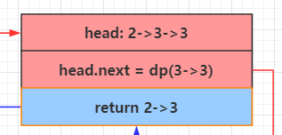

   这一层的返回值，会判断head->val == head->next->val ？可以知道是 $！=$，所以返回head，同时head->next是上一层的结果3

#### [82. 删除排序链表中的重复元素 II](https://leetcode-cn.com/problems/remove-duplicates-from-sorted-list-ii/) ★★

题目描述：存在一个按升序排列的链表，给你这个链表的头节点head，请你删除链表中所有存在数字重复情况的节点，只保留原始链表中**没有重复出现**的数字。

`解法一` 双指针

```C++
class Solution {
public:
    ListNode* deleteDuplicates(ListNode* head) {
        // 设置「哑节点」 因为头节点也可能被删除，所以要设置哑节点使得所有节点地位相同
        ListNode* dummy = new ListNode(-1);
        dummy->next = head;
        
        // 指向当前遍历的节点
        ListNode* cur = head;
        // 指向当前节点的前一个节点
        ListNode* prev = dummy;
        
        while(cur != NULL){
            while(cur->next != NULL && cur->next->val ==  cur->val){
                // 如果有重复的，cur 就一直往下走
                cur = cur->next;
            }
            
            if(prev->next == cur){
                prev = prev->next; // 如果当前是重复节点，一定不会进入到这里
            }
            else{
                prev->next = cur->next;
            }
            cur = cur->next;
        }
        
        return dummy->next;
    }
};
```

`注`

1. 这个代码的关键逻辑在于：

   - 如果没有遇到重复的元素，prev指针始终在cur指针的前一位置；但是如果遇到有重复的元素，由于只有cur往前移动，所以cur和prev指针的距离会大于1；因此可以根据prev->next是否为cur来判断是否有重复的元素出现：

     - 如果没有，那么prev，cur都向前游动一个位置

     - 如果有，那么prev->next就直接指向当前cur的下一个位置（把重复的全部删除），如下图所示：

       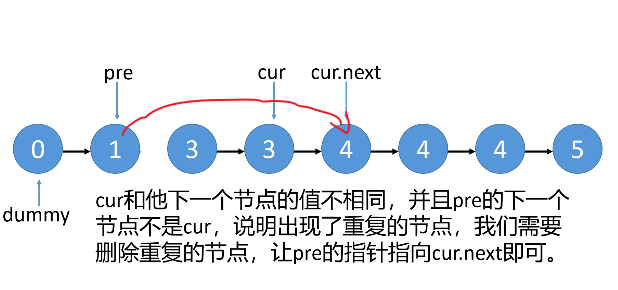
       
       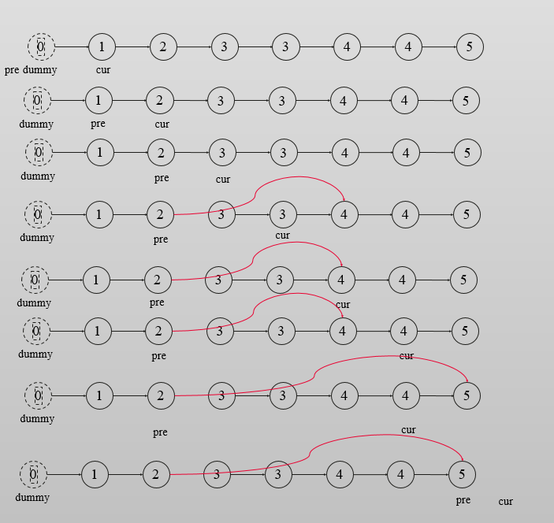

2. 参考链接：https://mp.weixin.qq.com/s/jg4XfDQCMo31tTKgmgKA6w

`解法二` 递归

```C++
class Solution {
public:
    ListNode* deleteDuplicates(ListNode* head) {
        if (!head || !head->next) {
            return head;
        }
        if (head->val != head->next->val) {
            head->next = deleteDuplicates(head->next);
        } else {
            ListNode* move = head->next;
            while (move && head->val == move->val) {
                move = move->next;
            }
            return deleteDuplicates(move);
        }
        return head;
    }
};
```

##### 对比82、83题的递归解法

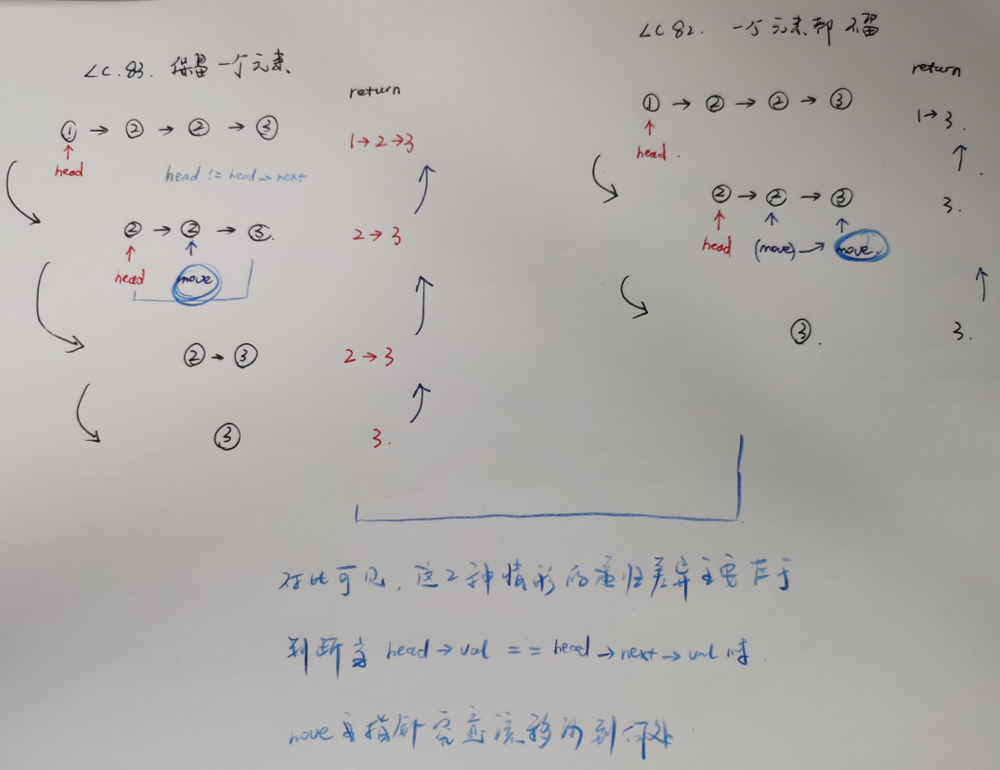


#### [19. 删除链表的倒数第 N 个结点](https://leetcode-cn.com/problems/remove-nth-node-from-end-of-list/)

题目描述：给你一个链表，删除链表的倒数第 `n` 个结点，并且返回链表的头结点。

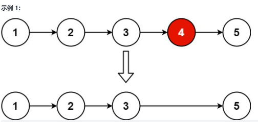

```C++
class Solution {
public:
    ListNode* removeNthFromEnd(ListNode* head, int n) {
        stack<ListNode*> stk; // 先进后出栈
        ListNode* dummy = new ListNode(-1, head);
        ListNode* cur = dummy;
        while(cur){
            stk.push(cur);
            cur = cur->next;
        }

        ListNode* top;
        for(int i = 0; i < n + 1; ++i){
            top = stk.top();
            stk.pop();
        }

        top->next = top->next->next;

        return dummy->next;
    }
};
```

`思路`

本题的思路是，首先利用栈返回链表的倒数k+1个元素，然后让其删除下一个；

所以需要考虑如果k等于链表长度的话怎么办，因此设置一个dummy节点


#### [141. 环形链表 ](https://leetcode-cn.com/problems/linked-list-cycle/)  链表中环的入口节点 ★

题目描述：给定一个链表，返回链表开始入环的第一个节点。 如果链表无环，则返回 NULL

```C++
class Solution {
public:
    ListNode *detectCycle(ListNode *head) {
        ListNode *fast = head, *slow = head;

        while(fast != NULL && fast->next != NULL){
            // 首先判断是否有环，利用快慢指针，若有环，必在环内相遇
            fast = fast->next->next;
            slow = slow->next;
            if(fast == slow){
                // 有环，继续重新设置快慢节点，用来查找环的起点
                fast = head;
                while(fast != slow){
                    fast = fast->next;
                    slow = slow->next;
                }
                return slow;
            }
        }
        return NULL;
    }
};
```

`注`

1. 本题需要考虑以下几个点，编程并不难，主要是思路问题

   1： **fast指针一定先进入环中，如果fast 指针和slow指针相遇的话，一定是在环中相遇，这是毋庸置疑的。**

   2：如果有环，如何找到这个环的入口
   
   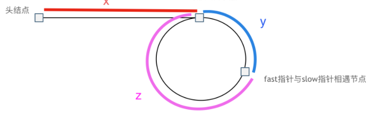

```swift
那么相遇时：
slow指针走过的节点数为: x + y
fast指针走过的节点数：  x + y + n*(y + z)，n为fast指针在环内走了n圈才遇到slow指针，（y+z）为一圈内节点的个数
因为fast指针是一步走两个节点，slow指针一步走一个节点， 所以 fast 指针走过的节点数 = slow 指针走过的节点数 * 2 
(x + y) * 2 = x + y + n (y + z)
两边消掉一个（x+y） 
x + y = n (y + z)
因为我们要找环形的入口，那么要求的是x，因为x表示 头结点到 环形入口节点的的距离。
所以我们要求x ，将x单独放在左面：
x = n (y + z) - y
在从 n(y+z) 中提出一个（y+z）来，整理公式之后为如下公式：
x = (n - 1) (y + z) + z 
注意这里n一定是大于等于1的，因为 fast指针至少要多走一圈才能相遇slow指针
这个公式说明什么呢，先拿n为1的情况来举例，意味着fast指针在环形里转了一圈之后，就遇到了 slow指针了。
当 n为1的时候，公式就化解为 $x = z$ 这就意味着，从头结点出发一个指针，从相遇节点 也出发一个指针，这两个指针每次只走一个节点， 那么当这两个指针相遇的时候就是 环形入口的节点
```


#### [剑指 Offer 24. 反转链表](https://leetcode-cn.com/problems/fan-zhuan-lian-biao-lcof/)

#### [206. 反转链表](https://leetcode-cn.com/problems/reverse-linked-list/)

**题目描述：定义一个函数，输入一个链表的头节点，反转该链表并输出反转后链表的头节点**

`法一 递归`

```C++
class Solution {
public:
    ListNode* reverseList(ListNode* head) {
        // 递归结束条件
        if(head == NULL || head->next == NULL) return head;

        ListNode* newHead = reverseList(head->next);
        
        // 下面这行错误，应当写成下下行的样子，因为这里是后序遍历的位置，递归到最深层逐个出栈，所以应该拿与入参相关的量做文章
        //newHead->next = head;
        head->next->next = head;
        
        head->next = NULL;

        return newHead;
    }
};
```

`法二 迭代`

```C++
class Solution {
public:
    ListNode* reverseList(ListNode* head) {
        ListNode* prev = NULL;
        ListNode* cur = head;

        while(cur != NULL){
            ListNode* temp = cur->next;
            cur->next = prev;
            prev = cur;
            cur = temp;
        }

        return prev;
    }
};
```

`注`

1. 通常 `反转链表的题目可以有迭代和递归（又分为前序和后序两种）两种解题方法，在这道题目中，由于是要反转链表，也就是说最后是要拿到入栈到最深处的指针然后返回的，所以使用后序遍历的方式会更简单`

2. 这题中：
   - 迭代：
     - 时间复杂度：O(n)，其中 n 是链表的长度。需要遍历链表一次。
     - 空间复杂度：O(1)
   - 递归
     - 时间复杂度：O(n)，其中 n 是链表的长度。需要对链表的每个节点进行反转操作。
     - 空间复杂度：O(n)，其中 n 是链表的长度。空间复杂度主要取决于递归调用的栈空间，最多为 n 层。
3. 这个题目虽然是简单题，但是就是要通过简单题夯实基础！！！！


#### [92. 反转链表 II](https://leetcode-cn.com/problems/reverse-linked-list-ii/)

题目描述：给你单链表的头指针 head 和两个整数 left 和 right ，其中 left <= right 。请你反转从位置 left 到位置 right 的链表节点，返回 反转后的链表 。

`整个题目可以有下面两种方法，第一种是自己想的朴素的接替方法；另一种是所谓的头插法`

`法1 朴素双指针法`    

```C++
/**
 * Definition for singly-linked list.
 * struct ListNode {
 *     int val;
 *     ListNode *next;
 *     ListNode() : val(0), next(nullptr) {}
 *     ListNode(int x) : val(x), next(nullptr) {}
 *     ListNode(int x, ListNode *next) : val(x), next(next) {}
 * };
 */
class Solution {
public:
    ListNode* reverseBetween(ListNode* head, int left, int right) {
        // dummy node, whatever the value, next pointer initialize by head
        ListNode* dummy = new ListNode(0, head);
        ListNode* prev = dummy;
        ListNode* cur = head;

        int cnt = 1;
        while(cur && cnt < left){
            prev = prev->next;
            cur = cur->next;
            cnt++;
        }

        ListNode* tail = prev;
        ListNode* start = cur;

        while(cur && cnt <= right){
            ListNode* nxt = cur->next;
            cur->next = prev;
            prev = cur;
            cur = nxt;
            cnt++;
        }

        tail->next = prev;
        start->next = cur;


        return dummy->next;
    }
};
```

需要特别注意start那一部分，防止被污染


`法2 头插法`

```C++
class Solution {
public:
    ListNode* reverseBetween(ListNode* head, int left, int right) {
        // 设置哑节点
        ListNode* dummy = new ListNode(0, head);
        ListNode* prev = dummy;
        ListNode* cur = head;

        int cnt = 1;
        while(cur && cnt < left){
            prev = prev->next;
            cur = cur->next;
            cnt++;
        }

        while(cur && cnt < right){
            ListNode* remove = cur->next;
            cur->next = cur->next->next;

            // 这种写法是错误的
            //prev->next = remove;
            //remove->next = cur;


            // 这种写法是正确的
            remove->next = prev->next;
            prev->next = remove;
            
            cnt++;            

        }

        return dummy->next;
    }
};
```

这种方法的原理如下图所述：

```swift
1、我们定义两个指针，分别称之为 g(guard 守卫) 和 p(point)。
我们首先根据方法的参数 m 确定 g 和 p 的位置。将 g 移动到第一个要反转的节点的前面，将 p 移动到第一个要反转的节点的位置上。我们以 m=2，n=4为例。
2、将 p 后面的元素删除，然后添加到 g 的后面。也即头插法。
3、根据 m 和 n 重复步骤（2）
4、返回 dummyHead.next
```

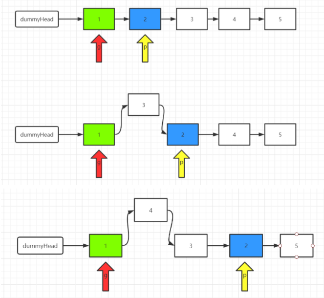

但是，这种方法需要特别注意，如上述代码中所示，有`2点需要特别注意`

`第一点` 指针的指向问题，如果按照上面错误的方式来写，也即是

```C++
remove->next = cur;
```

那么在第二个while循环时，第一轮没有问题，但是当第二次循环的时候，由于cur一直是2保持不变，所以第二次4的next会是2，而把3跳过了导致错误。

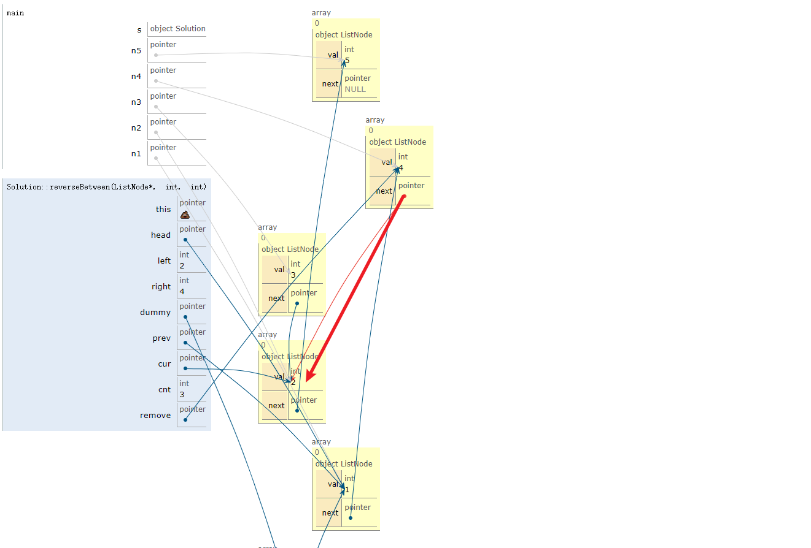

`第一点` 顺序问题

```C++
remove->next = prev->next;
prev->next = remove;
```

注意必须是这样的顺序，如果调换顺序的话会导致prev->next被污染了

##### 通用解法-abcd法

```C++
class Solution {
public:
    ListNode* reverseBetween(ListNode* head, int left, int right) {
        ListNode* dummy = new ListNode(0, head);

        ListNode* pre = dummy;
        ListNode* cur = dummy;

        int cnt = 1;

        while(cur && cnt < left){
            cnt++;
            pre = cur;
            cur = cur->next;
        }

        ListNode* a = cur;
        ListNode* b = cur->next;

        while(cur && cnt <= right){
            cnt++;
            pre = cur;
            cur = cur->next;
        }

        ListNode* c = cur;
        ListNode* d = cur->next;

        c->next = NULL;

        c = reverse(b);
        a->next = c;
        b->next = d;

        return dummy->next;
    }

private:
    ListNode* reverse(ListNode* head) {
        ListNode* pre = NULL;
        ListNode* cur = head;

        while(cur){
            ListNode* nxt = cur->next;
            cur->next = pre;
            pre = cur;
            cur = nxt;
        }

        return pre;
    }
};
```


#### [25. K 个一组翻转链表](https://leetcode-cn.com/problems/reverse-nodes-in-k-group/)

给你一个链表，每 k 个节点一组进行翻转，请你返回翻转后的链表。k 是一个正整数，它的值小于或等于链表的长度。如果节点总数不是 k 的整数倍，那么请将最后剩余的节点保持原有顺序。

**进阶：**

- 你可以设计一个只使用常数额外空间的算法来解决此问题吗？

`这个问题通常也是使用递归或者迭代的方式来解决,并且其实由于涉及到每翻转一次都要链接前后两个部分,所以迭代并不会比递归更简单;`

`进一步地,迭代可以作为本题进阶要求的解法,因为它使用的是常数空间`

`法一 迭代法`

首先回顾一下最基础的知识，**翻转以head为头节点的链表** 的做法

```C++
ListNode* reverse(ListNode* head){
    ListNode* prev = NULL;
    ListNode* cur = head;

    while(cur != NULL){
        ListNode* nxt = cur->next;
        cur->next = prev;
        prev = cur;
        cur = nxt;
    }

    return prev;
}
```

有了上面的基础,要K个一组翻转链表,只需要每次确定要反转的范围,翻转然后链接好就行了

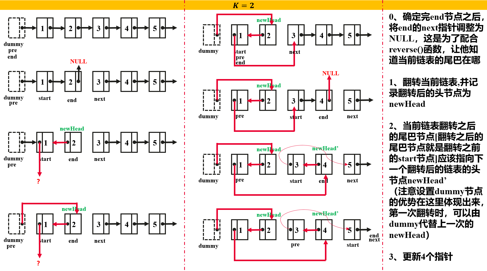

```C++
class Solution {
public:
    /*
    * @start: 这一次反转的子链表的头节点
    * @end: 这一次反转的子链表的尾节点（闭合）
    * @next：下一次需要反转的子链表的头节点
    * @pre：上一次反转后的尾巴节点（翻转前的头节点）
    */
    ListNode* reverseKGroup(ListNode* head, int k) {
        // 设置哑节点
        ListNode* dummy = new ListNode(0, head);
        ListNode* pre = dummy;
        ListNode* end = dummy;

        while(end->next != NULL){
            for(int i = 0; i < k && end != NULL; ++i){
                end = end->next;
            }
            if(end == NULL) break;

            ListNode* start = pre->next;
            ListNode* next = end->next;

            end->next = NULL;
            pre->next = reverse(start);

            start->next = next;
            pre = start;  
            end = start;
        }
        
        return dummy->next;
    }

private:
    ListNode* reverse(ListNode* head){
        ListNode* prev = NULL;
        ListNode* cur = head;

        while(cur != NULL){
            ListNode* nxt = cur->next;
            cur->next = prev;
            prev = cur;
            cur = nxt;
        }

        return prev;
    }
};
```


`法二 递归法`

```C++
class Solution {
public:
    ListNode* reverseKGroup(ListNode* head, int k) {
        if(head == NULL) return 0;

        ListNode* begin = head;
        ListNode* end = head;
        for(int i = 0; i < k; ++i){
            if(end == NULL) return head;
            end = end->next;
        }

        ListNode* newHead = reverseAb(begin, end);

        begin->next = reverseKGroup(end, k);

        return newHead;
    }

private:
    ListNode* reverseAb(ListNode* A, ListNode* B){
        ListNode* prev = NULL;
        ListNode* cur = A;
        

        while(cur != B){
            ListNode* nxt = cur->next;
            cur->next = prev;
            prev = cur;
            cur = nxt;
            
        }

        // 注意返回值
        return prev;
    }

};
```

##### 通用解法-abcd法

由于在链表翻转的过程中涉及到指针的交换以及链表的拼接，因此总是会造成弄混；因此使用abcd法可以非常好的避免混乱，形成秩序

`这个方法最关键的几步分为：`

1. 找到 a,b,c,d四个点；分别代表了割裂链表的连接点，比如说如下图所示：第一次找到要翻转链表的尾巴后，就可以知道要翻转的是前三个实线节点，那么abcd如下标注；

   第二次要翻转的是后三个节点，那么更新abcd

   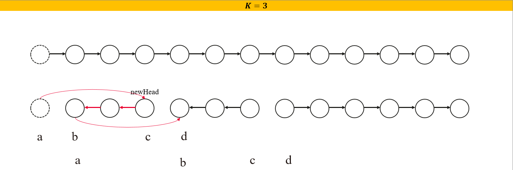

2. 翻转完成后要使用abcd来拼接链表，也就是简单的使用如下两行代码就可以：

   ```C++
   a->next = c;
   b->next = d;
   ```

`完整的代码如下：`

```C++
class Solution {
public:

    ListNode* reverseKGroup(ListNode* head, int k) {
        // 设置哑节点
        ListNode* dummy = new ListNode(0, head);
        ListNode* pre = dummy;
        ListNode* cur = dummy;

        while(cur){
            ListNode* a = pre;
            ListNode* b = pre->next;

            // 找到每一次的结尾
            for(int i = 0; i < k && cur != NULL; ++i){
                if(cur->next == NULL) return dummy->next;
                cur = cur->next;
            }

            ListNode* c = cur;
            ListNode* d = cur->next;

            c->next = NULL;
            c = reverse(b);

            a->next = c;
            b->next = d;

            pre = b;
            cur = b;

        }

        return dummy->next;
    }

private:
    ListNode* reverse(ListNode* head){
        ListNode* prev = NULL;
        ListNode* cur = head;

        while(cur != NULL){
            ListNode* nxt = cur->next;
            cur->next = prev;
            prev = cur;
            cur = nxt;
        }

        return prev;
    }
};
```


#### [剑指 Offer 25. 合并两个排序的链表](https://leetcode-cn.com/problems/he-bing-liang-ge-pai-xu-de-lian-biao-lcof/)

题目描述：输入两个递增排序的链表，合并这两个链表并使新链表中的节点仍然是递增排序的。

`法一：递归`

```C++
class Solution {
public:
    ListNode* mergeTwoLists(ListNode* l1, ListNode* l2) {
        if(l1 == NULL) return l2;
        else if(l2 == NULL) return l1;

        if(l1->val < l2->val){
            l1->next = mergeTwoLists(l1->next, l2);
            return l1;
        }
        else{
            l2->next = mergeTwoLists(l1, l2->next);
            return l2;
        }
    }
};
```

`注` 

1. 要注意：要将从下级函数获得的返回值，连接到当前节点的尾部

   

`迭代法`

```C++
class Solution {
public:
    ListNode* mergeTwoLists(ListNode* l1, ListNode* l2) {
        ListNode* dummy = new ListNode(0);
        ListNode* cur = dummy;
        while(l1 && l2){
           ListNode* p = (l1->val < l2->val) ? l1 : l2;
           cur->next = p;
           cur = cur->next;
           if(p == l1) l1 = l1->next;
           else l2 = l2->next;
        }

        cur->next = (l1 == NULL) ? l2 : l1;

        return dummy->next;
    }
};
```

`不要试图构建新的一个个的节点，链表的特征决定了只需要用指针将节点串起来就可以`

本题中为了省略当前p指向哪个链表的判断，可以使用`指向指针的指针技巧`，详见[一些炫酷好用的小技巧](./一些炫酷好用的小技巧.md)


`这个题目其实是一个组合拳`

> 快手一面，先让合并两个有序链表，然后让分析复杂度，接着让口述合并k个排序链表的思路，答出排序后又问有没有其他办法，当时不知道优先队列可以解，这应该是一套组合拳。

#### [23. 合并K个升序链表](https://leetcode-cn.com/problems/merge-k-sorted-lists/)

题目描述:给你一个链表数组，每个链表都已经按升序排列。请你将所有链表合并到一个升序链表中，返回合并后的链表。

`首先明确这道题使用有线队列，也就是小顶堆来解题。其次，相比于一股脑将所有链表的所有元素都一下子塞入小顶堆中，时间复杂度和空间复杂度较高；由于每个链表都是排序的，因此可以一次次的将每个链表的头元素塞进小顶堆中，这样带来的时间复杂度较小`

```C++
class Solution {
public:
    struct cmp{
        bool operator()(ListNode* a, ListNode* b){
            return a->val > b->val; // 小顶堆
        }
    };

    ListNode* mergeKLists(vector<ListNode*>& lists) {
        priority_queue<ListNode*, vector<ListNode*>, cmp> pri_queue; // 创建小顶堆
        for(auto elem : lists){
            if(elem) pri_queue.push(elem); // 将 K 个链表的头塞进小顶堆
        }

        ListNode* dummy = new ListNode(-1);
        ListNode* p = dummy;

        while(!pri_queue.empty()){
            ListNode* top = pri_queue.top();
            pri_queue.pop();
            p->next = top;
            p = top;
            if(top->next){ // 将当前链表的下一个元素塞进小顶堆
                pri_queue.push(top->next); 
            }
        }
        return dummy->next;

    }
};
```


`注`

上述解法的空间复杂度 O(k)，时间复杂度 O(**nlog(k)**)；n是所有节点个数，k是链表数


#### [剑指 Offer 35. 复杂链表的复制](https://leetcode-cn.com/problems/fu-za-lian-biao-de-fu-zhi-lcof/)

题目描述：请实现 $copyRandomList$ 函数，复制一个复杂链表。在复杂链表中，每个节点除了有一个 $next$​ 指针指向下一个节点，还有一个 $random$ 指针指向链表中的任意节点或者 $null$。

`本题的题目详细解释说明参考`：https://leetcode-cn.com/problems/copy-list-with-random-pointer/

- 复制示例图：

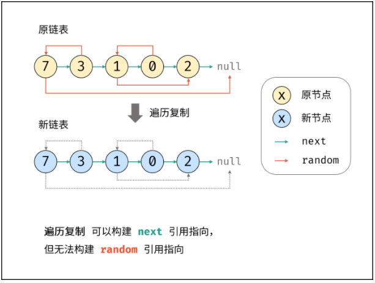

`思路一` 

```swift
整体思路：
    1. 首先可能会想到双指针边遍历边复制这种方式, 但是此方式只适合普通链表的复制
        由于本题中存在 random 属性，其指向的结点是随机的，因此双指针这种方式不行（因为链表查找元素只能一个一个遍历查找）
		所以其时间复杂度为 O(N^2)
    2. 那么问题在于，怎么使其变成可以支持快速访问呢？ --> 使用哈希表， 存储每个结点复制后的新结点；
    3. 在得到新结点与旧结点的映射关系后，怎么进行复制呢？
    4. 问题转化为 通过某种方式 将新结点按照旧结点的关系进行连线
        由于要参照旧结点的关系 ---> 一定需要遍历原始链表
    5. 连线方式：遍历到原始链表的当前结点cur, 从 map 中取出 cur 结点映射的结点 newCur, 
        我们需要做的就是 将newCur 按照 cur 在原始链表中的关系连线, 
        因为是要对 新结点 进行连线， 因此所有的结点都必须 从 map 中取对应的新结点
        newCur.next 对应的 next 在map中的映射为 map.get(cur.next);
        newCur.random 对应的 random 在 map中映射为 map.get(cur.random); 
    6. 返回头结点, 新链表的头结点也存储在 map中， 因此需要返回 map.get(head);!!!!  
```

```C++
class Solution {
public:
    Node* copyRandomList(Node* head) {
        if(head == NULL) return NULL;
        // 建立用来遍历 原链表 的指针
        Node* cur = head;
        // 哈希表 建立 “旧-新” 节点之间的对应关系
        unordered_map<Node*, Node*> um;

        // 复制各节点，并建立 “原节点 -> 新节点” 的 Map 映射
        while(cur != NULL){
            // new 用来 进行 ==> 深拷贝
            um[cur] = new Node(cur->val);
            cur = cur->next;
        }

        // 复制好节点后，遍历赋值每个节点的两个指针
        cur = head;
        while(cur != NULL){
            um[cur]->next = um[cur->next];
            um[cur]->random = um[cur->random];
            cur = cur->next;
        }

        return um[head];
    }
};
```

`注` 

1. 空间复杂度 $O(N)$，时间复杂度 $O(N)$​


#### [剑指 Offer 52. 两个链表的第一个公共节点](https://leetcode-cn.com/problems/liang-ge-lian-biao-de-di-yi-ge-gong-gong-jie-dian-lcof/)

#### [160. 相交链表](https://leetcode-cn.com/problems/intersection-of-two-linked-lists/)

题目描述：输入两个链表，找出它们的第一个公共节点

```C++
class Solution {
public:
    ListNode *getIntersectionNode(ListNode *headA, ListNode *headB) {
        ListNode* boy = headA;
        ListNode* girl = headB;

        while(boy != girl){ // 如果不相交，最后都会变成NULL，退出while
            boy = (boy == NULL) ? headB : boy->next;
            girl = (girl == NULL) ? headA : girl->next;
        }

        return boy;
    }
};
```

`注`

1. 思路：我们使用两个指针 node1，node2 分别指向两个链表 headA，headB 的头结点，然后同时分别逐结点遍历，当 node1 到达链表 headA 的末尾时，重新定位到链表 headB 的头结点；当 node2 到达链表 headB 的末尾时，重新定位到链表 headA 的头结点。

   这样，当它们相遇时，所指向的结点就是第一个公共结点。

    我的理解： 两个链表长度分别为L1+C、L2+C， C为公共部分的长度，按照楼主的做法： 第一个人走了L1+C步后，回到第二个人起点走L2步；第2个人走了L2+C步后，回到第一个人起点走L1步。 当两个人走的步数都为L1+L2+C时就两个家伙就相爱了

这不是《你的名字》的剧情么？

```swift
你变成我，走过我走过的路。
我变成你，走过你走过的路。
然后我们便相遇了..
```


#### [143. 重排链表](https://leetcode-cn.com/problems/reorder-list/)

题目描述：给定一个单链表 L 的头节点 head ，单链表 L 表示为：

```
L0 → L1 → … → Ln - 1 → Ln
```

请将其重新排列后变为：

```
L0 → Ln → L1 → Ln - 1 → L2 → Ln - 2 → …
```

```swift
不得不承认这个题挺好的，考察了很多链表的基本功

整体思路：

1、快慢指针找到中间节点
2、反转后半段链表
3、合并前半段链表和后半段链表
```

```C++
/**
 * Definition for singly-linked list.
 * struct ListNode {
 *     int val;
 *     ListNode *next;
 *     ListNode() : val(0), next(nullptr) {}
 *     ListNode(int x) : val(x), next(nullptr) {}
 *     ListNode(int x, ListNode *next) : val(x), next(next) {}
 * };
 */
class Solution {
public:
    void reorderList(ListNode* head) {
        ListNode* med = findMedium(head);

        ListNode* headB = med->next;
        med->next = NULL; // 断开前后两个链表
        headB = reverse(headB);

        merge(head, headB);
    }

private:
    ListNode* findMedium(ListNode* head){ // 快慢指针寻找链表中点
        ListNode* slow = head;
        ListNode* faster = head;

        while(faster != NULL  && faster->next != NULL){
            faster = faster->next->next;
            slow = slow->next;
        }
        return slow;
    }

    ListNode* reverse(ListNode* head){ // 链表翻转函数
        ListNode* prev = NULL;
        ListNode* cur = head;

        while(cur){
            ListNode* nxt = cur->next;
            cur->next = prev;
            prev = cur;
            cur = nxt;
        }
        return prev;
    }

    void merge(ListNode* headA, ListNode* headB){ // 链表交错合并函数,将headB链表插入到headA链表中
        ListNode* next1 = headA;
        ListNode* next2 = headB;

        while(headA && headB){
            next1 = headA->next;
            headA->next = headB;
            headA = next1;

            next2 = headB->next;
            headB->next = headA;
            headB = next2;
        }
    }
};
```

`注`

要注意，上述的寻找中点的函数在这里是特殊的，如果是偶数点，找到的是靠后的那个点，断点在靠后点的后面，因为这正是这道题需要的；

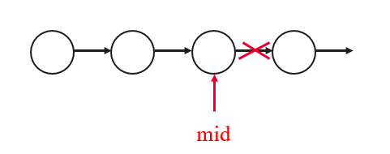

一般的，偶数节点时中点一般选择靠前面的点，如下代码所示：

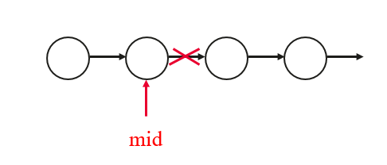

```C++
// 利用快慢指针找到链表中点
ListNode* findMid(ListNode* head){
    ListNode* slow = head;
    ListNode* fast = head;
    ListNode* cutNode = slow;

    while(fast != NULL && fast->next != NULL){
        cutNode = slow;
        fast = fast->next->next;
        slow = slow->next;
    }
    return cutNode;
}
```


#### [2. 两数相加](https://leetcode-cn.com/problems/add-two-numbers/)

题目描述：给你两个 非空 的链表，表示两个非负的整数。它们每位数字都是按照 逆序 的方式存储的，并且每个节点只能存储 一位 数字。请你将两个数相加，并以相同形式返回一个表示和的链表。

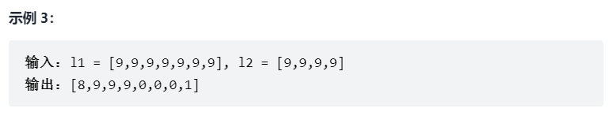

需要考虑的点有：

1. 进位问题 ===> 用carry标记进位值
2. 两个链表不等长问题 ===> 当某一链表为NULL时，遍历指针不再next前进，保持0值

```C++
class Solution {
public:
    ListNode* addTwoNumbers(ListNode* l1, ListNode* l2) {
        ListNode* dummy = new ListNode(-1);
        ListNode* cur = dummy;
        int carry = 0; // 进位标记

        while(l1 || l2){
            int x = (l1 == NULL) ? 0 : l1->val;
            int y = (l2 == NULL) ? 0 : l2->val;

            int sum = x + y + carry;
            carry = sum / 10;
            sum = sum % 10;
            cur->next = new ListNode(sum);

            cur = cur->next;

            if(l1) l1 = l1->next;
            if(l2) l2 = l2->next;
        }

        if(carry == 1) cur->next = new ListNode(carry);

        return dummy->next;
    }
};
```

`注` 

这道题非常好的揭示了加法运算的本质，值得学习

#### [445. 两数相加 II](https://leetcode-cn.com/problems/add-two-numbers-ii/)

题目描述：给你两个 **非空** 链表来代表两个非负整数。数字最高位位于链表开始位置。它们的每个节点只存储一位数字。将这两数相加会返回一个新的链表。

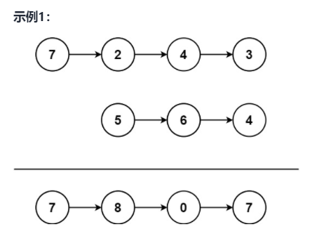

`解题思路`

1. 先把两条链表做翻转，这样就变成了上面的“两数相加”的题目，然后把相加完的结果再做翻转，就得到了结果

代码如下所示：

```C++
class Solution {
public:
    ListNode* addTwoNumbers(ListNode* l1, ListNode* l2) {
        ListNode* newl1 = reverse(l1);
        ListNode* newl2 = reverse(l2);
        ListNode* dummy = new ListNode(-1);
        ListNode* cur = dummy;
        int carry = 0;

        while(newl1 || newl2){
            int x = (newl1 == NULL) ? 0 : newl1->val;
            int y = (newl2 == NULL) ? 0 : newl2->val;

            int sum = x + y + carry;
            carry = sum / 10;
            sum = sum % 10;
            cur->next = new ListNode(sum);

            cur = cur->next; // 小心，别漏掉

            if(newl1) newl1 = newl1->next;
            if(newl2) newl2 = newl2->next;
        }

        if(carry == 1) cur->next = new ListNode(carry);

        return reverse(dummy->next);
    }

private:
    ListNode* reverse(ListNode* head){
        ListNode* pre = NULL;
        ListNode* cur = head;

        while(cur){
            ListNode* nxt = cur->next;
            cur->next = pre;
            pre = cur;
            cur = nxt;
        }

        return pre;
    }
};
```


#### [148. 排序链表](https://leetcode-cn.com/problems/sort-list/)

题目描述：给你链表的头结点 head ，请将其按 **升序** 排列并返回 **排序后的链表** 。

- **因为链表不支持随机访问，所以用归并排序将其拆分成小段链表，排序后再连接起来效率最高**            `链表排序->使用归并排序，模板如下`

```C++
class Solution {
public:
    ListNode* sortList(ListNode* head) {
        if(head == NULL || head->next == NULL) return head;

        ListNode* cutNode = findMid(head);
        ListNode* rightHead = cutNode->next;
        // 重要，前后断链
        cutNode->next = NULL;

        ListNode* left = sortList(head); // 递归排序前一段链表
        ListNode* right = sortList(rightHead); // 递归排序前一段链表

        return mergeTwoLists(left, right);
    }

private:
    // 利用快慢指针找到链表中点
    ListNode* findMid(ListNode* head){
        ListNode* slow = head;
        ListNode* fast = head;
        ListNode* cutNode = slow;

        while(fast != NULL && fast->next != NULL){
            cutNode = slow;
            fast = fast->next->next;
            slow = slow->next;
        }
        return cutNode;
    }

    // 合并两个有序链表, 链表的合并操作不需要O(n)空间，不同于数组需要O(n)空间
    ListNode* mergeTwoLists(ListNode* list1, ListNode* list2) {
        ListNode* dummy = new ListNode(-1);
        ListNode* cur = dummy;
        while(list1 && list2){
            cur->next = (list1->val < list2->val) ? list1 : list2;
            cur = cur->next;
            if(cur == list1) list1 = list1->next;
            else list2 = list2->next;
        }
        cur->next = (list1 == NULL) ? list2 : list1;

        return dummy->next;
    }

};
```


`进阶要求：你可以在 O(n log n) 时间复杂度和常数级空间复杂度下，对链表进行排序吗？，上述的递归的写法不满足常数空间复杂度，因此改用迭代的方法`


> 参考以下两个链接：
>
> https://leetcode-cn.com/problems/sort-list/solution/pai-xu-lian-biao-di-gui-die-dai-xiang-jie-by-cherr/ （迭代的思路、图、代码）
>
> https://leetcode-cn.com/problems/sort-list/solution/148-pai-xu-lian-biao-bottom-to-up-o1-kong-jian-by-/ （递归的代码及其子函数）

迭代方法的思路如下：

```swift
bottom-to-up 的归并思路是这样的：先两个两个的 merge，完成一趟后，再 4 个4个的 merge，直到结束。举个简单的例子：[4,3,1,7,8,9,2,11,5,6].

step=1: (3->4)->(1->7)->(8->9)->(2->11)->(5->6)
step=2: (1->3->4->7)->(2->8->9->11)->(5->6)
step=4: (1->2->3->4->7->8->9->11)->5->6)
step=8: (1->2->3->4->5->6->7->8->9->11)

链表里操作最难掌握的应该就是各种断链啊，然后再挂接啊。在这里，我们主要用到操作链表的两个十分常见且重要的两个技术：

merge(l1, l2)，双路归并，我相信这个操作大家已经非常熟练的，就不做介绍了。

cut(l, n)，可能有些同学没有听说过，它其实就是一种 split 操作，即断链操作。不过我感觉使用 cut 更准确一些，它表示，将链表 l 切掉前 n 个节点，并返回 后半部分的链表头。
```

```C++
/**
 * Definition for singly-linked list.
 * struct ListNode {
 *     int val;
 *     ListNode *next;
 *     ListNode() : val(0), next(nullptr) {}
 *     ListNode(int x) : val(x), next(nullptr) {}
 *     ListNode(int x, ListNode *next) : val(x), next(next) {}
 * };
 */
class Solution {
public:
    ListNode* sortList(ListNode* head) {
        int length = getLength(head);
        ListNode* dummy = new ListNode(-1, head);

        // 核心代码，bottom-to-up 迭代完成归并排序
        for(int step = 1; step < length; step *= 2){
            ListNode* tail = dummy;
            ListNode* cur = dummy->next;

            while(cur){
                ListNode* left = cur;
                ListNode* right = cut(cur, step);
                cur = cut(right, step);

                tail->next = merge(left, right);
                while(tail->next){
                    tail = tail->next;
                }
            }
        }
        return dummy->next;
    }

private:
    // 返回链表长度
    int getLength(ListNode* head){
        int count = 0;
        while(head){
            head = head->next;
            count++;
        }
        return count;
    }

    // 断链操作，切断以head为头，长度为step的链表，并返回断链的后一个节点
    ListNode* cut(ListNode* head, int step){
        ListNode* cur = head;
        while(--step && cur){
            cur = cur->next;
        }

        if(!cur) return NULL; //这句很重要

        ListNode* next = cur->next;
        cur->next = NULL;

        return next;
    }

    // 链表合并操作，递增的双路合并
    ListNode* merge(ListNode* headA, ListNode* headB){
        ListNode* dummy = new ListNode(-1, headA);
        ListNode* cur = dummy;

        while(headA && headB){
            cur->next = (headA->val < headB->val) ? headA : headB;
            cur = cur->next;
            if(cur == headA) headA = headA->next;
            else headB = headB->next;
        }

        cur->next = (headA == NULL) ? headB : headA;

        return dummy->next;
    }
};
```


#### [138. 复制带随机指针的链表](https://leetcode-cn.com/problems/copy-list-with-random-pointer/)

题目描述：（深拷贝一条带有随机指针的链表，链表中节点的结构如下代码所示）

```C++
// Definition for a Node.
class Node {
public:
    int val;
    Node* next;
    Node* random;
    
    Node(int _val) {
        val = _val;
        next = NULL;
        random = NULL;
    }
};
```


`思路`：这道题的思路比较清新脱俗，分为三个步骤：

`第一步：在每个原节点后面创建一个新节点`

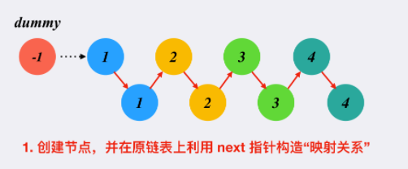

`第二步：设置每一个新创建节点的随机指针`

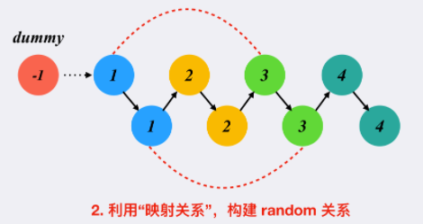

`第三步：挑出我们需要的部分链表`

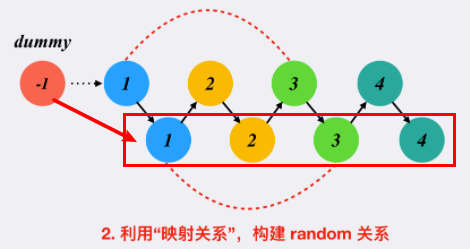

此处的代码比较具有的技巧性，可以多看几遍多学习：

```C++
class Solution {
public:
    Node* copyRandomList(Node* head) {
        // 步骤1 在每个节点后面建立一个新的节点
        Node* cur = head;
        while(cur){
            Node* nxt = cur->next;
            Node* newNode = new Node(cur->val);
            cur->next = newNode;
            newNode->next = nxt;
            cur = nxt;
        }

        // 步骤2 关键 设置每个新增节点的随机指针
        cur = head; // 指针复位到链表头
        while(cur){
            if(cur->random){
                cur->next->random = cur->random->next;
            }
            cur = cur->next->next; // cur如果存在，cur->next一定存在，因此这里不用判断cur->next
        }

        // 步骤3 挑出需要的部分链表
        Node* dummy = new Node(-1);
        cur = head;
        Node* link = dummy;

        while(cur){
            link->next = cur->next;                                 
            link = link->next;
            cur->next = link->next;
            cur = cur->next;
        }

        return dummy->next;
    }
};  
```

`注`

特别是两个while块里面的代码，值得品味！！！


#### [234. 回文链表](https://leetcode-cn.com/problems/palindrome-linked-list/)

题目描述：给你一个单链表的头节点 head，请你判断该链表是否为回文链表。如果是，返回 true；否则，返回 false

```swift
进阶：你能否用 O(n) 时间复杂度和 O(1) 空间复杂度解决此题？
```

`思路：由于要求O(1)的时间复杂度，所以 可以对链表中间往后的部分进行链表的反转操作，然后逐一判断`

```C++
class Solution {
public:
    bool isPalindrome(ListNode* head) {
        ListNode* newHead = reverse(findMid(head));
        while(head && newHead){ // 奇数点的时候，中点不做判断
            if(head->val != newHead->val){
                return false;              
            }
            head = head->next;
            newHead = newHead->next;
        }
        return true;
    }

private:
    ListNode* findMid(ListNode* head){
        ListNode* fast = head;
        ListNode* slow = head;
        ListNode* cutNode = slow;

        while(fast && fast->next){
            cutNode = slow;
            fast = fast->next->next;
            slow = slow->next;
        }
        cutNode->next = NULL;

        return slow;
    }

    ListNode* reverse(ListNode* head){
        ListNode* pre = NULL;
        ListNode* cur = head;

        while(cur){
            ListNode* nxt = cur->next;
            cur->next = pre;
            pre = cur;
            cur = nxt;
        }
        return pre;
    }
};
```

#### [61. 旋转链表](https://leetcode-cn.com/problems/rotate-list/)

题目描述：给你一个链表的头节点 head ，旋转链表，将链表每个节点向右移动 k 个位置

`解题思路`

1. 链接尾节点和头节点，形成环形链表
2. 要注意的是，k >= n 的情况，其中，n为链表长度；所以实际的移动位置为 k % n；因此`将链表的 n - n%k 的节点的next指针设置为NULL`

```C++
class Solution {
public:
    ListNode* rotateRight(ListNode* head, int k) {
        if(head == NULL) return 0;

        int n = getLength(head);
        k = k % n;
        int move = n - k; // 需要从move处断链

        ListNode* last = head;
        while(last->next){
            last = last->next;
        }
        last->next = head;

        ListNode* cur = head;
        for(int i = 0; i < move - 1; i++){
            cur = cur->next;
        }
        ListNode* newHead = cur->next;
        cur->next = NULL;

        return newHead;
    }

private:
    int getLength(ListNode* head){
        int count = 0;
        while(head){
            count++;
            head = head->next;
        }
        
        return count;
    }
};
```


#### [86. 分隔链表](https://leetcode-cn.com/problems/partition-list/)

题目描述：给你一个链表的头节点 head 和一个特定值 x ，请你对链表进行分隔，使得所有 小于 x 的节点都出现在 大于或等于 x 的节点之前。你应当 保留 两个分区中每个节点的初始相对位置。

`解题思路：这里可以运用两个dummy节点，小于x的节点挂在一条链表上，其余的挂在另一条链表上`

```C++
class Solution {
public:
    ListNode* partition(ListNode* head, int x) {
        // 关键是设置两个 dummy 节点
        ListNode* dummyless = new ListNode(-1);
        ListNode* p1 = dummyless;
        ListNode* dummymore = new ListNode(-1);
        ListNode* p2 = dummymore;

        ListNode* cur = head;
        while(cur){
            if(cur->val < x){
                p1->next = cur;
                p1 = p1->next;
            }
            else{
                p2->next = cur;
                p2 = p2->next;
            }

            cur = cur->next;
        }
        p1->next = dummymore->next;
        p2->next = NULL;

        return dummyless->next;
    }
};
```

`注`

1. `特别需要注意的是，这种链表的拼接操作时一定要注意链表在上面时候是结尾，也就是通常后一段链表挂在前一段的时候，后一段的末尾是否设置为NULL`

   正如上述代码中，当p2走出循环时，如果p2指向的不是原先链表的最后一个元素，那么其next指针必定还有值，这样会导致链表形成环！！！！

   所以要设置   

   ```C++
   p2->next = NULL
   ```

   


### 双向链表、环形链表

#### [剑指 Offer 36. 二叉搜索树与双向链表](https://leetcode-cn.com/problems/er-cha-sou-suo-shu-yu-shuang-xiang-lian-biao-lcof/)

题目描述：输入一棵`二叉搜索树`，将该二叉搜索树转换成一个排序的`循环双向链表`。要求不能创建任何新的节点，只能调整树中节点指针的指向。`

```C++
class Solution {
public:
    // head 最终结果的头节点， pre 当前节点cur 的前一个节点
    Node* head = NULL, *pre = NULL;

    Node* treeToDoublyList(Node* root) {
        if(root == NULL) return NULL;
        dfs(root);
        // 循环，首尾相连
        head->left = pre;
        pre->right = head;

        return head;
    }

    void dfs(Node* cur){
        if(cur == NULL) return;

        dfs(cur->left);
        
        /* 中序遍历 开始 */
        if(pre != NULL){
            pre->right = cur;
        }
        // 说明是根节点
        else{
            head = cur;

        }            
        cur->left = pre;
        pre = cur;
		/* 中序遍历 结束 */
        
        dfs(cur->right);
    }
};
```

`注`

1. 完成 $dfs()$​ ​各步，只是将**二叉树**变成了**双向排序链表**，我们还需要将链表的首尾连接到一起，将其变成**双向循环排序链表**

   ```C++
   // 循环，首尾相连
   head->left = pre;
   pre->right = head;
   ```


#### [142. 环形链表 II](https://leetcode-cn.com/problems/linked-list-cycle-ii/)

题目描述：给定一个链表，返回链表开始入环的第一个节点。 如果链表无环，则返回 null

`数学推导：abc法`

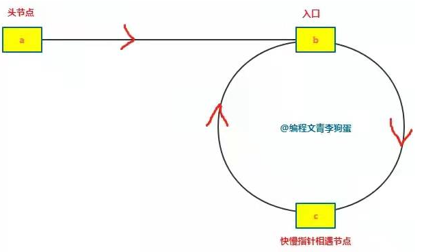

```swift
假设：
从头节点到入口的距离为 ab。
从入口到相遇点的距离为 bc。
从相遇点到入口的距离为 cb。
则链表环的长度 = bc + cb。

那么快慢指针相遇时所走过的步数为：
faststep = ab + bc + n * (bc + cb) 【公式 1】
slowstep = ab + bc 【公式 2】
n 指的是 fast 指针走过的圈数，n 的取值肯定是 n ≥ 1，因为快指针 fast 最少要多跑一圈才能追上慢指针 slow。

又由于快指针每次走 2 步，慢指针每次走 1 步，所以又有：
faststep = 2 * slowstep 【公式 3】

综合公式 1、公式 2、公式 3，得出：
ab + bc + n * (bc + cb) = 2 * (ab + bc) 【公式 4】

整理得：
ab = (n - 1) * (bc + cb) + cb 【公式 5】
其中 (n - 1) * (bc + cb) 正好是 (n - 1) 个环形的长度。

为了更好的理解公式 5，我们假设 n = 1，也就是快指针 fast 指针走一圈就可以碰到慢指针 slow。

那么公式 5 变成：
ab = cb

你看这个公式好巧妙，ab 是从节点到入口的距离，cb 是从相遇节点到入口的距离，这说明什么呢？
说明同时从头节点和相遇节点出发的两个指针，每次走 1 步，最终会在入口处相遇。

那么，当 n = 2/3/4...的时候呢，其实就是多绕了几圈而已
ab = (n - 1) * (bc + cb) + cb
slow指针从c节点开始，faster指针从head节点开始，，于是slow绕完n -1圈后回到c,再走cb长度就能和faster指针在环入口处相遇了！！
```

```C++
class Solution {
public:
    ListNode *detectCycle(ListNode *head) {
        ListNode* slow = head;
        ListNode* faster = head;
        while(faster != NULL && faster->next != NULL){
            faster = faster->next->next;
            slow = slow->next;
            if(faster == slow){ // 有环
                faster = head;
                while(faster != slow){  // 双 while 循环
                    faster = faster->next;
                    slow = slow->next;
                }
                return slow;
            }
        }

        return NULL; // 无环
    }
};
```

