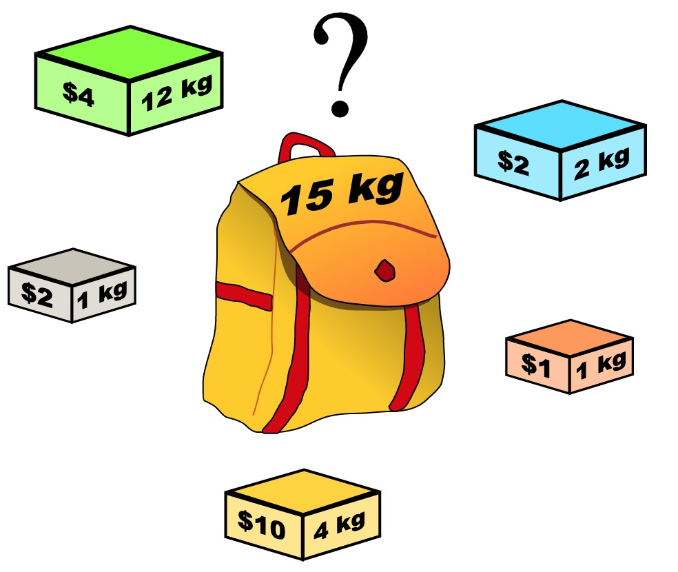

# 动态规划之背包问题

## 背包问题分类

- 01背包：即一个商品如果可以重复多次放入是完全背包，而只能放入一次是01背包
- 完全背包：完全背包又是也是01背包稍作变化而来，即完全背包的物品数量是无限的
- 多重背包

### 界定背包问题


**背包问题的理论基础重中之重是01背包，一定要理解透！**


## 0-1 背包问题

### 问题描述

有 N 件物品和一个最多能背重量为 W 的背包。第 i 件物品的重量是 weight[i]，价值是 value[i] 。**每件物品只能用一次**，求解将哪些物品装入背包里物品价值总和最大。



### 解决方案1（二维dp）

**定义状态转移数组 $dp[i][j]$ ，表示**下标为[0-i]的物品里任意取**，背包限制重量为 j 的情况下能装的最大价值。**

例如，$dp[3][4]=6$，表示用前3个物品装入重量为4的背包所能获得的最大价值为6，此时并不是3个物品全部装入，而是3个物品满足装入背包的条件下的最大价值。

#### 确定递推公式

有两个方向可以得到$dp[i][j]$，

- **不放物品i**：由$dp[i - 1$][j]推出，即背包容量为 j，里面不放物品i的最大价值，此时$dp[i][j]$就是$dp[i - 1$][j]。(其实就是当物品i的重量大于背包j的重量时，物品i无法放进背包中，所以被背包内的价值依然和前面相同。)
- **放物品i**：由$dp[i - 1][j - weight[i]]$推出，$dp[i - 1][j - weight[i]] $为背包容量为j - weight[i]的时候不放物品i的最大价值，那么$dp[i - 1][j - weight[i]] + value[i]$ （物品i的价值），就是背包放物品i得到的最大价值

所以递归公式：$ dp[i][j] = max(dp[i - 1][j], dp[i - 1][j - weight[i]] + value[i])$

```C++
void test_2_wei_bag_problem1() {
    vector<int> weight = {1, 3, 4};
    vector<int> value = {15, 20, 30};
    int bagWeight = 4;

    // 二维数组
    vector<vector<int>> dp(weight.size(), vector<int>(bagWeight + 1, 0));

    // 初始化
    for (int j = weight[0]; j <= bagWeight; j++) {
        dp[0][j] = value[0];
    }

    // weight数组的大小 就是物品个数
    for(int i = 1; i < weight.size(); i++) { // 遍历物品
        for(int j = 0; j <= bagWeight; j++) { // 遍历背包容量
            if (j < weight[i]) dp[i][j] = dp[i - 1][j];
            else dp[i][j] = max(dp[i - 1][j], dp[i - 1][j - weight[i]] + value[i]);

        }
    }

    cout << dp[weight.size() - 1][bagWeight] << endl;
}

int main() {
    test_2_wei_bag_problem1();
}
```

### 解决方案2（一维dp）

基于解决方案1，对于背包问题其实状态都是可以压缩的；也就是使用滚动数组

在使用二维数组的时候，递推公式：$dp[i][j] = max(dp[i - 1][j], dp[i - 1][j - weight[i]] + value[i])$

**其实可以发现如果把dp[i - 1]那一层拷贝到dp[i]上，表达式完全可以是：$dp[i][j] = max(dp[i][j], dp[i][j - weight[i]] + value[i])$**

**与其把dp[i - 1]这一层拷贝到dp[i]上，不如只用一个一维数组了**，只用dp[j]（一维数组，也可以理解是一个滚动数组）。

这就是滚动数组的由来，需要满足的条件是上一层可以重复利用，直接拷贝到当前层。

在一维dp数组中，dp[j]表示：容量为j的背包，所背的物品价值可以最大为dp[j]。

所以递归公式为：

```
dp[j] = max(dp[j], dp[j - weight[i]] + value[i]);
```

#### 确定遍历顺序

二维dp遍历的时候，背包容量是从小到大，而一维dp遍历的时候，背包是从大到小。

`这是为了确保旧值在未使用前不被覆盖`

```C++
void test_1_wei_bag_problem() {
    vector<int> weight = {1, 3, 4};
    vector<int> value = {15, 20, 30};
    int bagWeight = 4;

    // 初始化
    vector<int> dp(bagWeight + 1, 0);
    for(int i = 0; i < weight.size(); i++) { // 遍历物品
        for(int j = bagWeight; j >= weight[i]; j--) { // 遍历背包容量
            dp[j] = max(dp[j], dp[j - weight[i]] + value[i]);
        }
    }
    cout << dp[bagWeight] << endl;
}

int main() {
    test_1_wei_bag_problem();
}
```


### 题目转化为01背包

#### [416. 分割等和子集](https://leetcode-cn.com/problems/partition-equal-subset-sum/)

题目描述：给你一个 **只包含正整数** 的 **非空** 数组 nums  请你判断是否可以将这个数组分割成两个子集，使得两个子集的元素和相等。

```C++
class Solution {
public:
    // 特点1：每个元素只能选择一次；特点2：背包容量为数组中值的总和的1/2；
    // 所以：每个物品的价值为数组中每个元素的数值；每个物品的质量也是数组中每个元素的数值，因此将其转换01背包问题
    bool canPartition(vector<int>& nums) {
        // 直接选取解决方案2（一维dp）,dp[j]表示背包容量为 j 的情况下能构成的子集和的最大值
        int sum = 0;
        for(auto it : nums){
            sum += it;
        }
        if(sum % 2 != 0) return false;
        int W = sum / 2;

        // 初始化dp[j]
        vector<int> dp(W + 1, 0);
        for(int i = 0; i < nums.size(); ++i){
            for(int j = W; j >= nums[i]; --j){
                dp[j] = max(dp[j], dp[j - nums[i]] + nums[i]);
            }
        }

        if(dp[W] == W) return true;
        return false;
    }
};
```

`注`

1. 把题目往背包问题进行转换的时候，要考虑的问题是，在转换后的问题中，背包容量是是么，每个物体的质量是是么，每个物体的价值是多少以及最后要求解的原问题和最大背包价值之间存在什么样的联系

2. 针对上述具体问题：
   1. 背包的体积为sum / 2
   2. 背包要放入的商品（集合里的元素）重量为 元素的数值，价值也为元素的数值
   3. 背包如果正好装满，说明找到了总和为 sum / 2 的子集（转换关系）

3. coding方面，需要注意的是这个条件 

   ```
   for(int j = W; j >= nums[i]; --j)
   ```


#### [1049. 最后一块石头的重量 II](https://leetcode-cn.com/problems/last-stone-weight-ii/)

题目描述：大致描述为石头之间两两抵消，求最后剩下的最小值

##### 思路

> 本题其实就是`尽量`让石头分成重量相同的两堆，`相撞`之后剩下的石头最小，**这样就化解成01背包问题了**
>
> 也就是求出石头的总质量/2作为背包容量，然后求dp[j]为容量为j的背包最大可以背的石头的质量，这样就相当于在求两堆石头质量相差的最小值了

本题物品的重量为 stone[i]，物品的价值也为 stone[i]

$dp[j$] 表示容量（这里说容量更形象，其实就是重量）为j的背包，最多可以背$dp[j]$这么多价值的石头。

则，直接可以应用01背包的递推公式为：$dp[j] = max(dp[j], dp[j - weight[i]] + value[i])$

本题则是：$dp[j] = max(dp[j], dp[j - stones[i]] + stones[i])$

最后，

$dp[target]$ 里是容量为target的背包所能背的最大价值（重量）的石头

那么分成两堆石头，一堆石头的总重量是 $dp[target]$，另一堆就是 $sum - dp[target]$

**在计算target的时候，target = sum / 2 因为是向下取整，所以$sum - dp[target] $一定是大于等于$dp[target]$的**

```C++
class Solution {
public:
    int lastStoneWeightII(vector<int>& stones) {
        int sum = 0;
        for(auto it : stones){
            sum += it;
        }
        int W = sum / 2; // 向下取整
        vector<int> dp(W + 1, 0);

        for(int i = 0; i < stones.size(); ++i){
            for(int j = W; j >= stones[i]; --j){
                dp[j] = max(dp[j - stones[i]] + stones[i], dp[j]);
            }
        }

        return (sum - dp[W]) - dp[W];
    }
};
```


#### [494. 目标和](https://leetcode-cn.com/problems/target-sum/)

题目描述：大致描述为给一个式子添加正负号，使其最后的和为S，求添加的方案的数量

##### 思路

这道题有要转换为01背包问题的最大不同在于不再是求背包容量下的价值的最大值

###### 如何转换成01背包问题

假设加法的总和为x，那么减法对应的总和就是sum - x。

所以我们要求的是 x - (sum - x) = S

$x = (S + sum) / 2$

**此时问题就转化为，`装满容量为 x 背包，有几种方法`**。

看到$(S + sum) / 2 $应该担心计算的过程中向下取整有没有影响。

例如sum 是5，S是2的话其实就是无解的，所以：

```
if ((S + sum) % 2 == 1) return 0; // 此时没有方案
```

同时如果 S的绝对值已经大于sum，那么也是没有方案的。

```
if (abs(S) > sum) return 0; // 此时没有方案
```

再回归到01背包问题，为什么是01背包呢？ 因为每个物品（题目中的1）只用一次！

这次和之前遇到的背包问题不一样了，之前都是求容量为 $j$ 的背包，最多能装多少。

本题则是装满有几种方法。其实这就是一个组合问题了。

针对上述具体问题：

1. 背包的体积为 $x$
2. 背包要放入的物品重量为 元素的数值，价值也为元素的数值
3. 背包如果正好装满，有 $dp[j]$ 种方法（转换关系）

###### 确定递推公式

> 有哪些来源可以推出 dp[j] 呢？

因为：假设不考虑nums[i]的情况下，填满容量为 $j - nums[i]$的背包，有$dp[j - nums[i]]$种方法。那么只要搞到nums[i]的话，凑成$dp[j]$就有$dp[j - nums[i]] $种方法。

```swift
例如：dp[j]，j 为5，

已经有一个1（nums[i]） 的话，有 dp[4]种方法 凑成 dp[5]。（本题就是这样）√


已经有一个2（nums[i]） 的话，有 dp[3]种方法 凑成 dp[5]
已经有一个3（nums[i]） 的话，有 dp[2]中方法 凑成 dp[5]
已经有一个4（nums[i]） 的话，有 dp[1]中方法 凑成 dp[5]
已经有一个5 （nums[i]）的话，有 dp[0]中方法 凑成 dp[5]
```

那么凑整$dp[5]$有多少方法呢，也就是把 所有的 $dp[j - nums[i]]$ 累加起来。

所以求组合类问题的公式，都是类似这种：

```swift
dp[j] += dp[j - nums[i]]
```

**这个公式在后面在讲解背包解决排列组合问题的时候还会用到！**


###### dp数组的初始化

从递归公式可以看出，在初始化的时候dp[0] 一定要初始化为1，因为dp[0]是在公式中一切递推结果的起源，如果dp[0]是0的话，递归结果将都是0。

dp[0] = 1，理论上也很好解释，装满容量为0的背包，有1种方法，就是装0件物品。

dp[j]其他下标对应的数值应该初始化为0，从递归公式也可以看出，dp[j]要保证是0的初始值，才能正确的由dp[j - nums[i]]推导出来。


###### 确定遍历顺序

对于01背包问题一维dp的遍历，nums放在外循环，target在内循环，且内循环倒序。


###### 举例推导dp数组

已知输入：nums: [1, 1, 1, 1, 1], S: 3；bagSize = (S + sum) / 2 = (3 + 5) / 2 = 4


```C++
class Solution {
public:
    int findTargetSumWays(vector<int>& nums, int target) {
        int sum = 0;
        for(auto it : nums){
            sum += it;
        }
        if(abs(target) > sum) return 0;
        // 例如像 [1, 1, 1] 要组成 2
        if((sum + target) % 2 != 0) return 0;
        // 加法的总和为 x, 减法的总和就是 sum - x; 所以只要在数组中可以挑选出部分数字使得总和为 bagSize，就必定满足原式满足target条件
        int bagSize = (sum + target) / 2;
        // 问题转换为填满背包容量为bagSize有多少种方法
        vector<int> dp(bagSize + 1, 0);
        dp[0] = 1;

        for(int i = 0; i < nums.size(); ++i){
            for(int j = bagSize; j >= nums[i]; --j){
                dp[j] += dp[j - nums[i]];
            }
        }

        return dp[bagSize];
    }
};
```


###### 代码2：使用二维dp的情况下：

二维dp其实更能反映事物的本质

**其中 $dp[i][j]$ 表示的是 从$nums[0, i-1]$中选取元素使得可以填满容量为$j$的背包的方案数**

`这里注意是i-1，因为dp数组增加了一行一列，方便初始化·`

然后，第二个需要注意的点是，初始化只能初始化 $dp[0][0] = 1$，而不能如下一样的把第一列全初始化了

```C++
for(int i = 0; i <= nums.size(); ++i){
     dp[i][0] = 1; // 填满背包容量为0的方法数总是为1
}
```

因为要考虑如下的输入：nums = [0, 0, 0, 0, 1]，target = 1

所以最后的代码如下所示：

```C++
class Solution {
public:
    int findTargetSumWays(vector<int>& nums, int target) {
        int sum = 0;
        for(auto it : nums){
            sum += it;
        }
        if(abs(target) > sum) return 0;
        // 例如像 [1, 1, 1] 要组成 2
        if((sum + target) % 2 != 0) return 0;
        // 加法的总和为 x, 减法的总和就是 sum - x; 所以只要在数组中可以挑选出部分数字使得总和为 bagSize，就必定满足原式满足target条件
        int bagSize = (sum + target) / 2;
        // 问题转换为填满背包容量为bagSize有多少种方法
        vector<vector<int>> dp(nums.size() + 1, vector<int>(bagSize + 1, 0));
        // 初始化
        // for(int i = 0; i <= nums.size(); ++i){
        //     dp[i][0] = 1; // 填满背包容量为0的方法数总是为1
        // }
        dp[0][0] = 1;

        for(int i = 1; i <= nums.size(); ++i){
            for(int j = 0; j <= bagSize; ++j){
                if(j < nums[i - 1]) dp[i][j] = dp[i - 1][j];
                else dp[i][j] = dp[i - 1][j] + dp[i - 1][j - nums[i - 1]];
            }
        }

        return dp[nums.size()][bagSize];
    }
};
```


#### [474. 一和零](https://leetcode-cn.com/problems/ones-and-zeroes/)

题目描述：求最长的满足条件的子集的长度

##### 思路

> 本题其实是01背包问题！！！
>
> 只不过这个背包有两个维度，一个是 m 一个是 n，而不同长度的字符串就是不同大小的待装物品

其中，$dp[i][j]$：最多有 $i$ 个 0 和 $j$ 个 1 的 strs 的最大子集的大小为 $dp[i][j]$

- 字符串的zeroNum和oneNum相当于物品的重量（weight[i]）
- 字符串本身的个数相当于物品的价值（value[i]），`也就是说一个字符串不管长短以及0 / 1的个数，其价值均为 1`

###### 确定递推公式

$dp[i][j]$ 可以由`前一个` strs 里的字符串推导出来，假设 `当前` strs 里的字符串有zeroNum个0，oneNum个1。

$dp[i][j]$ 就可以是 $dp[i - zeroNum][j - oneNum]$ + 1

然后我们在遍历的过程中，取$dp[i][j]$的最大值。（也就是考虑要不要把当前的字符串加入到背包中）

所以递推公式：$dp[i][j] = max(dp[i][j], dp[i - zeroNum][j - oneNum] + 1)$

此时回想一下01背包的递推公式：$dp[j] = max(dp[j], dp[j - weight[i]] + value[i])$


因此，**这就是一个典型的01背包！** 只不过物品的重量有了两个维度而已

这道题的本质是有两个维度的01背包，如果大家认识到这一点，对这道题的理解就比较深入了。

=> 所以，如果采取原来的二维dp的话，在这里就会升级为三维dp

```C++
class Solution {
public:
    int findMaxForm(vector<string>& strs, int m, int n) {
        // 本质还是01背包，m和n是重量的两个维度，strs中的每个物品价值为1，要求固定背包容量下的价值的最大值
        vector<vector<int>> dp(m + 1, vector<int>(n + 1, 0));
        // 第一层遍历物品
        for(auto str : strs){
            int ZeroNum = 0;
            int OneNum = 0;
            for(char it : str){
                if(it == '1') OneNum++;
                else ZeroNum++;
            }
            // 第2层遍历背包容量（*倒序）
            for(int i = m; i >= ZeroNum; --i){
                for(int j = n; j >= OneNum; --j){
                    dp[i][j] = max(dp[i][j], dp[i - ZeroNum][j - OneNum] + 1);
                }
            }
        }
        // dp[i][j] 的含义为：最多可以有i个0和j个1的情况下，字符串的最大子集长度为dp[i][j]
        return dp[m][n];
    }
};
```


## 完全背包问题

### 问题描述

有N件物品和一个最多能背重量为W的背包。第i件物品的重量是weight[i]，得到的价值是value[i] 。**每件物品都有无限个（也就是可以放入背包多次）**，求解将哪些物品装入背包里物品价值总和最大。

### 解决方案（一维dp）

`01背包和完全背包唯一不同就是体现在遍历顺序上`

回顾一下01背包的核心代码为

```C++
for(int i = 0; i < weight.size(); i++) { // 遍历物品
    for(int j = bagWeight; j >= weight[i]; j--) { // 遍历背包容量
        dp[j] = max(dp[j], dp[j - weight[i]] + value[i]);
    }
}
```

我们知道01背包内嵌的循环是从大到小遍历，为了保证每个物品仅被添加一次。

`而完全背包的物品是可以添加多次的，所以要从小到大去遍历`，即：

```C++
// 先遍历物品，再遍历背包
for(int i = 0; i < weight.size(); i++) { // 遍历物品
    for(int j = weight[i]; j <= bagWeight; j++) { // 遍历背包容量
        dp[j] = max(dp[j], dp[j - weight[i]] + value[i]);
    }
}
```


### 内外层遍历次序问题

- 01背包中二维dp数组的两个for遍历的先后循序是可以颠倒的

- 一维dp数组的两个for循环先后循序一定是先遍历物品，再遍历背包容量

- **在完全背包中，对于一维dp数组来说，其实两个for循环嵌套顺序同样无所谓！**

原因如下：因为 dp[j] 是根据 下标j之前所对应的 dp[j] 计算出来的。 只要保证下标 j 之前的 dp[j] 都是经过计算的就可以了。

#### 遍历物品在外层循环，遍历背包容量在内层循环，状态如图：


#### 遍历背包容量在外层循环，遍历物品在内层循环，状态如图：


### 总结

1. 纯完全背包求得是能否凑成总和，和凑成总和的元素有没有顺序没关系，即：有顺序也行，没有顺序也行；则 外层for循环遍历物品，内层for遍历背包或者 外层for遍历背包，内层for循环遍历物品都可以

2. 如果要求的是方案的总数（组合数），例如[518. 零钱兑换 II](https://leetcode-cn.com/problems/coin-change-2/)的话，元素之间要求没有顺序，这个时候则只能是 外层for循环遍历物品，内层for遍历背包

例子：

```swift
我们先来看 外层for循环遍历物品（钱币），内层for遍历背包（金钱总额）的情况。
代码如下：

for (int i = 0; i < coins.size(); i++) { // 遍历物品
    for (int j = coins[i]; j <= amount; j++) { // 遍历背包容量
        dp[j] += dp[j - coins[i]];
    }
}

假设：coins[0] = 1，coins[1] = 5。
那么就是先把1加入计算，然后再把5加入计算，得到的方法数量只有{1, 5}这种情况。而不会出现{5, 1}的情况。
所以这种遍历顺序中dp[j]里计算的是组合数！

如果把两个for交换顺序，代码如下：
for (int j = 0; j <= amount; j++) { // 遍历背包容量
    for (int i = 0; i < coins.size(); i++) { // 遍历物品
        if (j - coins[i] >= 0) dp[j] += dp[j - coins[i]];
    }
}

背包容量的每一个值，都是经过 1 和 5 的计算，包含了{1, 5} 和 {5, 1}两种情况。
此时dp[j]里算出来的就是排列数！
```


### 题目转换为完全背包问题

#### [518. 零钱兑换 II](https://leetcode-cn.com/problems/coin-change-2/)

题目描述：给你一个整数数组 coins 表示不同面额的硬币，另给一个整数 amount 表示总金额。假设每一种面额的硬币有无限个。 计算并返回可以凑成总金额的硬币组合数。

> 这是一道典型的背包问题，一看到钱币数量无限，就知道这是一个完全背包。
>
> 但本题和纯完全背包不一样，**纯完全背包是能否凑成总金额（价值最大值），而本题是要求凑成总金额的个数！**

> 注意题目描述中是凑成总金额的硬币组合数，为什么强调是组合数呢？
>
> 例如示例一：
>
> 5 = 2 + 2 + 1
>
> 5 = 2 + 1 + 2
>
> 这是一种组合，都是 2 2 1。
>
> 如果问的是排列数，那么上面就是两种排列了。
>
> **组合不强调元素之间的顺序，排列强调元素之间的顺序**。 其实这一点我们在讲解回溯算法专题的时候就讲过了哈。


##### 分析

首先自然地，定义 $dp[j]$ ：凑成总金额 $j$ 的货币组合数为 $dp[j]$

所以递推公式：$dp[j] += dp[j - coins[i]]$

> `小结`        求装满背包有几种方法，一般公式都是：$dp[j] += dp[j - nums[i]]$

```C++
class Solution {
public:
    int change(int amount, vector<int>& coins) {
        vector<int> dp(amount + 1, 0);
        // 初始化
        dp[0] = 1;
        // 组合数：外层遍历物品，内层遍历背包
        for(int i = 0; i < coins.size(); ++i){
            // 完全背包：正序遍历
            for(int j = coins[i]; j <= amount; ++j){
                dp[j] += dp[j - coins[i]];
            }
        }

        return dp[amount];
    }
};
```


#### [377. 组合总和 Ⅳ](https://leetcode-cn.com/problems/combination-sum-iv/)

题目描述：给你一个由 不同 整数组成的数组 nums ，和一个目标整数 target 。请你从 nums 中找出并返回总和为 target 的元素组合的个数。

```swift
请注意，顺序不同的序列被视作不同的组合。
```

```C++
class Solution {
public:
    int combinationSum4(vector<int>& nums, int target) {
        vector<double> dp(target + 1); // C++测试用例有两个数相加超过int的数据,所以使用8字节的double
        dp[0] = 1;

        for(int j = 0; j <= target; ++j){
            for(int i = 0; i < nums.size(); ++i){
                if(j - nums[i] >= 0) dp[j] += dp[j - nums[i]];
            }
        }

        return dp[target];
    }
};
```

`注`

1. **求装满背包有几种方法，递归公式都是一样的，没有什么差别，但关键在于遍历顺序！**

   本题与[动态规划：518.零钱兑换II](https://gitee.com/link?target=https%3A%2F%2Fprogrammercarl.com%2F0518.%E9%9B%B6%E9%92%B1%E5%85%91%E6%8D%A2II.html)就是一个鲜明的对比，一个是求排列，一个是求组合，遍历顺序完全不同


#### [322. 零钱兑换](https://leetcode-cn.com/problems/coin-change/)

题目描述：给你一个整数数组 coins ，表示不同面额的硬币；以及一个整数 amount ，表示总金额。

计算并返回可以凑成总金额所需的 **最少的硬币个数** 。如果没有任何一种硬币组合能组成总金额，返回 -1 。

你可以认为每种硬币的数量是无限的。

```C++
class Solution {
public:
    int coinChange(vector<int>& coins, int amount) {
        // dp[j] 表示：凑成总金额为 j 的最少的硬币个数为 dp[j]
        vector<int> dp(amount + 1, INT_MAX);
        dp[0] = 0;
        // 对于求最小的硬币个数来说，组合数和排列数都一样，所以遍历顺序无所谓
        for(int i = 0; i < coins.size(); ++i){
            for(int j = coins[i]; j <= amount; ++j){
               if (dp[j - coins[i]] != INT_MAX) dp[j] = min(dp[j], dp[j - coins[i]] + 1);
            }
        }
        if(dp[amount] == INT_MAX) return -1;
        return dp[amount];
    }
};
```

`注`

1. 这里这个   $if (dp[j - coins[i]] != INT_MAX)$    条件很重要，否则的话会出现，INT_MAX + 1的情况，导致越界


#### [279. 完全平方数](https://leetcode-cn.com/problems/perfect-squares/)

题目描述：给你一个整数 n ，返回 和为 n 的完全平方数的 最少数量

> 这个题目可以翻译为：**完全平方数就是物品（可以无限件使用），凑个正整数 n 就是背包，问凑满这个背包 最少有多少物品？**
>
> 这样就和上述[322. 零钱兑换](https://leetcode-cn.com/problems/coin-change/)的意思一样了

```C++     
class Solution {
public:
    bool isSquare(int k){
        for(int i = 1; i <= sqrt(k); ++i){
            if(i * i == k) return true;
        }
        return false;
    }

    // 完全平方数是物品，背包容量为n，问装满背包所需的物品的最小数量
    int numSquares(int n) {
        vector<int> goods;

        for(int k = 1; k <= n; k++){
            if(isSquare(k) == true){
                goods.push_back(k);
                cout << k << endl; 
            }
        }

        int sz = goods.size();
        cout << sz << endl;
        // dp[j] 表示：整数 j 需要最少 dp[j] 个完全平方数来构成
        vector<int> dp(n + 1, INT_MAX);
        dp[0] = 0;

        for(int i = 0; i < sz; ++i){
            for(int j = goods[i]; j <= n; ++j){
                if(j - goods[i] >= 0) dp[j] = min(dp[j], dp[j - goods[i]] + 1);
            }
        }

        return dp[n];
    }
};
```

`注`

1. 经过前面的总结，这个题在这里已经可以作为一个简单题来处理了，下面给出这个题的解决过程：

   1. 将题目翻译为：**完全平方数就是物品（可以无限件使用），凑个正整数 n 就是背包，完全平方数的数值就是大小和价值，问凑满这个背包 最少有多少物品？**

   2. 给定一个数 n 求出其对应可能的物品组合，也就是小于 n 的完全平方数集合 goods[]

   3. 由于本题是求最小数！**所以本题外层for遍历背包，内层for遍历物品【排列数】，还是外层for遍历物品，内层for遍历背包【组合数】，都是可以的！**暂且采取外层物品，内层背包的形式

   4. 递推公式的获得可以根据，dp[j] 是由 dp[j - good[i]] （不要当前这个完全平方数） + 1 ，`然后求最小`

      


#### [139. 单词拆分](https://leetcode.cn/problems/word-break/)

题目描述：给你一个字符串 s 和一个字符串列表 wordDict 作为字典。请你判断是否可以利用字典中出现的单词拼接出 s

```C++
class Solution {
public:
    // 转换为完全背包：求能否恰好装满背包
    bool wordBreak(string s, vector<string>& wordDict) {
        // 将字符串数组转换成哈希表方便查找
        unordered_set<string> wordSet(wordDict.begin(), wordDict.end());
        // dp[j] 表示为：dp[j]=true 则字符串长度为 j 的部分可以被拆分为字典中的单词
        vector<bool> dp(s.size() + 1, false);
        // 初始化
        dp[0] = true;

        // 先遍历背包，再遍历物品
        for(int j = 0; j <= s.size(); ++j){
            for(int i = 0; i < j; ++i){
                string word = s.substr(i, j - i);
                // 如果确定dp[i] 是true，且 [i, j] 这个区间的子串出现在字典里，那么dp[j]一定是true
                if(wordSet.find(word) != wordSet.end() && dp[i] == true) dp[j] = true;
            }
        }

        return dp[s.size()];
    }
};
```

`注`

1. 时间复杂度：$O(n^3)$ 这是因为 substr 函数返回子串的副本还有 $O(n)$ 的复杂度


