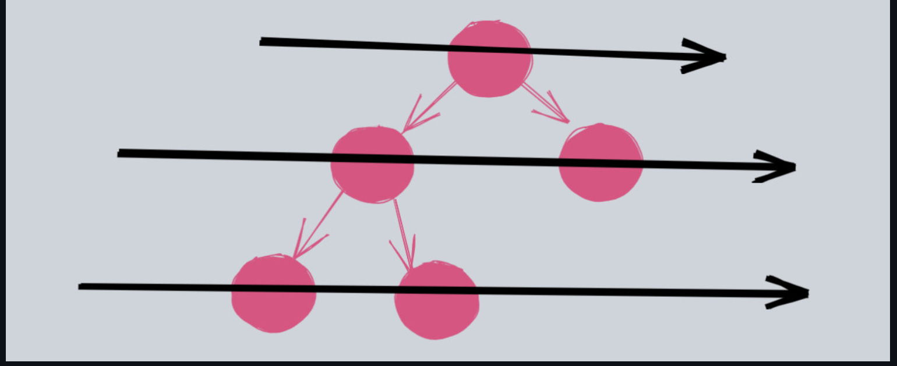

# 深度优先和广度优先算法综述

上面提到了树的遍历有两种基本方式，分别是**深度优先遍历（以下简称 DFS）和广度优先遍历（以下简称 BFS），这就是两个基本点**。这两种遍历方式下面又会细分几种方式。比如 **DFS 细分为前中后序遍历， BFS 细分为带层的和不带层的**。

**DFS 适合做一些暴力枚举的题目，DFS 如果借助函数调用栈，则可以轻松地使用递归来实现。**

### BFS 不是 层次遍历

而 BFS 适合求最短距离，这个和层次遍历是不一样的，很多人搞混。这里强调一下，层次遍历和 BFS 是**完全不一样**的东西。

层次遍历就是一层层遍历树，按照树的层次顺序进行访问。

