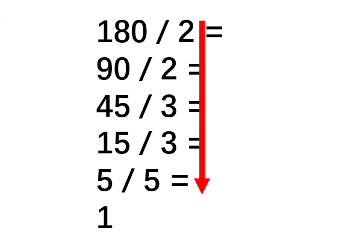
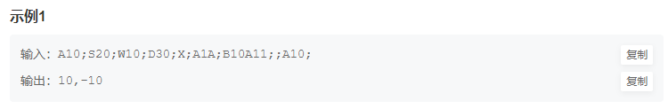
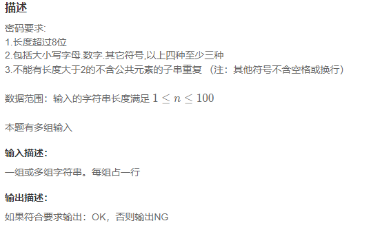
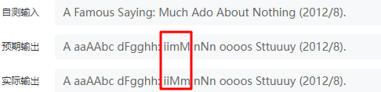
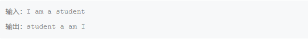
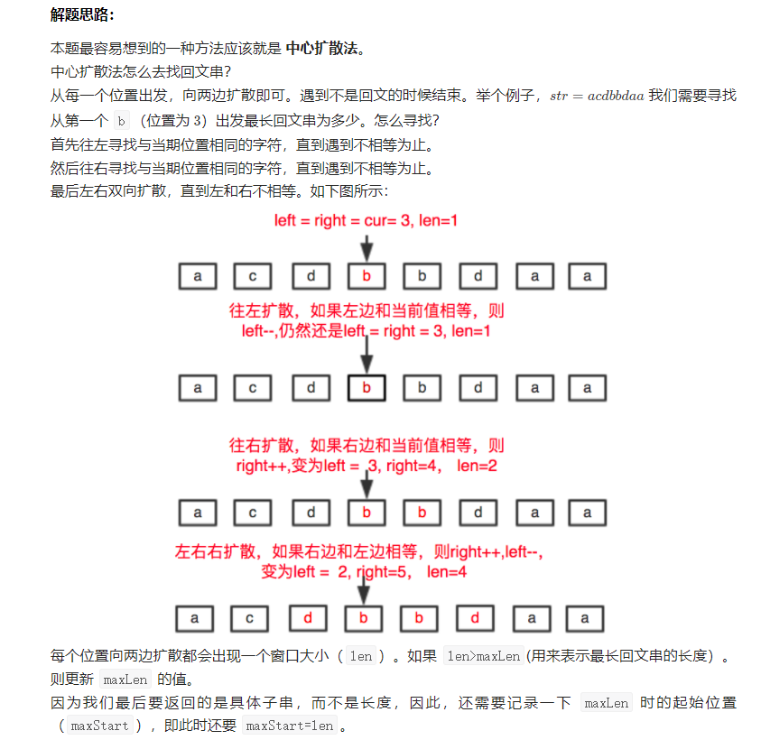
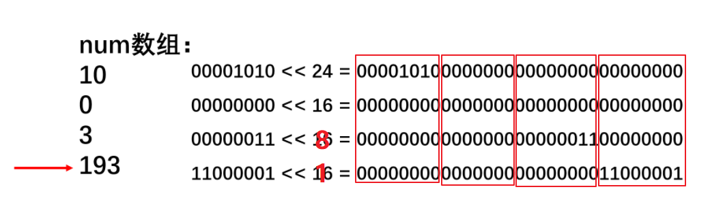

# 华为机试

> ​                                                                                                                                                                                                                                                                                         **基础不牢，地动山摇**

## 关键点（分章节叙述）

1. 注意字符串的输入输出的处理
2. 数字等多行的数据的输入
3. 字符串的常用处理
4. 成对的pair数据的输入输出
4. 正则表达式


## 字符串的输入输出

### 读入包含空格的整个字符串

```C++
char c;

string str = "";
while((c = getchar()) != '\n'){
str += c;
}
```

### C++ cin 根据空格分隔，逐个单词读入

```C++
string str;

while(cin >> str){
}
```

`C++输入cin每次只能读入一个（不含空格）字符串且遇到回车键就会结束`

### C++ cin 整行读入

```C++
string str;
getline(cin, str);
```


## 数字 「多行数据」 的输入

```C++
while(cin >> n) {    //输入每组数据的个数
    for(int i = 0; i < n; i++) {
    	int num;
    	cin >> num;    //输入数字
    }
}
```

## 字符串的常用处理

### 截取字串 ★

```C++
str1.substr(0,8); //从0位置开始，截取8个字符
```

### stoi() 函数

语法：

```C++
int stoi (const string&  str, [size_t* idx], [int base]);
```

- const string＆str是输入字符串
- size_t * idx是一个可选参数(指向由函数设置值的对象的指针)，其默认值为0或我们可以将其分配给nullptr
- **int base也是一个可选参数，默认值为10。它指定基数来确定`输入字符串的值类型`(二进制为2，八进制为8，十进制为10，十六进制为16)。**

因此，stoi()不仅可以用来将类似“123”的string类型转化为123的数值类型；还可以用来进行进制转换，例如HJ5所示。

### 整数转成字符串

```C++
string s = to_string(num);
```

### 将string类型转换成C++风格的输入流的操作

```C++
string ip;
istringstream iss(ip); // 将ip这样的string类型转换为类似C++输入流
```

通常像上面这样做是为了处理的方便：

根据‘.’分割string

```C++
bool is_ip(string ip){ // ip 可能类似于 10.233.128.123
    int segCnt = 0;
    istringstream iss(ip); // 将ip这样的string类型转换为类似C++输入流
    string seg;
    while(getline(iss, seg, '.')){ // getline()函数第三参数用于表明以'.'为分割，默认情况下getline函数以'\n'为结束
        if(++segCnt > 4 || seg.empty() || stoi(seg) > 255) return false;
    }
    return segCnt == 4;
}
```

又如：

根据‘~’分割string

```C++
while(cin >> str){
    istringstream iss(str);
    string ipOrMask;
    vector<string> v;
    while(getline(iss, ipOrMask, '~')){
        v.push_back(ipOrMask);
    }
    ...
}
```


## 成对的pair数据的输入输出

```C++
map<int, int> mp; // map默认按照key值升序排列
for(int i = 0; i < n; ++i){
	int key, value;
	cin >> key >> value;
	
	mp.insert(make_pair(key, value)); // 制作pair对插入map中

}
```


## 试题

### **HJ1** **字符串最后一个单词的长度**

题目描述：计算字符串最后一个单词的长度，单词以空格隔开，字符串长度小于5000。（注：字符串末尾不以空格为结尾）

#### 解法1：老老实实将整个字符串读入，然后索引到逆序第一个空格位置，相减得到最后一个单词的长度

```C++
#include<iostream>
#include<string>
using namespace std;

class Solution{
public:
    int lastWordLen(string s){
        int sz = s.size();
        int i = sz - 1;
        while(s[i] != ' ' && i >= 0){
            i--;
        }
        
        return sz - i - 1;
    }
};

int main(){
    Solution s;
    
    char c;
    string str = "";
    while((c = getchar()) != '\n'){
        str += c;
    }
          
    cout << s.lastWordLen(str);     
    
    return 0;
}
```

或者：

```C++
#include<iostream>
#include<string>
using namespace std;

class Solution{
public:
    int lastWordLen(string s){
        int sz = s.size();
        int i = sz - 1;
        while(s[i] != ' ' && i >= 0){
            i--;
        }
        
        return sz - i - 1;
    }
};

int main(){
    Solution s;
    
    string str;
    getline(cin, str);
          
    cout << s.lastWordLen(str);     
    
    return 0;
}
```


#### 解法2：利用C++ cin输入流自动根据空格读入不同的单词，然后统计size

```C++
#include<iostream>
#include<string>
using namespace std;

int main(){
    string str;
    while(cin >> str){
    }
          
    cout << str.size();     
    
    return 0;
}
```


### **HJ2** **计算某字符出现次数**

题目描述：写出一个程序，接受一个由字母、数字和空格组成的字符串，和一个字符，然后输出输入字符串中该字符的出现次数。（不区分大小写字母）

`注意需要考虑输入中可以有数字`

```C++
#include<iostream>
#include<string>
using namespace std;

class Solution{
public:
    int wordFreq(string s, char c){
        int freq = 0;
       if((c >= 'a' && c <= 'z') || (c >= 'A' && c <= 'Z')){ // 统计的是字母的话，需要考虑大小写
           for(int i = 0; i < s.size(); ++i){
                if(s[i] == c || (s[i] - c) == ('A' - 'a') || (c - s[i]) == ('A' - 'a')){
                    freq++;
                }
            }
       }
       else{ // 统计的不是字母的话，不需要考虑大小写
           for(int i = 0; i < s.size(); ++i){
                if(s[i] == c){
                    freq++;
                }
            }
       }
        
        return freq;
    }
};

int main(){
    Solution s;
    
    char c;
    string str;
    getline(cin, str);
    c = getchar();
          
    cout << s.wordFreq(str, c);     
    
    return 0;
}
```


### **HJ3** **明明的随机数**

题目描述：参见示例

```C++
#include<iostream>
#include<set>
using namespace std;

int main(){
    int n;
    
    while(cin >> n){ //输入每组数据的个数，可能存在多组数据
        set<int> order;
        for(int i = 0; i < n; ++i){
            int num;
            cin >> num;
            order.insert(num);
        }
        
        for(auto it : order){
            cout << it << endl;
        }
    }
    
    return 0;
}
```

`注` 这里使用了C++中无重复元素的排序容器set，还需注意auto it 就是表示元素本身，而不是迭代器，输出的时候不用加*


### **HJ4** **字符串分隔**

题目描述：连续输入字符串，请按长度为8拆分每个输入字符串并进行输出；长度不是8整数倍的字符串请在后面补数字0，空字符串不处理。（注：本题有多组输入）

```C++
#include<iostream>
#include<string>
using namespace std;

int main(){
    string s;
    while(getline(cin, s)){
        while(s.size() > 8){
            cout << s.substr(0, 8) << endl;
            s = s.substr(8, s.size() - 8);
        }
        
        int len = s.size();
        for(int i = 0; i < 8 - len; ++i){
            s += '0';
        }
        cout << s << endl;
    }
    
    return 0;
}
```

`注`

如果将

```C++
int len = s.size();

for(int i = 0; i < 8 - len; ++i){
	s += '0';
}
```

写成

```C++
for(int i = 0; i < 8 - s.size(); ++i){
	s += '0';
}
```

是错误的，这是因为一旦进入for循环之后，s.size()将被覆写，因此需要将s.size()的大小提前保存起来!!


### **HJ5** **进制转换**

写出一个程序，接受一个十六进制的数，输出该数值的十进制表示

注意本题有多组输入

#### 解法1：直接利用C++ STL中的stoi()函数进行 n 进制到10进制的转换

```C++
#include<iostream>
#include<string>
using namespace std;

int main(){
    string str;
    while(cin >> str){
        cout << stoi(str, 0, 16) << endl;
    }    
    return 0;
}
```

#### 解法2：流输入输出的格式化

> cin和cout有自己的格式化操作，在输入输出前加hex，表示后续这个是十六进制的数，在输入输出前加dec，表示后续这个是十进制的数，我们可以利用这个原理让输入的十六进制数输出成十进制数

```C++
#include<iostream>
using namespace std;

int main(){
    int res = 0;
    while(cin >> hex >> res)  //hex表示读入十六进制数
        cout << dec << res << endl; //dec表示输出十进制数
    return 0;
}
```

#### 解法3：老老实实进行转换

```C++
#include<iostream>
#include<string>
#include<math.h>
using namespace std;

int main(){
    string str;
    while(cin >> str){
        int res = 0;
        int pos = str.find('x'); // 找到0x之后的位置
        int n = str.size() - 2;// 有效字符长度需要减去 '0x' 这俩个字符
        for(int i = pos + 1; i < str.size(); ++i){
            int temp = 0;
            if(str[i] >= 'A'){
                temp = 10 + (str[i] - 'A');
            }
            else{
                temp = str[i] - '0';
            }

            res = res + temp * pow(16, n - i + 1);
        }
        
        cout << res << endl;
    }    
    
    return 0;
}
```

`注`

k进制转10进制很简单，只要从低到高逐位 $16^i$ 即可


### **HJ6** **质数因子**

> 首先需要了解质数因子的相关知识，总结如下所示：

```swift
1不算在质因数里面，但是如果这个数本来就是质数，那么它本身就是它的质因数。

所有的合数都是由质数相乘得到的，只要一个数把质因数全部除掉，它就不会有合因数了。

一个数的质因数不会超过它的算术平方根

即：那我们可以从2遍历到该数的算术平方根，然后检查是否是因子，如果是则将这个因子全部除尽且输出，再进入下一个。我们最后需要检查这个数本身就是质数的情况，因为在上述过程中它的大小没有变，所以只要它大于1，我们就可以输出这个质数。
```

所以，总体的算法流程如下图所示：



```C++
#include<iostream>
#include<vector>
#include<math.h>
using namespace std;

class Solution{
public:
    void getPrimeFactor(long data){
        for(long i = 2; i <= sqrt(data); ++i){ // 从小到大的质数因子
            while(data % i == 0){
                res.push_back(i);
                data /= i;
            }
        }
        
        if(data - 1) res.push_back(data); // 自己本身就是质数的话，（需要排除1，1不是质数）
    }
    
    void print(){
        for(auto it : res){
            cout << it << " ";
        }
        cout << endl;
    }
    
private:
    vector<int> res;
};


int main(){
    Solution s;
    long data;
    cin >> data;
    s.getPrimeFactor(data);
    s.print();
    
    return 0;
    
}
```


### **HJ8** **合并表记录**

题目描述：数据表记录包含表索引和数值（int范围的正整数），请对表索引相同的记录进行合并，即将相同索引的数值进行求和运算，输出按照key值升序进行输出。

```C++
#include<iostream>
#include<map>
using namespace std;

int main(){
    int n;
    cin >> n;
    
    map<int, int> mp; // map默认按照key值升序排列
    for(int i = 0; i < n; ++i){
        int key, value;
        cin >> key >> value;
        if(mp.count(key) == 0){
            mp.insert(make_pair(key, value)); // 制作pair对插入map中
        }
        else{
            mp[key] += value;
        }
    }
    
    for(auto it : mp){
        cout << it.first << ' ' << it.second << endl;
    }
    
    return 0;
}
```


### **HJ13** **句子逆序**

题目描述：输入一个英文语句，每个单词用空格隔开。保证输入只包含空格和字母。

```C++
#include<iostream>
#include<string>
#include<stack>
using namespace std;

int main(){
    string str;
    stack<string> stk;
    while(cin >> str){
        stk.push(str);
    }
    
    while(!stk.empty()){
        cout << stk.top() << " ";
        stk.pop();
    }
    
    return 0;
}
```


### **HJ14** **字符串排序**

#### 解法1：利用有序集合进行排序

```C++
#include<iostream>
#include<string>
#include<set>
using namespace std;

int main(){
    int n;
    cin >> n;
    multiset<string> order; //考虑有可能会有重复的元素，因此需要使用multiset
    for(int i = 0; i < n; ++i){
        string str;
        cin >> str;
        order.insert(str);
    }
    
    for(auto it : order){
        cout << it << endl;
    }
    
    return 0;
}
```

`注` 内部插入利用红黑树进行排序，因此总的时间复杂度为 $n * logn$

#### 解法2：利用堆排序

```C++
#include<iostream>
#include<string>
#include<queue>
using namespace std;

int main(){
    int n;
    cin >> n;
    priority_queue<string, vector<string>, greater<string>> pq; // 小顶堆
    for(int i = 0; i < n; ++i){
        string str;
        cin >> str;
        pq.push(str);
    }
    
    while(!pq.empty()){
        cout << pq.top() << endl;
        pq.pop();
    }
    
    return 0;
}
```

#### 解法3：老老实实的使用归并排序

```C++
#include<iostream>
#include<string>
#include<vector>
using namespace std;

vector<string> temp; //全局变量，用来临时保存合并后的结果，需要在主函数中初始化其大小


// 归并排序函数
void mergeSort(vector<string>& s, int l, int r){
    // 递归出口
    if(l >= r) return;
    
    int mid = (r - l) / 2 + l;
    mergeSort(s, l, mid);
    mergeSort(s, mid + 1, r);
    // s[l..mid] s[mid+1, r] 分别已经排好序，合并
    int i = l, j = mid + 1;
    int k = 0;
    while(i <= mid && j <= r){
        if(s[i] <= s[j]) temp[k++] = s[i++];
        else temp[k++] = s[j++];
    }
    
    while(i <= mid) temp[k++] = s[i++];
    while(j <= r) temp[k++] = s[j++];
    
    // 拷贝回原来的位置
    for(int i = 0; i < r - l + 1; ++i){
        s[i + l] = temp[i];
    }
}

int main(){
    int n;
    cin >> n;
    
    vector<string> strs;
    
    for(int i = 0; i < n; ++i){
        string str;
        cin >> str;
        strs.push_back(str);
    }
    
    temp.resize(n); // 这一步很重要
    
    mergeSort(strs, 0, n - 1);
    
    for(auto it : strs){
        cout << it << endl;
    }
    
    return 0;
}
```


### **HJ15** **求int型正整数在内存中存储时1的个数**

```C++
#include<iostream>
#include<algorithm>
using namespace std;

int main(){
    int num;
    cin >> num;
    
    // 利用 n&n-1 可以去掉n最低位的1 的性质
    int cnt = 0;
    while(num){
        cnt++;
        num = num & (num - 1);
    }
    
    cout << cnt << endl;
    
    return 0;
}
```


### **HJ16** **购物单**

题目描述：见https://www.nowcoder.com/practice/f9c6f980eeec43ef85be20755ddbeaf4?tpId=37&tqId=21239&rp=1&ru=/ta/huawei&qru=/ta/huawei&difficulty=&judgeStatus=&tags=/question-ranking

#### 解题思路

购物车本质上还是0-1背包问题，只不过多了主件和附件。假设先不看附件，那么就和0-1背包一样了。

通常 **背包问题** 相关的题，都是在考察我们的**建模**的能力，也就是将问题转换为 **背包问题** 的能力

- 很容易看出本题的**成本**可以看成是物品的价格

  

```C++
#include<iostream>
#include<vector>
#include<algorithm>
using namespace std;

class Solution{
public:
    /*
    * N : 总的钱数
    * m : 希望购买的物品的数量
    * item : 经过整理后的数据，格式为 “主件（价格-加权价值）- 附件1（价格-加权价值）- 附件2（价格-加权价值）”
    */
    int dp(int N, int m, vector<vector<int>> item){
        // 建模抽象
        // dp[i][j] 表示在前 i 个物品里面预算值（背包容量）为 j 的情况下可以获得的最大的加权价值和
        vector<vector<int>> dp(m + 1, vector<int>(N + 1, 0));
        
        for(int i = 1; i <= m; ++i){
            for(int j = 1; j <= N; ++j){
                int a = item[i][0], d = item[i][1]; // 主件的价格、加权价值
                int b = item[i][2], e = item[i][3]; // 附件1的价格、加权价值
                int c = item[i][4], f = item[i][5]; // 附件2的价格、加权价值
                
                // 已经买不起主件了
                // j < a,完全没有这个预算可以买当前的主件
                if(j < a) dp[i][j] = dp[i - 1][j];
                // 只挑选 1 个主件
                // j >= a 有可能可以买得起当前的主件
                if(j >= a) dp[i][j] = max(dp[i - 1][j - a] + d, dp[i - 1][j]);
                // 挑选 1 个主件和第 1 个附件
                // 这里为什么是dp[i][j]：因为考虑完只放主件的情况之后，dp[i][j]已经有值了（放主件和不放主件中较大者），如果不能放入其他附件，应该沿用这个值。
                if(j >= a + b) dp[i][j] = max(dp[i - 1][j - a - b] + d + e, dp[i][j]);
                // 挑选 1 个主件和第 2 个附件
                if(j >= a + c) dp[i][j] = max(dp[i - 1][j - a - c] + d + f, dp[i][j]);
                // 挑选 1 个主件和第 1、2 个附件
                if(j >= a + b + c) dp[i][j] = max(dp[i - 1][j - a - b - c] + d + e + f, dp[i][j]);
            }
        }
        
        return dp[m][N];
    }
    
};

int main(){
    int N, m, v, p, q;
    cin >> N >> m;
    
    // 初始化 items 表格
    vector<vector<int>> items(m + 1, vector<int>(6, 0)); // m + 1行 * 6列,初始化为全0
    for(int i = 1; i <= m; ++i){
        cin >> v >> p >> q;  // 输入编号为 1-m 的物品的 价格-权重-主附性
        p *= v; // 价格*权重 => 加权价值
        if(q == 0){ // 主件
            items[i][0] = v;
            items[i][1] = p;
        } 
        else if(items[q][2] == 0){ // 当前第一个附件的位置为空，则填入第一个附件
            items[q][2] = v;
            items[q][3] = p;
        }
        else{ // 当前第一个附件的位置已经有物件，则填入第二个附件
            items[q][4] = v;
            items[q][5] = p;
        }
    }
    
    Solution s;
    cout << s.dp(N, m, items) << endl;
    
    return 0;
}
```


### ★ **HJ17** **坐标移动**

题目描述：



`注`

这里首先需要注意一个以前一直弄错的点，是switch-case语句的用法

```C++
switch(a){
	case 1: ...;
	case 2: ...;
	...
	case n: ...;
	default: ...;
}
```

如上代码所示：如果不在每一个case语句之后加上break; 那么程序执行完case1就执行case2（不管之后的case是否满足），一直执行下去。直到碰到break或者switch结束。

所以如果希望只执行我们希望的符合条件的那个case，应该加上break

```C++
switch(a){
	case 1: ...; break;
	case 2: ...; break;
	...
	case n: ...; break;
	default: ...; break;
}
```

`注`

本题的思路非常好，对于字符串的substr的运用极致，还用到了stoi函数，find函数等：

```C++
#include<iostream>
#include<string>
#include<vector>
#include<algorithm>

using namespace std;

int main(){
    string str;
    getline(cin, str);
    
    pair<int, int> coord(0, 0); // 坐标初始化为 （0，0）
    
    while(true){
        if(str.find(';') == string::npos){
            break; // 当前字符串中已经没有';'了，退出循环
        }
        
        int pos = str.find(';');
        string temp = str.substr(0, pos); // 截取出当前字符串中到第一个分号前面的子串
        // 数据符合要求的进行处理，不符合的直接跳过
        if((temp.size() == 3 && temp[1] >= '0' && temp[1] <= '9' && temp[2] >= '0' && temp[2] <= '9') ||
           (temp.size() == 2 && temp[1] >= '0' && temp[1] <= '9')){
            switch(temp[0]){
                case 'A': coord.first -= stoi(temp.substr(1), 0, 10); break;
                case 'W': coord.second += stoi(temp.substr(1), 0, 10); break;
                case 'S': coord.second -= stoi(temp.substr(1), 0, 10); break;
                case 'D': coord.first += stoi(temp.substr(1), 0, 10); break;
                default: break;
            }
        }
        
        // 处理完后，删去处理过的部分
        str = str.substr(pos + 1);        
    }
    
    cout << coord.first << "," << coord.second << endl;
    
    return 0;
}
```


### **HJ18** **识别有效的IP地址和掩码并进行分类统计**

题目描述：对ip地址进行合法性判断并对合法的ip进行a~e的分类

```C++
#include<iostream>
#include<sstream>
#include<string>
#include<vector>
#include<algorithm>

using namespace std;

/*
 * 判断IP地址是否合法，如果满足下列条件之一即为非法地址:
 *     数字段数不为4
 *     存在空段，即【192..1.0】这种
 *     某个段的数字大于255
*/
bool is_ip(string ip){ // ip 可能类似于 10.233.128.123
    int segCnt = 0;
    istringstream iss(ip); // 将ip这样的string类型转换为类似C++输入流
    string seg;
    while(getline(iss, seg, '.')){ // getline()函数第三参数用于表明以'.'为分割，默认情况下getline函数以'\n'为结束
        if(++segCnt > 4 || seg.empty() || stoi(seg) > 255) return false;
    }
    return segCnt == 4;
}

/*
 * 判断子网掩码是否合法，如果满足下列条件之一即为非法掩码:
 *     ★ 子网掩码首先要是一个合格的IP地址格式，因此要符合is_ip()的规定
 *     在二进制下，不满足前面连续是1，然后全是0
 *           如何判断一个掩码地址是不是满足前面连续是1，然后全是0？
 *              将掩码地址转换为 32 位无符号整型，假设这个数为 b 。如果此时b为0，则为非法掩码
 *              将b按位取反后 +1。如果此时 b 为 1，则 b 原来是二进制全1，非法掩码
 *              基于上述将b按位取反+1，合法的子网掩码应该此时只有有一个1 
                因此如果 b & (b-1) == 0，则说明是合法掩码，否则为非法掩码
 *     在二进制下，全为0或全为1
*/
bool is_mask(string mask){
    istringstream iss(mask);
    string seg;
    unsigned b = 0;
    while(getline(iss, seg, '.')) b = (b << 8) + stoi(seg);
    
    if(!b) return false;
    b = ~b + 1;
    if(b == 1) return false;
    if(b & (b - 1) == 0) return true; // 错误！！！！！！！！！！！
    if((b & (b - 1)) == 0) return true; // 正确！！！！！！！！！！！
    
    return false;
}

// 判断是否是私网IP
bool is_private(string ip){
    istringstream iss(ip);
    string seg;
    vector<int> vec;
    while(getline(iss, seg, '.')){
        vec.push_back(stoi(seg));
    }
    
    if(vec[0] == 10) return true;
    if(vec[0] == 172 && (vec[1] >= 16 && vec[1] <= 31)) return true;
    if(vec[0] == 192 && vec[1] == 168) return true;
    return false;
}

int main(){
    string str;
    int a = 0, b = 0, c = 0, d = 0, e = 0, err = 0, pri = 0;
    while(cin >> str){
        istringstream iss(str);
        string ipOrMask;
        vector<string> v;
        while(getline(iss, ipOrMask, '~')){
            v.push_back(ipOrMask);
        }
        int firstSeg = stoi(v[0].substr(0, v[0].find_first_of('.')));
        if(firstSeg != 127 && (!is_ip(v[1]) || !is_mask(v[1]))) err++; // firstSeg != 127 是因为题目说类似于【0.*.*.*】和【127.*.*.*】的IP地址不属于上述输入的任意一类，也不属于不合法ip地址，计数时请忽略      
        else{
            if(!is_ip(v[0])) err++;
            else{
                if(is_private(v[0])) pri++;
                if(firstSeg > 0 && firstSeg < 127) a++;
                else if(firstSeg > 127 && firstSeg < 192) b++;
                else if(firstSeg > 191 && firstSeg < 224) c++;
                else if(firstSeg > 223 && firstSeg < 240) d++;
                else if(firstSeg > 239 && firstSeg < 256) e++;
            }
        }
    }
    cout << a << " " << b << " " << c << " " << d << " " << e << " " << err << " " << pri << endl;
    
    return 0;
}
```


### **HJ19** **简单错误记录**

题目描述：按照要求记录最新的8条错误信息

```C++
#include<iostream>
#include<string>
#include<algorithm>
#include<vector>
using namespace std;

// 错误代码类，记录其文件名、行号，出现次数等数据
class err_codes{
public:
    string filename;
    int codeline;
    int cnt = 1; //初始化为1
    // 重载 '=='
    bool operator==(const err_codes& e){
        if(e.filename == this->filename && e.codeline == this->codeline) return true;
        else return false;
    }
};

// 获取有效的文件名（根据题目要求）
string getFileName(string filename){
    int num;
    string res;
    num = filename.size() - filename.rfind("\\") - 1; // 统计"\\"后面的有效部分的文件名长度
    if(num < 16){
        res = filename.substr(filename.rfind("\\") + 1); // 取"\\"后面的部分
    }
    else{
        res = filename.substr(filename.size() - 16); // 取最后16个字符
    }
    
    return res;
}

int main(){
    vector<err_codes> temp;
    int line;
    string str;
    
    int i = 0;
    
    while(cin >> str >> line){
        err_codes errCode;
        errCode.filename = getFileName(str);
        errCode.codeline = line;
        
        auto iter = find(temp.begin(), temp.end(), errCode);
        if(iter == temp.end()){ // 当前errCode未出现过
            temp.push_back(errCode);
        }
        else{
            iter->cnt++;
        }
        
        ++i;
    }    
    
    int k = 0;
    if(temp.size() > 8){
        k = temp.size() - 8;
    }
    for(k; k < temp.size(); ++k){
        cout << temp[k].filename << " "<< temp[k].codeline << " " << temp[k].cnt << endl;
    }
    
    return 0;
}
```

`注`

1. 注意这里运用了反向迭代器输出 “ \ \ ” 后的字符个数

```C++
num = filename.size() - filename.rfind("\\") - 1; // 统计"\\"后面的有效部分的文件名长度
```


### **HJ20** **密码验证合格程序**

题目描述：



#### 解法1：正则表达式匹配法

```C++
#include<iostream>
#include<string>
#include<regex>
using namespace std;

int main(){
    string s;
    while(cin >> s){
        // 1. 长度超过8位
        if(s.size() <= 8){
            cout << "NG" << endl;
            continue;
        }
        // 分别匹配 小写字母、大写字母、数字、其他字符
        string re[4] = {"[a-z]", "[A-Z]", "\\d", "[^a-zA-Z0-9]"};
        int cnt = 0;
        for(int i = 0; i < 4; ++i){
            regex pattern(re[i]);
            if(regex_search(s, pattern)) cnt++;
        }
        if(cnt < 3){
            cout << "NG" << endl;
            continue;
        }
        // 匹配有3个字符一样的重复字串出现
        regex pattern(".*(...)(.*\\1).*");
        if(regex_search(s, pattern)){
            cout << "NG" << endl;
            continue;
        }
        
        cout << "OK" << endl;
    }
    return 0;
}

```

#### 解法2：采用遍历的方法判断重复的子串

> 时间复杂度为 $O(n^2)$

部分代码如下所示：

```C++
        bool repute = false; //记录重复子串
        //遍历检查是否有长度为3的相同的字串
        for(int i = 0; i <= s.length() - 6; i++){
            for(int j = i + 3; j < s.length(); j++){
                if(s.substr(i, 3) == s.substr(j, 3)){
                    repute = true;
                    break;
                }
            }
        }
        if(repute) //有重复
            cout << "NG" << endl;
        else
            cout << "OK" << endl;
```


### **HJ22** **汽水瓶**

题目描述：有这样一道智力题：“某商店规定：三个空汽水瓶可以换一瓶汽水。小张手上有十个空汽水瓶，她最多可以换多少瓶汽水喝？”答案是 5 瓶，方法如下：先用 9 个空瓶子换3瓶汽水，喝掉 3 瓶满的，喝完以后 4 个空瓶子，用 3 个再换一瓶，喝掉这瓶满的，这时候剩 2 个空瓶子。然后你让老板先借给你一瓶汽水，喝掉这瓶满的，喝完以后用 3 个空瓶子换一瓶满的还给老板。如果小张手上有 n 个空汽水瓶，最多可以换多少瓶汽水喝？

`解法1：递归`

```C++
#include<iostream>
using namespace std;

int recursion(int num){
    // 递归出口
    if(num == 1){ // 只剩1个空瓶，没办法喝到
        return 0;
    }
    if(num == 2){ // 剩2个空瓶，借1瓶可以兑1瓶
        return 1;
    }
    
    return recursion((num - 2)) + 1; // 减去3个空瓶就可以兑换1个新的
}

int main(){
    int num;
    while(cin >> num){
        if(num == 0) break;
        cout << recursion(num) << endl;
    }
    
    return 0;
}
```

`注`

1. 这里不太想的明白的是下面这行代码中为什么是 -2 而不是 -3

```C++
return recursion((num - 2)) + 1; // 减去3个空瓶就可以兑换1个新的
```

这是因为实参表示的是现在手上有的空瓶子的数量，又由于扣除3个空瓶可以换到一瓶汽水，也就是又多一个空瓶

```swift
3个瓶子换1瓶水+1个空瓶子，两个瓶子换1瓶水+0个空瓶子，1个瓶子换0瓶水。

f(1) = 0
f(2) = 1
f(3) = 1
f(4) = f(2)+1//4个瓶子，其中3个可以换1瓶水+1个空瓶，所以是f(2)+1
f(5) = f(3)+1//3个瓶子换1瓶水+1个空瓶，所以是f(3)+1
...

f(n) = f(n-2)+1
```

`解法2：直接 / 2`


### **HJ23** **删除字符串中出现次数最少的字符**

题目描述：实现删除字符串中出现次数最少的字符，若出现次数最少的字符有多个，则把出现次数最少的字符都删除。输出删除这些单词后的字符串，字符串中其它字符保持原来的顺序。

```C++
// 思路：哈希表？ O(n)-O(n)
#include<iostream>
#include<unordered_map>
#include<unordered_set>
using namespace std;

int main(){
    unordered_map<char, int> umap;
    unordered_set<char> uset;
    string str;
    cin >> str;
    for(int i = 0; i < str.size(); ++i){
        if(umap.count(str[i]) == 0) umap.insert(make_pair(str[i], 1));
        else umap[str[i]]++;
    }
    
    auto it = umap.begin();
    int min_count = it->second;
    while(it != umap.end()){
        if(it->second < min_count) min_count = it->second;
        it++;
    }
    
    // 真的去做删除的操作
    /*
    it = umap.begin();
    while(it != umap.end()){
        if(it->second == min_count) uset.insert(it->first);
        it++;
    }
     
    int n = str.size();
    int i = 0;
    while(i < n){
        if(uset.count(str[i])){
            str.erase(i, 1);
            --i;
        }
        ++i;
    }
    
    cout << str << endl;
    */
    
    // 其实，被删除的不输出就完了
    for(int i = 0; i < str.size(); ++i){
        if(umap[str[i]] > min_count) cout << str[i];
    }
    
    return 0;
}
```


### **HJ24** **合唱队**

题目描述：见上链接

```C++
// 参考Leetcode 300 最长递增子序列
#include<iostream>
#include<string>
#include<vector>
using namespace std;

class Solution{
public:
    void setNums(vector<int>& _nums){
        this->nums = _nums;
    }
    
    void init(){
        dp_LIS.resize(nums.size());
        dp_LDS.resize(nums.size());
        for(int i = 0; i < nums.size(); ++i){
            dp_LIS[i] = 1;
            dp_LDS[i] = 1;
        }
    }
    
    // 求解LIS 最长递增子序列
    void lengthOfLIS(vector<int>& nums){
        for(int i = 0; i < nums.size(); ++i){
            for(int j = 0; j < i; ++j){
                if(nums[i] > nums[j]) dp_LIS[i] = max(dp_LIS[i], dp_LIS[j] + 1);
            }
        }
    }

    // 求解LIS 最长递减子序列
    void lengthOfLDS(vector<int>& nums){
        for(int i = nums.size() - 1; i >= 0; --i){
            for(int j = nums.size() - 1; j > i; --j){
                if(nums[i] > nums[j]) dp_LDS[i] = max(dp_LDS[i], dp_LDS[j] + 1);
            }
        }
    }
    
    // 对成员变量对位相加并取最大值的结果
    int addAndMax(){
        init();
        lengthOfLIS(nums);
        lengthOfLDS(nums);
        int n = dp_LIS.size();
        vector<int> res(n, 0);
        for(int i = 0; i < dp_LIS.size(); ++i){
            res[i] = dp_LIS[i] + dp_LDS[i];
        }
        int max = res[0];
        for(int i = 0; i < n; ++i){
            if(res[i] > max) max = res[i];
        }
        return max;
    }
    
private:
    vector<int> nums;
    
    vector<int> dp_LIS;
    vector<int> dp_LDS;
};


int main(){
    int n;
    cin >> n;
    vector<int> nums; // 保存初始的身高数据
    int num;
    while(cin >> num){
        nums.push_back(num);
    }
    
    Solution s;
    s.setNums(nums);
    cout << n - (s.addAndMax() - 1) << endl;
    
    return 0;
}
```

这题抛开场景，核心问题是最长递增子序列，可以参考leetcode 最长递增子序列 来理解。

总的来说，就是自左向右求出最长递增子序列的最优值dp数组，`自右向左求出最长递减子序列的最优值dp数组`，两者对位相加-1，其中的最大值，就是整个合唱队留在场上的人数的最大值，因此也就是出列的最小值。

dp的这部分，需要做三步：

1. 定义dp的含义，比如这一题，dp是一个数组，dp[i]表示的是，在确定必须选择v[i]的情况下，表示v[0..i]中的最长递增子序列的长度。
2. 写出递归式或者状态转换方程：dp[i] = max(dp[j]) + 1 当v[i]>v[j]时
3. 定义最优值，这里的最优值可能是dp中的某一项。本题中，LISLength = max(dp[i])


### **HJ25** **数据分类处理**

```C++
// 存储序列号即可
#include<iostream>
#include<vector>
#include<unordered_set>
#include<queue>
#include<map>
#include<algorithm>
using namespace std;

bool isSubstr(string str, string s){
    if(str.find(s) == string::npos) return false;
    else return true;
}

int main(){
    int n, num, m, key;
    cin >> n;
    vector<int> nums;
    for(int i = 0; i < n; ++i){
        cin >> num;
        nums.push_back(num); // 将数据存储在vector中
    }
    
    map<int, map<int, int>> rules; // < rule - <index - value> > rule 升序，index升序
    map<int, int> blank;
    cin >> m;
    for(int i = 0; i < m; ++i){
        cin >> key;
        if(!rules.count(key)){
            rules.insert(make_pair(key, blank));
        }
    }
    
    auto it = rules.begin();
    while(it != rules.end()){
        for(int i =  0; i < n; ++i){
            if(isSubstr(to_string(nums[i]), to_string(it->first))){
                it->second.insert(make_pair(i, nums[i]));
            }
        }
        it++;
    }
    
    // 按照格式输出结果
    int sum = 0;
    it = rules.begin();
    while(it != rules.end()){
        sum += (it->second.size()) * 2;
        if(it->second.size() != 0) sum += 2;
        it++;
    }

    cout << sum << " ";
    
    it = rules.begin();
    while(it != rules.end()){
        if(it->second.size() != 0){
            cout << it->first << " ";
            cout << it->second.size() << " ";
            auto iter = it->second.begin();
            while(iter != it->second.end()){
                cout << iter->first << " " << iter->second <<" ";
                iter++;
            }
        }
        it++;
    }
    
    return 0;
}
```

`注` 完全自己写


### **HJ26** **字符串排序**

```C++
#include<iostream>
#include<queue>
#include<string>
#include<vector>
using namespace std;

// 设计一个类
class Pair{
public:
    Pair(char _c, int _index){
        c = _c;
        index = _index;
    }

    char c;
    int index;
};

struct cmp{
    bool operator()(Pair p1, Pair p2){
        p1.c = tolower(p1.c);
        p2.c = tolower(p2.c);
        
        if(p1.c == p2.c) return p1.index > p2.index; // 把同一字母的大小写认为是相同优先级，按照插入顺序排序
        else return p1. c > p2. c; // 然后再字典序进行排序
    }
};

int main(){
    string str;
    getline(cin, str);
    
    priority_queue<Pair, vector<Pair>, cmp> q;
    for(int i = 0; i < str.size(); ++i){
        if((str[i] >= 'a' && str[i] <= 'z') || str[i] >= 'A' && str[i] <= 'Z'){
            // 按照规则顺序把需要调整顺序的字符塞进优先级队列中
            q.push(Pair(str[i], i));
        }
    }
    
    for(int i = 0; i < str.size(); ++i){
        if((str[i] >= 'a' && str[i] <= 'z') || str[i] >= 'A' && str[i] <= 'Z'){
            // 按照规则顺序弹出相应字符
            str[i] = q.top().c;
            q.pop();
        }
        else{
            ;//维持原有的字符不变
        }
    }
    
    cout << str << endl;

    return 0;
}
```

`要注意，下面的代码是有问题的`

```C++
#include<iostream>
#include<queue>
#include<string>
#include<vector>
using namespace std;

struct cmp{
    bool operator()(char c1, char c2){
        if((c1 - c2) == 32 || (c2 - c1) == 32) return c1 == c2; // 把同一字母的大小写认为是相同优先级，按照插入顺序排序
        else{
            if(c1 >= 'a') c1 = c1 - 32; // 不同字母首先都转换为大写字母
            if(c2 >= 'a') c2 = c2 - 32;
            return c1 > c2; // 然后再字典序进行排序
        }
    }
};


int main(){
    string str;
    getline(cin, str);
    
    priority_queue<char, vector<char>, cmp> q;
    for(int i = 0; i < str.size(); ++i){
        if((str[i] >= 'a' && str[i] <= 'z') || str[i] >= 'A' && str[i] <= 'Z'){
            // 按照规则顺序把需要调整顺序的字符塞进优先级队列中
            q.push(str[i]);
        }
    }
    
    for(int i = 0; i < str.size(); ++i){
        if((str[i] >= 'a' && str[i] <= 'z') || str[i] >= 'A' && str[i] <= 'Z'){
            // 按照规则顺序弹出相应字符
            str[i] = q.top();
            q.pop();
        }
        else{
            ;//维持原有的字符不变
        }
    }
    
    cout << str << endl;

    return 0;
}
```

`错误在于这一句   if((c1 - c2) == 32 || (c2 - c1) == 32) return c1 == c2; // 把同一字母的大小写认为是相同优先级，按照插入顺序排序`

实际上 `如果连续插入的几个元素值相同，则他们在[队列](https://so.csdn.net/so/search?q=队列&spm=1001.2101.3001.7020)中的排列顺序完全没有规律。`

所以有可能会导致这样的错误：




### **HJ27** **查找兄弟单词**

#### 方法一：利用回溯算法找出全排列（自己想的）

题目描述：

```C++
#include<iostream>
#include<string>
#include<algorithm>
#include<vector>
#include<unordered_set>
#include<queue>
using namespace std;

// 用来解决字符串全排列,需要考虑字符串内重复字符的测试用例
class Solution{
public:
    vector<string> res;
    
    void backtrack(string& str, string& track, vector<bool>& used){
        // 结束条件
        if(track.size() == str.size()){
            res.push_back(track);
            return;
        }
        
        for(int i = 0; i < str.size(); ++i){
            // 排除不合法的选择
            if(used[i] == true) continue;
            if(i > 0 && str[i] == str[i - 1] && used[i - 1] == false) continue;
            // 做选择
            track.push_back(str[i]);
            used[i] = true;
            // 递归，进入下一层决策树
            backtrack(str, track, used);
            // 取消选择
            track.pop_back();
            used[i] = false;
        }
    }
    
    void permute(string str){ // 形参不能加&，不然str会变成sort()之后的
        sort(str.begin(), str.end());
        vector<bool> used(str.size(), false);
        string track = "";
        backtrack(str, track, used);
    }
};

int main(){
    int num;
    vector<string> words;
    cin >> num;
    for(int i = 0; i < num; ++i){
        string word;
        cin >> word;
        words.push_back(word);
    }
    
    string str;
    int index;
    cin >> str;
    cin >> index;
    
    // 做出str的全排列
    Solution s;
    s.permute(str);
    
    unordered_set<string> permutation;
    for(int i = 0; i < s.res.size(); ++i){
        if(s.res[i] != str) permutation.insert(s.res[i]);
    }
    
    priority_queue<string, vector<string>, greater<string>> q;
    for(int i = 0; i < words.size(); ++i){
        if(permutation.count(words[i])) q.push(words[i]);
    }
    
    cout << q.size() << endl;
    string r = "";
    while(index && index < q.size()){ // 第二个条件是必须的，因为要考虑到异常输入导致的越界
        r = q.top();
        q.pop();
        index--;
    }
    cout << r << endl;
    
    return 0;
}
```

#### 方法二：排序法；找到兄弟单词的实质

> 判断两个单词是否是兄弟单词时，我们首先看长度是否一样，长度一样才有可能，然后看是否是相同的字符串，相同字符串则不是兄弟单词，最后我们对两个字符串分别以各自的字符排序，这样两个字符串都是一样的顺序，只要字符集和各个字符数量对得上，排序出来的单词应该是一样的，这就是兄弟单词。

```C++
#include<iostream>
#include<string>
#include<vector>
#include<algorithm>
using namespace std;

bool isbrother(string s1, string s2){  //查看是否是兄弟单词
    if(s1.length() == s2.length()){ //兄弟单词一定要长度相等
        if(s1 == s2) //不能是同一个
            return false;
        sort(s1.begin(), s1.end());  //对两个字符串按字符字典序排序
        sort(s2.begin(), s2.end());
        if(s1 == s2) //排序后一样才是改变位置能办到的
            return true;
    }
    return false;
} 
int main(){
    int n;
    while(cin >> n){
        vector<string> strs(n);
        for(int i = 0; i < n; i++) //输入n个字符串
            cin >> strs[i];
        string str;
        cin >> str; //字符串str
        int k;
        cin >> k;
        vector<string> brothers;
        for(int i = 0; i < n; i++){ //检查每个字符串是否是兄弟单词
            if(isbrother(str, strs[i]))
                brothers.push_back(strs[i]);
        }
        sort(brothers.begin(), brothers.end()); //对后续排序
        cout << brothers.size() << endl;
        if(brothers.size() >= k) //输出第k个
            cout << brothers[k - 1] << endl;
    }
    return 0;
}

```


### **HJ28** **素数伴侣**

题目描述：

`应用了著名的匈牙利算法`

> 参考链接：

https://zhuanlan.zhihu.com/p/96229700

https://blog.csdn.net/dark_scope/article/details/8880547

```c++
#include<iostream>
#include<vector>
using namespace std;

// 判断素数
bool isPrime(int num){
    for(int i = 2; i * i <= num; ++i){
        if(num % i == 0) return false;
    }
    return true;
}

// 匈牙利算法(核心是：先到先得，能让就让，后来居上；实现方法是递归)
// find() 函数用来判断当前奇数odd 能否找到一个偶数进行配对，
// 这个配对的优先级或者说逻辑采用的是匈牙利算法
bool find(int odd, vector<int>& evens, vector<bool>& used, vector<int>& match){
    for(int i = 0; i < evens.size(); ++i){ // 将当前的奇数与所有偶数遍历比较
        if(isPrime(odd + evens[i]) && !used[i]){
            used[i] = true;
            // 如果第i个偶数还没有配对，或者跟他配对的那个奇数还有别的选择(能给被抛弃的奇数找到新的偶数)
            if(match[i] == -1 || find(match[i], evens, used, match)){ // “== ”写成了”=“造成的错误
                // 则将这个偶数配对给该奇数
                match[i] = odd; // 建立偶数和奇数之间的关系
                return true;
            }
        }
    }
    return false;
}

int main(){
    int n;
    int num;
    
    while(cin >> n){
        vector<int> odds;
        vector<int> evens;
        // 按照奇偶数进行分类
        for(int i = 0; i < n; ++i){
            cin >> num;
            if(num % 2 == 0) evens.push_back(num);
            else odds.push_back(num);
        }
        
        int count = 0; // 最佳的匹配对数
        // 两数相加只有 奇数+偶数 才有可能形成一个 素数
        if(odds.empty() || evens.empty()){
            cout << count << endl;
            continue; // 继续输入下一组数据
        }
        
        // 记录每个偶数被匹配的奇数
        vector<int> match(evens.size(), -1);
        for(int i = 0; i < odds.size(); ++i){
            // 每一轮奇数在匹配的时候，都需要刷新，但是match是不变的
            vector<bool> used(evens.size(), false);
            if(find(odds[i], evens, used, match)) count++; // find()参数i表示的是index
        }
        
        cout << count << endl;
    }
    
    return 0;
}
```


### **HJ30** **字符串合并处理**

题目描述：

```C++
#include<iostream>
#include<string>
#include<algorithm>
using namespace std;

// 挑选出str中奇数索引下标的字符,并进行排序
string sortOdd(string str){
    string odd = "";
    for(int i = 0; i < str.size(); ++i){
        if(i % 2 == 1){
            odd += str[i];
        }
    }
    sort(odd.begin(), odd.end());
    return odd;
}

// 挑选出str中偶数索引下标的字符,并进行排序
string sortEven(string str){
    string even = "";
    for(int i = 0; i < str.size(); ++i){
        if(i % 2 == 0){
            even += str[i];
        }
    }
    sort(even.begin(), even.end());
    return even;
}

// ★转换为二进制，然后按位倒序，再转换成现在所表示的十六进制
string translate(string str){
    for(int i = 0; i < str.size(); ++i){
        int num = -1; 
        // 首先将数字或者'a'-'z'的大小写字符转换成十进制的数字
        if(str[i] >= '0' && str[i] <= '9') num = str[i] - '0';
        else if((str[i] >= 'a' && str[i] <= 'f') || (str[i] >= 'A' && str[i] <= 'F')){
            str[i] = tolower(str[i]);
            num = str[i] - 'a' + 10; // 与'a'的距离 + 10
        }

        // 然后通过除法2取余的方法计算出十进制数的二进制表示，且每个十六进制字符的二进制表达最多4位
        if(num != -1){ // 考虑特殊输入，非数字或字母保持不变
            int bit[4];
            for(int j = 0; j < 4; ++j){
                bit[j] = num % 2;
                num /= 2;
            }
            num = bit[0] * 8 + bit[1] * 4 + bit[2] * 2 + bit[3] * 1;// 按照倒序再转换为十六进制
            if(num >= 0 && num <= 9) str[i] = num + '0';
            else if(num >= 10 && num <= 16) str[i] = num - 10 + 'A';
        }
    }

    return str;
}

int main(){
    string str, str1, str2;
    cin >> str1 >> str2;
    
    // step1
    str = str1 + str2;
    // step2
    string odd, even;
    odd = sortOdd(str);
    even = sortEven(str);
    for(int i = 0; i < str.size(); ++i){
        if(i % 2 == 0) str[i] = even[i / 2];
        else str[i] = odd[(i + 1) / 2 - 1];
    }
    // step3
    str = translate(str);
    cout << str << endl;
    
    return 0;
}
```


### **HJ31** **单词倒排**

题目描述：（示例）



#### 自己写的代码

```C++
#include<iostream>
#include<string>
#include<stack>

using namespace std;

int main(){
    string str;
    getline(cin, str);
    
    stack<string> stk;
    string word = "";
    int i = 0;
    while(i < str.size()){
        if(isalpha(str[i])){
            while(isalpha(str[i])){
                word += str[i];
                ++i;
            }
            stk.push(word);
            word = "";
        }
        else{
            while(!isalpha(str[i])){
                word = " ";
                ++i;
            }
            stk.push(word);
            word = "";
        }
    }
    
    string res = "";
    while(!stk.empty()){
        res += stk.top();
        stk.pop();
    }
    
    cout << res << endl;
    
    return 0;
}

```

#### 比较好的代码

```C++
#include <iostream>
#include <vector>
using namespace std;

// 方法二： 学习，简洁有力！！！！！！！！！！
int main(){
    vector<string> str(100);
    int j = 0;
    string ss;
    getline(cin, ss);
    for(int i = 0; i < ss.size(); ++i){
        if(!isalpha(ss[i]))
            continue;
        while(isalpha(ss[i]))
            str[j] += ss[i++];
        j++;
    }
    for(int i = j - 1; i >= 0; --i)
        cout << str[i] << ' ';
}
```

`启发` 从一个反向的反面来做判断也许会比较容易考虑


### **HJ32** **密码截取**

题目描述：同Leetcode 5.[5. 最长回文子串](https://leetcode-cn.com/problems/longest-palindromic-substring/)

> 参考题解：https://leetcode-cn.com/problems/longest-palindromic-substring/solution/5-zui-chang-hui-wen-zi-chuan-dong-tai-gu-3vfv/

#### 方法1：动态规划

```C++
#include<iostream>
#include<string>
#include<vector>
#include<algorithm>
using namespace std;

/* 
 * 注意：在确定递推公式时，就要分析如下几种情况。整体上是两种，就是s[i]与s[j]相等，s[i]与s[j]不相等这两种。
 *  当s[i]与s[j]不相等，dp[i][j]一定是false
 *  当s[i]与s[j]相等时，这就复杂一些了，有如下三种情况:
 *   情况一：下标i 与 j相同，同一个字符例如a，当然是回文子串
 *   情况二：下标i 与 j相差为1，例如aa，也是文子串
 *   情况三：下标：i 与 j相差大于1的时候，例如cabac，此时s[i]与s[j]已经相同了，我们看区间dp[i + 1][j - 1]是否为true
*/

int main(){
    string str;
    getline(cin, str);
    
    // dp[i][j] 表示从 str[i..j] 是否为回文串(左闭右闭区间)
    vector<vector<bool>> dp(str.size(), vector<bool>(str.size(), false));
    // 初始化，将对角线初始化为true
    for(int i = 0; i < str.size(); ++i){
        dp[i][i] = true;
    }
    
    // 由于dp[i][j] 的状态需要取决于 dp[i + 1][j - 1] 的状态（左下角），因此需要采取从下到上，从左到右的遍历顺序！
    int maxLength = 0;
    for(int i = str.size() - 1; i >= 0; --i){
        for(int j = i; j < str.size(); ++j){
            if(str[i] == str[j]){
                if(j - i < 2) dp[i][j] = true;
                else{
                    if(dp[i + 1][j - 1]) dp[i][j] = true;
                }
            }
            
            // 记录长度
            if(dp[i][j]) maxLength = max(maxLength, j - i + 1);
        }
    }
    
    cout << maxLength << endl;
    
    return 0;
}
```

`主要是要掌握下面的1. 分析逻辑以及2. 从下到上，从左到右的遍历顺序：`

```swift
 注意：在确定递推公式时，就要分析如下几种情况。整体上是两种，就是s[i]与s[j]相等，s[i]与s[j]不相等这两种。
   当s[i]与s[j]不相等，dp[i][j]一定是false
   当s[i]与s[j]相等时，这就复杂一些了，有如下三种情况:
    情况一：下标i 与 j相同，同一个字符例如a，当然是回文子串
    情况二：下标i 与 j相差为1，例如aa，也是文子串
    情况三：下标：i 与 j相差大于1的时候，例如cabac，此时s[i]与s[j]已经相同了，我们看区间dp[i + 1][j - 1]是否为true
```

#### 方法2：中心扩散法

参考解题思路如下：



```C++
#include<iostream>
#include<string>
#include<vector>
#include<algorithm>
using namespace std;

// 法2：中心扩散法
int main(){
    string str;
    getline(cin, str);
    
    int left, right;
    int maxLength = 0;
    // 遍历字符串中的每一个字符作为中心
    for(int i = 0; i < str.size(); ++i){
        left = i - 1;
        right = i + 1;
        int len = 1;
        while(left >= 0 && str.at(left) == str.at(i)){
            len += 1;
            left--;
        }
        while(right < str.size() && str.at(right) == str.at(i)){
            len += 1;
            right++;
        }
        while(left >= 0 && right < str.size() && str.at(right) == str.at(left)){
            len += 2;
            right++;
            left--;
        }
        
        maxLength = max(maxLength, len);
    }
    
    cout << maxLength << endl;
    
    return 0;
}
```


### **HJ33** **整数与IP地址间的转换**

题目描述：

- ip地址的每段可以看成是一个0-255的整数，把每段拆分成一个二进制形式组合起来，然后把这个二进制数转变成一个长整数
- 输入需要将一个ip地址转换为整数、将一个整数转换为ip地址

#### 自己啰啰嗦嗦写了超级大一堆，仅仅完成了从ip转换成整数的功能

```C++
#include<iostream>
#include<string>
#include<vector>
#include<cmath>
using namespace std;

vector<int> toBinary(string str){
    int num = stoi(str);
    vector<int> res(8, 0);
    int i = 0;
    while(num){
        if(num % 2) res[i] = 1;
        ++i;
        num /= 2;
    }
    return res;
}

int main(){
    string s;
    getline(cin, s);
    string word;
    
    vector<vector<int>> ips;
    for(int i = 0; i < s.size(); ++i){
        if(s[i] != '.') word += s[i];
        else{
            ips.push_back(toBinary(word));
            word.clear();
        }
    }
    ips.push_back(toBinary(word));
    
    // 拉直成一维数据
    vector<int> ip;
    for(int i = ips.size() - 1; i >= 0; --i){
        for(int j = 0; j < 8; ++j){
            ip.push_back(ips[i][j]);
        }
    }
    
    int sum = 0;
    for(int i = 0; i < ip.size(); ++i){
        sum += ip[i] * pow(2, i);
    }
    cout << sum << endl;
    
    return 0;
}
```

#### 优秀的写法

`主要的差别在于：要知道int类型也可以直接进行位运算`

所以ip转成整数，可以在根据‘.’分割之后，直接进行位运算，如下图所示：



```C++
#include<iostream>
#include<string>
#include<vector>
#include<cmath>
using namespace std;

void toNum(string ip){
    long num[4] = {0 ,0, 0, 0};
    int point = 0; // 记录'.'出现的次数
    for(int i = 0; i < ip.size(); ++i){
        if(ip[i] != '.') num[point] = num[point] * 10 + ip[i] - '0';
        else point++;
    }
    long output = num[0] << 24 | num[1] << 16 | num[2] << 8 | num[3];
    cout << output << endl;
}

void toIP(long num){
    string output = "";
    output += to_string((num >> 24) & 0xFF); // &0xFF只取低8位
    output += '.';
    output += to_string((num >> 16) & 0xFF);
    output += '.';
    output += to_string((num >> 8) & 0xFF);
    output += '.';
    output += to_string((num) & 0xFF);
    cout << output << endl;
}

int main(){
    string ip;
    long num;
    getline(cin, ip);
    cin >> num;
    
    toNum(ip);
    toIP(num);
    
    return 0;
}
```

#### 使用正则表达式

不论字符串还是数字，都将其看成字符串

```C++
#include<iostream>
#include<sstream>
#include<regex>
#include<string>
using namespace std;

int main(){
    string s;
    while(cin >> s){
        if(s.find_first_of('.') != string::npos){ //查找到有.的就是IP地址
            long num[4];
            stringstream(regex_replace(s, regex("\\."), " ")) >> num[0] >> num[1] >> num[2] >> num[3]; //用正则表达式分割后输入数组
            long output = num[0] << 24 | num[1] << 16 | num[2] << 8 | num[3]; //位运算组装
            cout << output << endl;
        }else{ //否则是整数
            long num;
            stringstream(s) >> num; //流输入转数字
            stringstream output;
            output << ((num >> 24) & 0xff) << "." << ((num >> 16) & 0xff) << "." << ((num >> 8) & 0xff) << "." << (num & 0xff); //流输出格式
            cout << output.str() << endl; //转字符串输出
        }
    }
    return 0;
}
```

